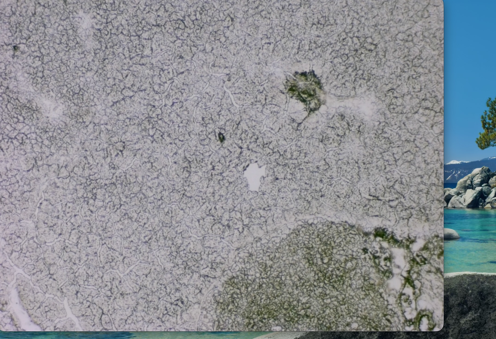
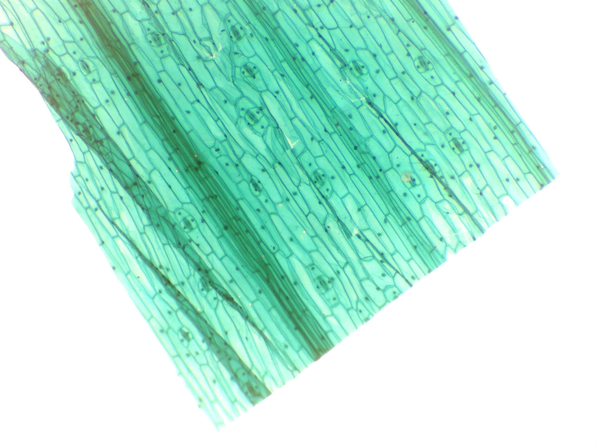
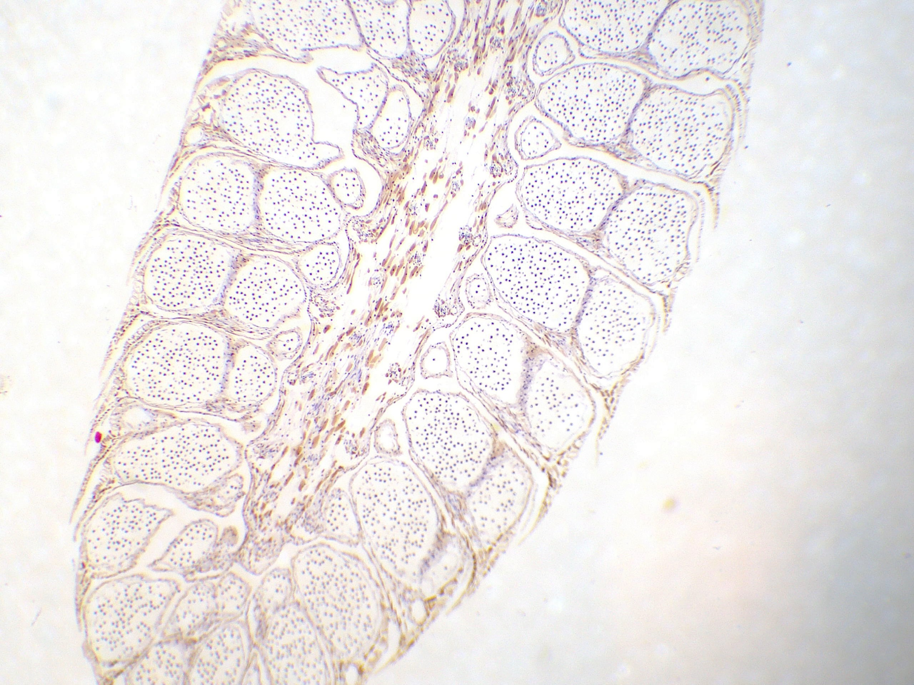

  

  <figure class="cell-tile">
    
    <figcaption><b>Leaf epidermis</b>peel · stomata</figcaption>
  </figure>
  <figure class="cell-tile">
    
    <figcaption><b>Tissue</b>stained · lobules septa</figcaption>
  </figure>

  <button class="cell-nav cell-prev" type="button" aria-label="Previous image">‹</button>
  <figure class="cell-stage">
    
    <figcaption><b id="cell-name"></b></figcaption>
  </figure>
  <button class="cell-nav cell-next" type="button" aria-label="Next image">›</button>
  <button class="cell-close" type="button" aria-label="Close">×</button>

