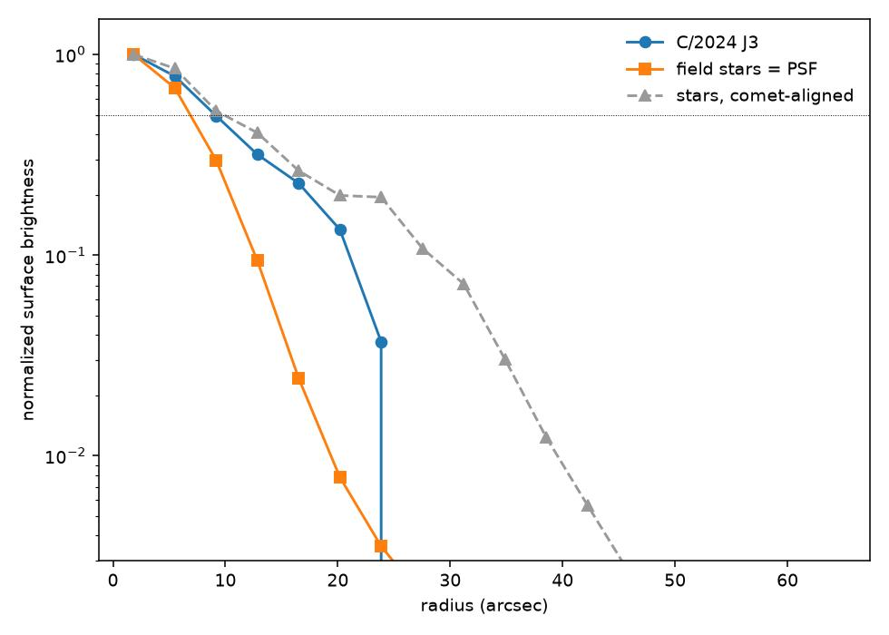

Fifty twenty-second exposures of the asteroid 3 Juno, measured against the fixed stars around it, put its position within <strong>0.74″</strong> of where JPL Horizons says it was. That residual is not the asteroid — Horizons knows Juno's orbit far better than a 30 mm telescope can measure it — so it is the error bar on every position this instrument produces. The same night's method, pointed at <strong>Barnard's Star</strong>, recovers a decade of its motion across the sky to <strong>0.4%</strong>; pointed at a comet nobody was looking for, it measures a coma <strong>28,000 km</strong> across.

## What a position is

### A position is only ever relative

There is no ruler in the sky. A telescope cannot report where something is; it can only report where something sits relative to other things in the same picture. Every astrometric measurement is therefore borrowed — you find objects whose positions are already known to great precision, and you measure your target against them.

The lender here is **Gaia DR3**, the European Space Agency's survey of nearly two billion stars, whose positions are good to fractions of a milliarcsecond. Next to that, our own errors are the entire story. That is the arrangement worth understanding before any number below: we are not measuring Juno, we are measuring the gap between Juno and a catalog, and almost all of that gap is ours.

### Plate solving turns a picture into coordinates

A raw frame is a grid of pixels with no idea where it is pointing. **Plate solving** fixes that. The software picks out the stars, takes them four at a time, and computes a shape from each quadruple that does not change if you rotate, magnify or shift it. That shape is a fingerprint, and it is looked up in a pre-built index of every such quadruple in the sky. One match anchors the whole frame.

The answer it returns is a **WCS**, a World Coordinate System: the function mapping any pixel in this frame to a point on the sky. Everything downstream is that function applied to one carefully measured pixel.

The mount here has no idea where it is pointing either — it writes no coordinates into the files at all — so every frame is solved from its own pixels, locally, with no network involved.

## The night

### Shooting fifty subs of a moving target

3 Juno is the third asteroid ever discovered, found in 1804, and at magnitude 9.1 it is an obvious dot in a single exposure. That was the point of choosing it. A first attempt at astrometry should fail on the arithmetic if it fails at all, not on whether the target is visible.

50 × 20 s subs over 37.5 min · median SNR 32 · <strong>6.2 px</strong> of motion against the fixed stars

Fifty separate exposures rather than one long one, because each is an independent measurement of the same quantity and the spread between them is the honest error bar. A single deep stack would have given a prettier picture and no way to know how much to trust it.

<figure></figure>
<figure></figure>

Those two frames are the first and last of the run, each solved independently and then cropped around the same sky coordinate rather than the same pixel. That is what locks the star field in place. The mount drifts by up to four arcminutes over a run, so cropping on pixels would set the whole field sliding and bury the thing we came to see.

<figure></figure>

Juno moves 24.5″ in forty minutes. It is a real displacement and it is also a reminder of scale: the Moon covers that distance in about a second.

## Frame to position

### Refitting every frame against Gaia

The plate solver is built to answer where is this field quickly, not to deliver a sub-arcsecond frame, and it matches against an older catalog than Gaia. So each solution is used as a starting point and then improved: pull every Gaia star in the field, move each one to tonight using its cataloged proper motion, match them to what the frame actually shows, and fit a fresh mapping to those pairs.

<strong>50 of 50</strong> frames refit, on a median of <strong>115</strong> Gaia stars · WCS residual <strong>1.97″ → 1.30″</strong>

Moving the catalog stars to tonight is not a detail. Gaia's positions are quoted for the year 2016, and stars have been drifting ever since; using them as printed would fit the frame to where the sky was a decade ago.

### Modeling the curvature of the field

A frame is a curved patch of sky projected onto a flat sensor, and no lens does that perfectly. Measuring our own residual against Gaia as a function of distance from the center shows how imperfectly:

| distance from frame center | residual against Gaia |
|---|---|
| within 10′ | 0.79″ |
| 10–30′ | 1.21″ |
| 30–60′ | 1.49″ |
| beyond 60′ | 3.23″ |

A factor of four across the frame. The fix is to let the mapping bend — a **SIP** correction, which adds polynomial terms so the model can follow the distortion instead of averaging over it.

Fitting a flat model to a curved field does not fail loudly. It strikes a compromise, and the compromise it strikes pulls hardest at the center of the frame — which is exactly where a deliberately centered target sits. Modeling the curvature halved the final error and brought every frame into the fit.

## Reading the result

### Differencing against the ephemeris

For each frame, the measured position is differenced against JPL Horizons' prediction for that exact instant. The difference is the **O−C**, observed minus computed.

<figure></figure>

O−C = 0.74″ median

Along-track +0.24″ (scatter 0.62″) · cross-track −0.55″ (scatter 0.50″)

Because Horizons knows Juno's orbit far better than we can measure it, essentially all of that is instrumental. The number is a description of the telescope, not of the asteroid.

### Resolving the residual along the track

The obvious way to report a position error is as a miss in right ascension and a miss in declination. It is the wrong basis, because it mixes two errors with different causes and different fixes.

Resolve the residual instead along the direction the object is moving, and perpendicular to it:

along-track error = rate × timing error

An error in **along-track** can come from the clock — if you think the exposure happened a second later than it did, the object has moved on and you will say so. **Cross-track** has no such term. A timing error cannot push an object sideways off its own path. So a systematic in cross-track has to be the measurement or the mapping, and the split tells you which drawer to look in before you start looking.

Ours reads +0.24″ along and −0.55″ across. The along-track figure being small says the clock is honest. The cross-track figure is the part still being chased, and the current evidence says it belongs to the frame rather than to Juno: ordinary field stars measured the same way show the same offset in the same direction.

### Measuring the error bar instead of deriving it

The tempting move, having taken fifty measurements, is to divide the scatter by the square root of fifty and claim an error ten times smaller. It is wrong here, and the way it is wrong generalizes.

Dividing by √N assumes the measurements are independent. These are not. All fifty frames share a plate solution built the same way, a centroid algorithm with the same habits, and the same demosaic. Errors like that do not cancel when averaged — they are the same error, fifty times.

So the error bar is measured rather than derived. Take 107 ordinary field stars whose true positions are already known, push them through the identical pipeline on the identical frames, average them the identical way, and see how far off they land:

0.27″

the median error on an averaged position from this instrument — 68th percentile 0.34″, 90th 0.55″. Dividing the frame-to-frame scatter by √N instead gives 0.08″, three times too small.

That number is the denominator for everything that follows. A result is only interesting if it is large compared to 0.27″, and any claim below it is noise wearing a decimal point.

## A star that moves

### Recovering ten years of Barnard's Star

Every star in the sky is moving; almost all of them are too far away for it to show. Barnard's Star is six light years away and crossing our line of sight quickly, giving it the largest **proper motion** known — 10.4 arcseconds per year, roughly a full Moon's width every 180 years.

Gaia's catalog positions are quoted for 2016. That means a decade of motion has accumulated since, for free, in a measurement anyone can look up. Photograph the star tonight, compare it to where the catalog left it, and you are measuring ten years of stellar motion in one night.

110.53″ measured against 110.09″ predicted

from 205 frames — 0.40% in length and 4.0′ of arc in direction, at 1.6× the measurement floor.

Read it as a consistency test rather than a discovery. The plate solution is itself built from Gaia stars, so the frame is Gaia's frame; what has been shown is that the star sits where that frame says it should. That still exercises the solve, the centroid and the epoch arithmetic all at once, on a 30 mm telescope in a suburban backyard.

One honest complication sits inside the leftover 0.44″. Barnard's Star is close enough that the Earth's own orbit shifts its apparent position by about 0.55″ over a year — **parallax**, the effect that first measured the distance to a star. That term has not been removed, and it is the same size as the residual. Subtracting the parallax predicted for the night of the observation shrinks the leftover to 0.32″, within a factor of 1.2 of the floor. That is not proof: a fixed instrumental offset of the same size would look identical from one night. Only a second observation six months later can separate them, because by then the parallax has reversed direction and an instrumental offset has not.

## The comet that turned up

### Finding a comet in frames taken for something else

A cone search against the Minor Planet Center's sky-body service costs a few seconds and can be run on any frame already on disk, using nothing but the coordinates in its header. Run across sixteen nights shot for other projects, it turned up comet **C/2024 J3** sitting in a field taken for variable-star photometry.

At magnitude 14 it is nowhere near visible in a five-second exposure. Recovering it means stacking hundreds of frames, and the interesting part is how you stack them.

<figure></figure>

The run is split into three time slices and each slice stacked with the stars aligned. The field stars therefore sit still from panel to panel, and anything that moves relative to them steps across — which is what the marked circle is doing. The first panel is a single raw sub, for scale: at a signal-to-noise ratio of about 0.2, there is nothing there to see at all.

comet at magnitude <strong>14.12</strong>, against a <strong>15.42</strong> limit · zero point from 218 Gaia stars at 0.225 mag scatter

### Telling a comet from an asteroid

Both are small bodies moving against the stars, and at this scale neither shows a disc. The distinction is physical: a comet is ice and sublimates, wrapping itself in a diffuse envelope of gas and dust, while an asteroid is inert rock and never does. So the test is whether the object is extended — wider than the instrument's own blur.

Every point source in the frame is spread out by the same amount by the optics, and that spread is measurable from the field stars themselves. Three widths make the argument:

| | FWHM | what it is |
|---|---|---|
| C/2024 J3, comet-aligned | 18.2″ | the object |
| field stars, star-aligned | 14.5″ | the instrument |
| field stars, comet-aligned | 19.8″ | the control |

<figure></figure>

The third row is what makes it an argument rather than an assertion. In a stack aligned on the comet's motion the stars are the things being smeared, so they must come out wider than in a star-aligned stack — and they do. That confirms the alignment behaved as expected, and it brackets the comet: wider than an unsmeared star, narrower than a smeared one.

Widths combine in quadrature when one blur is applied on top of another, so the comet's intrinsic size is √(18.2² − 14.5²) = 11.1″. At 3.445 AU, where one arcsecond is 2,499 km, that is a coma about **27,700 km** across — twice the diameter of the Earth — and it is an upper bound, because any error in the comet's predicted track smears the stack a little further.

### What is still missing

The classification above has only ever been run on a comet. A test that has never once returned the other answer is not yet a test, and the honest state of this project is that the asteroid control is still outstanding. Two candidates were tried and both failed, for opposite reasons: one was bright enough but sat 38″ from a star 181 times brighter, which floods the measurement; the other had a clean field and was too faint to profile.

That failure did at least produce a specification. What is needed is an asteroid fainter than about magnitude 14.5 with no star brighter than magnitude 14 within two arcminutes — and the sweep that found the comet can now screen for exactly that.

