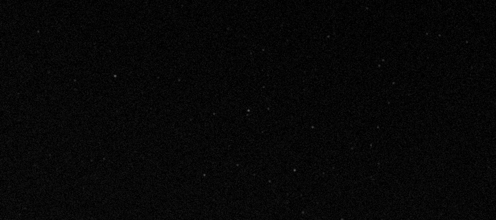
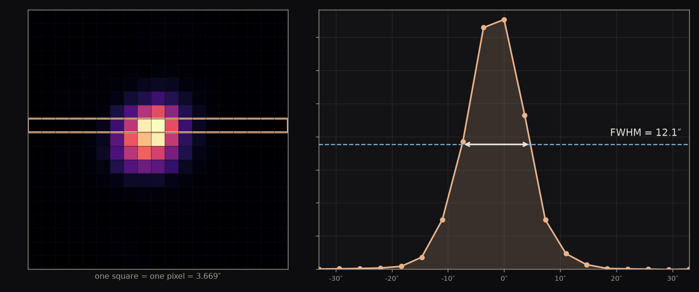

The Seestar's accuracy in pinpointing a star is measured to be <strong>0.27″</strong>. With that metric in hand: a single frame of an asteroid sits <strong>0.74″</strong> from prediction, a decade of motion by the fastest-moving star comes back within <strong>0.4%</strong> of prediction, and an invisible comet is shown to carry a <strong>28,000 km</strong> tail.

## What a position is

### Finding the reference

The key question is not where any particular object is in the sky. It is how well this telescope can say where anything is. Every other astronomy project that points at a star has to trust that answer, and none of them can check it.

There is no ruler in the sky. A telescope cannot report where something is; it can only report where something sits relative to other things in the same picture. Every astrometric measurement is therefore borrowed — you find objects whose positions are already known to great precision, and you measure your target against them.

So everything rests on what you borrow from, and the sky splits that question in two. Nearly every dot in a frame is a star, drifting in a straight line and so slowly that a catalog stays usable for years. A few dots are not: the bodies of our own solar system, which orbit, and whose apparent paths across our sky speed up, slow down and double back. Two populations, two kinds of motion, and two different authorities to borrow from.

**Gaia DR3** is the European Space Agency's survey of nearly two billion stars, whose positions are good to fractions of a milliarcsecond. It carries a second thing besides those positions: each star's own rate of drift across the sky. Because that drift is a straight line at a steady rate, two numbers describe a star forever — which is what makes a catalog published for the year 2016 usable on a frame taken tonight, by arithmetic anyone can do.

**JPL Horizons** answers the same question for the solar system, and it cannot do it with a catalog. An orbiting body has no steady drift to publish: over a year Juno's rate across the sky runs from −785″ to +1754″ a day and reverses twice, because Earth is orbiting too and periodically overtakes it. So what NASA's Jet Propulsion Laboratory stores is the orbit itself, fitted to every observation since 1804, and Horizons integrates it forward under the gravity of the Sun and planets to the instant and the spot on Earth you ask about.

Gaia is what the frame gets fitted to, so it builds the ruler. Horizons is what erratic moving targets get checked against, so it holds the answer. And the two are independent — Horizons knows nothing of stars and Gaia knows nothing of asteroids.

### Choosing the frame

Both populations are in this one frame. That is what makes it a measurement rather than a photograph.

<figure class="medium"></figure>

Nearly every dot here is a star, and Gaia knows where each of them belongs to a fraction of a milliarcsecond. Fitting the frame to them is what turns its pixels into coordinates — the star field **is** the ruler.

Ringed near the center is the one dot that is not a star but an asteroid. That is the thing the ruler gets used **on**, and Horizons holds its answer independently. One exposure, both categories, each doing the job only it can do.

And they arrive together, which matters more than it sounds. A ruler built on one night and applied to another would carry errors the target never shared. Here the reference and the target sit in the same picture, at the same instant, through the same air — so whatever the frame gets wrong, it gets wrong about both of them at once.

The target itself is chosen to be uninteresting. 3 Juno is bright enough to be obvious in twenty seconds, and its orbit has been refined for two centuries, so it is known far better than one night with a 30 mm telescope could ever measure. Any disagreement is therefore not news about the asteroid. It is a description of the instrument.

## Building the ruler

### Turning a picture into coordinates

A raw frame is a grid of pixels with no idea where it is pointing. What has to come out of it is a function — give it any pixel, get back celestial coordinates — and nothing in the file provides one. It has to be worked out from the pattern of stars itself, and it can be, without recognizing a single constellation.

The difficulty is that three things are unknown at the same time: where the frame points, how much sky each pixel covers, and which way is north. So whatever we look the frame up by cannot depend on any of the three, or we would need the answer before we could search for it.

The way out is to measure the stars only against each other. The software picks out the stars and takes them four at a time. For each quadruple it finds the two most widely separated stars, treats the line between them as its own private coordinate system, and writes down where the other two fall inside it — as fractions of that line, not as distances. Four numbers. Rotate the group, magnify it, slide it anywhere on the sensor, and those four numbers do not change, because every length in them has been divided by another length from the same group.

<figure class="medium">
<svg viewBox="0 0 640 240" style="width:100%;height:auto" role="img" aria-label="Left, a field of stars with four of them picked out as larger dark dots among fainter ones. Right, those same four alone, joined into a quadrilateral with the widest pair drawn as a dashed baseline.">
  <defs>
    <marker id="q-arr" markerUnits="userSpaceOnUse" markerWidth="10" markerHeight="10" refX="9" refY="4.5" orient="auto">
      <path d="M0,0 L10,4.5 L0,9 z" fill="#8b949e"/>
    </marker>
  </defs>

  <!-- LEFT: the sky as the sensor has it. Faint field stars are drawn as small
       muted dots so the four chosen ones read as a selection out of many, and
       nothing is joined up — at this stage no geometry has been extracted. -->
  <g fill="#c9d1d9">
    <circle cx="82"  cy="42"  r="2"/><circle cx="196" cy="55"  r="2"/>
    <circle cx="40"  cy="112" r="2"/><circle cx="212" cy="148" r="2"/>
    <circle cx="88"  cy="205" r="2"/><circle cx="168" cy="212" r="2"/>
    <circle cx="140" cy="46"  r="2"/><circle cx="34"  cy="186" r="2"/>
    <circle cx="110" cy="125" r="2"/><circle cx="155" cy="140" r="2"/>
  </g>
  <g fill="#1f2328">
    <circle cx="55"  cy="165" r="5"/><circle cx="105" cy="72"  r="5"/>
    <circle cx="185" cy="95"  r="5"/><circle cx="152" cy="178" r="5"/>
  </g>

  <line x1="270" y1="128" x2="360" y2="128" stroke="#8b949e" stroke-width="1.6" marker-end="url(#q-arr)"/>

  <!-- RIGHT: the SAME four stars, same arrangement, translated +405 in x and
       nothing else — not rotated and not rescaled, because the claim here is
       extraction rather than invariance. The dashed line joins the widest pair,
       which is genuinely A-C at 147.6 units against the next longest at 115.9. -->
  <g fill="none" stroke="#4a86c8" stroke-width="2" stroke-linejoin="round">
    <polygon points="460,165 510,72 590,95 557,178"/>
  </g>
  <g fill="none" stroke="#1f2328" stroke-width="1.5" stroke-dasharray="5 4">
    <line x1="460" y1="165" x2="590" y2="95"/>
  </g>
  <g fill="#1f2328">
    <circle cx="460" cy="165" r="5"/><circle cx="510" cy="72"  r="5"/>
    <circle cx="590" cy="95"  r="5"/><circle cx="557" cy="178" r="5"/>
  </g>
</svg>
</figure>

That invariance is what makes the lookup possible at all: a quad's fingerprint is the same whatever telescope took it, however it was framed and whichever way up. So the four numbers can be looked up in a pre-built index holding the fingerprint of every such group in the sky, and one confident match anchors the whole frame — because knowing which four stars these are, and which pixels they landed on, pins down the pointing, the scale and the bearing together.

The answer that comes back is a **WCS**, a World Coordinate System: the function that turns any pixel in this frame into celestial coordinates. Right ascension and declination are the sky's address system and are there whether or not anyone photographs it — a WCS is what lets one particular photograph reach them.

### Identify the frame

Run that method on the frame and it answers one question: which patch of sky is this.

**astrometry.net** is the free software that runs the quad method above. It matches the frame against a pre-built index of the sky, and it needs nothing but the pixels.

The solver works through quads until one match is unambiguous, and then it stops, because what it was asked has been answered. So what comes back rests on however few stars it took to be certain — enough to place the frame on the sky, and nothing beyond that. It found where the frame is. It never worked out how precisely the frame maps, because nothing asked it to.

center <strong>RA 301.809° Dec −5.156°</strong> · <strong>3.669″</strong> per pixel · rotated <strong>179.92°</strong>

That mapping is complete and it works: hand it any pixel in the frame and it hands back a celestial coordinate. The only question left is how close that coordinate is to the truth, and it can be asked directly, because the frame is full of stars whose real positions Gaia already knows. Put each one through this mapping and compare:

the solver's mapping lands <strong>2.14″</strong> from where Gaia puts the same stars

### Calibrate the frame

Now we ask the question nobody asked the solver. Not where is this frame, but how precisely does it map — and the way to improve an answer is to use everything the frame is holding. The solver stopped at a handful of stars. This uses all of them, and it measures them against Gaia rather than against a coarse index:

- **Detect our own stars.** Find every source sitting 4σ above the background, each with a sub-pixel center. These are what the new mapping will be fitted to, so what matters is that there are many of them and that they are spread across the sensor.
- **Pull the Gaia stars.** Ask the catalog for everything in this patch of sky. This is the truth the frame is about to be held against.
- **Move them to tonight.** Carry each star along its own drift across the decade since 2016, so the catalog describes the sky actually in front of the telescope.
- **Pair the two lists.** Match each detection to its catalog star and reject anything more than 5 arcseconds apart — wide enough to cover the error being corrected, tight enough that no star is confused with a neighbor. A catalog star claimed by two detections is dropped entirely.
- **Fit the mapping.** Solve for the WCS that best carries those pixel positions onto those catalog positions, and keep it in place of the solver's.

That runs on all fifty frames of the night, on a median of 115 stars each. Finding out what it bought takes one precaution, and it is the precaution the rest of this page keeps returning to. Ask how far the new mapping puts the stars it was fitted to and the number will improve — but it would improve whether or not the mapping got better, because those stars are what the fit was told to satisfy. A model marking its own homework always passes.

So the stars are split into five groups and the mapping is fitted five times, each time with one group left out. Every star is then scored against a mapping that had no part in placing it:

2.14″ → 1.36″

the calibrated mapping, scored only on the stars it was never fitted to

center <strong>RA 301.809° Dec −5.156°</strong> · <strong>3.670″</strong> per pixel · rotated <strong>179.97°</strong>

Almost the same four numbers as before. The pointing has not moved at this precision, and the scale shifts in the fourth decimal. That is the right outcome: the solver had already found where the frame was. What it had never done was make the mapping hold evenly across the whole of it, and that is what changed.

The ruler exists now. What it is worth is a different question, and nothing here has answered it — every number in this act was measured against Gaia, and Gaia is what the mapping was fitted to. To find out what the ruler is worth, it has to measure something it has never seen.

## Assessing the ruler

### Differencing against the ephemeris

Something the ruler has never seen. That is what the asteroid is for, and it is the only thing in the frame that qualifies — every star here has already been used to build the mapping or to check it, but Juno was never part of either.

So the measurement is three steps. Find Juno's pixel. Push it through the mapping. Difference the answer against where JPL Horizons says it was at that exact instant. Because Horizons knows Juno's orbit far better than this telescope can measure it, whatever comes out is not news about the asteroid. It is the instrument's report card.

**O−C** is that difference: observed minus computed, where we measured the object less where the ephemeris said it would be. It is the working currency of this kind of astronomy, because a position on its own only says you found something — an O−C says how well. Since Juno's orbit is known far better than a 30 mm telescope can measure it, essentially all of the difference is our instrument.

An **ephemeris** is a table of where an object was, computed for the instants you name and for the spot on Earth you are standing. Two corrections in there are worth naming, and both are absent from any star catalog. Juno's light took **15 minutes** to reach us that night, so the answer has to be where it was when the light left. And standing in Vancouver rather than at the Earth's center moves it **4.6″** — a parallax that matters here because Juno is close, and that is under a milliarcsecond for almost every star in the frame.

Under the mapping fitted so far — flat, a plane onto a plane — that difference comes out at:

<strong>O−C = 1.57″</strong> median on a flat mapping

### Finding that the field is not flat

The sky is a sphere and the sensor is a flat rectangle, so something has to give. Nearly four degrees of curved sky is being pressed onto a plane, and no lens performs that trick perfectly — which means the error in the mapping is not one number across the frame. It is small in the middle and grows toward the corners.

Checking our own frames against Gaia says exactly that: pooled over ten frames and 1,076 stars, the residual runs **1.28″** within ten arcminutes of the center and climbs to **2.90″** beyond a degree, rising steadily the whole way out.

That matters more than the size of it suggests, because of where a flat model puts its compromise. Asked to fit a curved field with a plane, the fit splits the difference across the whole frame — and since the disagreement is worst at the corners, that is where it spends its effort. What it gives up is the middle, which is precisely where a deliberately centered target sits.

### Letting the model bend, but only so far

If the field bends, let the mapping bend with it. Instead of a plane, allow the model some curve, so it can follow the shape of the field rather than average over it.

**SIP**, Simple Imaging Polynomial, is how that curve gets written into a WCS: polynomial terms in pixel position, sitting alongside the flat mapping. Degree 2 costs twelve extra free parameters, degree 3 costs twenty, and every one of them is paid for out of matched stars.

Which leaves one question — how much bend to allow — and it carries a trap. Every extra term you grant the model lets it follow your reference stars more closely, always, whether or not that freedom corresponds to anything real in the lens. So how well it fits those stars cannot be what decides. The way out is to judge each model by something it never saw. Fit it on the stars, then ask how well it places Juno against Horizons.

<figure class="medium"></figure>

The blue bar is the trap, drawn. It is how well each model fits the stars it was fitted to, and it falls every time the model is handed another parameter — which is exactly what it would do whether or not the extra freedom corresponded to anything real. The other two bars are the honest test. The middle one is the whole disagreement with Horizons. The third is the part of that disagreement running perpendicular to Juno's motion — the piece a distortion error would show up in, since a mis-shaped field pushes a target sideways rather than along its own path.

median disagreement with the ephemeris <strong>1.57″ flat · 0.74″ at degree 2 · 0.75″ at degree 3</strong>

### Measuring the error bar

Everything so far has produced one position from one frame. The run holds fifty of them, and the reason it does is this step: fifty separate answers to the same question are the only way to find out how much any one of them is worth. A single deep exposure would have given a prettier picture and no way at all to judge it.

What **one** position costs is already in hand: **0.74″**, which is what the last two steps arrived at once the mapping was allowed to bend. The other number is not. What is an **average** of fifty worth? It cannot be looked up in a specification either — it is a property of this telescope on this night, and it has to be measured.

50 × 20 s frames over 37.5 min · Juno arriving <strong>32×</strong> stronger than the noise around it

That last number is the **signal-to-noise ratio**, and it is why one frame is enough to measure from: Juno's light stands thirty-two times clear of the grain in the picture, so its center can be pinned down without help from any other frame. Hold on to it — the comet later in this page arrives at 0.2, and everything about how it has to be handled follows from that one difference.

The fifty frames are genuinely separate: separate exposures, separately solved, and the light in each arrived independently of the light in the others. So the spread between their answers is real information — it is an honest picture of how much this instrument wobbles from one frame to the next.

The tempting move is to take that spread, divide it by the square root of fifty, and claim an error seven times smaller. It is wrong here, and the way it is wrong generalizes.

Separate frames are not the same thing as independent *errors*, and √N needs the second. All fifty share a plate solution built the same way, a centroid algorithm with the same habits, and the same demosaic. Whatever those get wrong, they get wrong identically in every frame — so it never shows up as scatter between them, and averaging cannot touch it. That part is one error, fifty times.

So the error bar is measured rather than derived. Take 107 ordinary field stars whose true positions are already known, push them through the identical pipeline on the identical frames, average them the identical way:

0.27″

the median error on an averaged position from this instrument

From here on, this is the denominator. Everything below gets quoted as a multiple of it, because a result smaller than 0.27″ is not something this telescope can distinguish from its own noise. Barnard's decade of motion comes in at 1.6× the floor. What is left of the parallax after subtraction comes in at 1.2×, which is why that one is reported as a hint rather than a detection.

## Using the ruler

### Measuring Juno

With a floor in hand, every result from here can be judged rather than merely reported. The question stops being *what did we measure* and becomes *is it bigger than 0.27″*.

Juno is the only thing in the frame that is not a star, and over half an hour it says so. Each frame was solved independently and then cropped around the same sky coordinate.

<figure class="medium"></figure>

24.5″ moved in 40.1 minutes

the night's first frame to its last — <strong>6.7 px</strong> on the sensor, which is <strong>91×</strong> the 0.27″ floor

Ninety times the floor is large enough that the arithmetic is almost beside the point — you can simply watch it happen in the figure above. And it is worth noticing what your eye is doing there, because it is the same thing the whole page is doing. It is not measuring Juno against the edge of the frame or against the page. It is measuring Juno against the stars, which sit still. A position is only ever relative, and that holds for the eye as much as for the pipeline: what registers is one dot moving while several hundred do not.

The stars sit still because they were made to. Each frame was solved on its own and cropped about the same sky coordinate, so all fifty had already been put into a common reference before anyone looked. And that is the general lesson — motion is the easiest thing a small telescope measures, because it is the one quantity where the instrument's own errors mostly cancel.

### Dissecting the error

The 0.74″ is a length, and a length is the least informative thing about a vector. The error also has a direction, and what that direction gets measured against is a choice — one that decides whether the number stays merely large or starts saying something.

The obvious basis is the coordinate grid: so far off in right ascension, so far off in declination. That is the wrong choice, and the reason is that those axes are ours. Right ascension and declination are bookkeeping laid over the sky, and nothing about an instrument's errors has any reason to line up with them. Splitting along them mixes causes together.

The asteroid supplies a better pair of axes, and this is the one place where the astronomy does the work rather than the arithmetic. Juno is on an orbit, so it has a direction of travel that belongs to the object itself. Resolve the error along that direction, and perpendicular to it.

<figure class="medium">
<svg viewBox="0 0 640 210" style="width:100%;height:auto" role="img" aria-label="An object's track running up to the right. The predicted position sits on the track and the measured position sits off it; the gap between them is drawn as two legs, one running along the track and one perpendicular to it. A hollow marker further up the track shows where a clock error would move the prediction — along the track, and no distance at all off it.">
  <defs>
    <marker id="t-arr" markerUnits="userSpaceOnUse" markerWidth="10" markerHeight="10" refX="9" refY="4.5" orient="auto">
      <path d="M0,0 L10,4.5 L0,9 z" fill="#8b949e"/>
    </marker>
  </defs>

  <!-- The track, and everything on it placed by computed offset rather than by
       eye: the along leg runs 150 units up the unit tangent from the predicted
       point and the cross leg 62 units up the normal, so the corner really is
       square. The hollow marker sits 250 units up the tangent — clear of the
       along leg, because a clock error must not look like part of it. -->
  <line x1="60" y1="165" x2="580" y2="45" stroke="#8b949e" stroke-width="1.6" marker-end="url(#t-arr)"/>

  <line x1="258" y1="119" x2="404" y2="86" stroke="#4a86c8" stroke-width="3"/>
  <line x1="404" y1="86" x2="418" y2="146" stroke="#d1584a" stroke-width="3"/>
  <line x1="258" y1="119" x2="418" y2="146" stroke="#1f2328" stroke-width="1.4" stroke-dasharray="5 4"/>

  <circle cx="258" cy="119" r="7" fill="#1f2328"/>
  <circle cx="418" cy="146" r="7" fill="#1f2328"/>
  <circle cx="501" cy="63" r="6.5" fill="#ffffff" stroke="#57606a" stroke-width="2.2"/>
</svg>
</figure>

The filled dot on the track is where the ephemeris says Juno was; the filled dot off it is where we measured it. The blue leg is the along-track error and the red leg is the cross-track error.

along-track error = rate × timing error

The split matters because a clock error can only ever produce the blue leg. If we believe an exposure happened a second later than it did, the object has moved on along its own path and we will say so — that is the hollow marker, sliding the prediction up the track and changing nothing perpendicular to it. Cross-track has no such term. A wrong clock cannot push an object sideways off its own orbit, so a systematic error across the track has to be the measurement or the mapping, and the decomposition tells you which drawer to look in before you start looking.

<figure></figure>

Two numbers now, where there was one. Along-track comes out at **+0.24″** and cross-track at **−0.55″**. The along-track miss is the smaller of the pair, which says the clock is telling roughly the truth. The cross-track miss is the larger, and no clock can produce it — so whatever is left sits in the mapping or in how the target was measured, and it stays on the books as the one thing this run could not explain away.

### Measuring Barnard's Star

Every star in the sky is moving; almost all of them are too far away for it to show within a human lifetime. Barnard's Star is six light years away and crossing our line of sight quickly, which gives it the largest **proper motion** known — 10.4 arcseconds per year, a full Moon's width every 180 years.

Gaia's catalog positions are quoted for 2016. So a decade of that motion has already accumulated, for free, inside a measurement anyone can look up. Photograph the star tonight, compare it with where the catalog left it, and the difference is ten years of stellar motion measured in one night.

<figure></figure>

110.53″ measured against 110.09″ predicted

from 205 frames — a gap of <strong>0.44″</strong> which is <strong>1.6×</strong> the 0.27″ floor

Read that as a consistency test rather than a discovery. The plate solution is itself built from Gaia stars moved forward to tonight, so the frame is Gaia's frame, and what has been shown is that the star sits where that frame says it should. It still exercises the solve, the centroid and the decade of epoch arithmetic all at once.

### Dissecting the error

Magnify the arrival end of that measurement a thousand times — the right panel of the figure above — and an honest complication appears.

**Parallax** is the apparent shift of a nearby object against a distant background when the observer moves. Earth's orbit moves the observer by 300 million km across six months, so a nearby star traces a small ellipse against the far ones — and the size of that ellipse is the only direct measurement of a star's distance there has ever been. Barnard's Star is close enough for the effect to reach 0.55″, twice our error floor.

Our measurement carries that shift and the catalog position it is compared against does not, because the correction we applied moves the star for its own drift and nothing else. So the parallax is not an error in the comparison, it is a term deliberately left in it, and it is the same size as the leftover we are trying to explain.

<figure class="medium">
<svg viewBox="0 0 700 200" style="width:100%;height:auto" role="img" aria-label="The Sun with Earth's orbit around it, Earth drawn at two opposite points six months apart. A sight line from each position passes the nearby star and continues to a distant field of background stars, the two arriving far apart — so the near star appears against one part of the background in January and another in July.">
  <!-- Sight lines are computed, not drawn by eye: each runs from an Earth
       position THROUGH the star and on to the background at x=660, so the
       separation on the right is the geometry's own answer rather than a
       decorative pair of lines. The two hollow rings mark where the near star
       APPEARS to sit from each end of the orbit. -->
  <ellipse cx="170" cy="140" rx="100" ry="30" fill="none" stroke="#d1d9e0" stroke-width="1.6"/>
  <circle cx="170" cy="140" r="12" fill="#e8b44a"/>

  <g stroke="#8b949e" stroke-width="1.3" stroke-dasharray="5 4">
    <line x1="70"  y1="140" x2="660" y2="83"/>
    <line x1="270" y1="140" x2="660" y2="19"/>
  </g>

  <circle cx="70"  cy="140" r="8" fill="#4a86c8"/>
  <circle cx="270" cy="140" r="8" fill="#4a86c8"/>
  <circle cx="360" cy="112" r="9" fill="#d1584a"/>

  <!-- the distant background the near star is seen against -->
  <g fill="#c9d1d9">
    <circle cx="636" cy="44"  r="2.5"/><circle cx="682" cy="62"  r="2"/>
    <circle cx="644" cy="112" r="2.5"/><circle cx="676" cy="140" r="2"/>
    <circle cx="668" cy="8"   r="2"/>  <circle cx="632" cy="168" r="2"/>
    <circle cx="690" cy="104" r="2.5"/><circle cx="654" cy="60"  r="2"/>
  </g>
  <g fill="none" stroke="#d1584a" stroke-width="2.2">
    <circle cx="660" cy="83" r="7"/>
    <circle cx="660" cy="19" r="7"/>
  </g>
</svg>
</figure>

The leftover was **0.459″**. The parallax predicted for that night was **0.425″** — almost the same size. Subtract it and **0.319″** survives, which moves the disagreement from 1.7× the floor down to 1.2×.

Both halves of that are encouraging. A correction pointed in a random direction would on average have made the residual *larger*, not smaller, so the fact that it shrank says this one pointed roughly the right way. And landing at 1.2× the floor means the full model — proper motion plus parallax — now accounts for very nearly everything this telescope can resolve. There is hardly anything left over to explain.

What it does not do is prove that the thing explaining it is parallax, and the reason is visible in the figure rather than in the arithmetic. The two arrows are **42° apart**, so most of what we measured does not lie along the parallax at all, and the neat agreement between the two lengths is partly an accident of that angle. A fixed instrumental offset of the same size would look identical from one night.

What separates them is the one thing the figure makes obvious: six months later Earth is on the other side of its orbit and the parallax vector reverses, while an instrumental offset points exactly where it pointed before. The two hypotheses predict opposite shifts, so a second epoch around February decides it. That observation has been scheduled and not yet made.

## The same ruler, a different question

### Sweeping nights that were shot for something else

Everything so far has asked *where*. The same instrument, characterized the same way, answers *how big* — and the object that shows it was already sitting on a disk here, in frames shot for something else entirely.

Every frame carries its own pointing and its own timestamp in the header, and those two numbers are enough to ask a question without opening the image data at all: which known small bodies were inside this field at the moment it was taken?

**SkyBoT** answers exactly that. Give it a patch of sky and an instant and it returns every solar system object known to have been inside it, with a predicted brightness for each. The orbits have already been fitted and the positions already computed, so the answer costs a query rather than a night.

| object | predicted magnitude | the night it was on |
|---|---|---|
| 3 Juno | 9.1 | its own run — the target |
| C/2024 J3 | 13.1 | a night shot on a variable star |

The second row is where the rest of this page comes from. Nobody pointed the telescope at a comet — it was sitting in a field shot for a variable star, and a header query is what noticed.

### Recovering an object below the single-frame limit

**C/2024 J3** sits in a field shot at five seconds a frame, at magnitude 14 — nowhere near visible in a single exposure. At a signal-to-noise ratio of about 0.2 there is nothing there to see at all. Recovering it means stacking hundreds of frames, and the interesting part is how they are stacked.

<figure></figure>

The run is split into three time slices and each slice is stacked with the stars aligned. The field stars therefore sit still from panel to panel, and anything moving relative to them steps across — which is what the circle is doing. The first panel is a single raw frame at the same crop, and it is there to show what nothing looks like: no stacking, no smudge, so the thing appearing in the other three was put there by the stacking rather than by a hopeful eye.

comet at magnitude <strong>14.12</strong>, against a <strong>15.42</strong> limit

### Telling a comet from an asteroid

Both are small bodies moving against the stars, and at this scale neither shows a disc. The distinction is physical: a comet is partly ice and sublimates as it warms, wrapping itself in a diffuse envelope of gas and dust, while an asteroid is inert rock and never does. So the test is whether the object is extended — genuinely wider than a point source can look through this telescope.

Every star in this frame is a **point source**. Not approximately — the nearest star to the Sun would be about 0.001 arcseconds across from here, and even Betelgeuse, one of the largest discs in the sky, is under 0.05. One pixel of this sensor is 3.669. So any width a star shows was put there entirely by the telescope and the air on the way down, and that shape is the **PSF**, the point spread function. The field stars measure it directly: they are the one thing in the picture whose true size is known to be zero.

**FWHM**, full width at half maximum, is how that smear gets a number: the width of the profile at the height where it has fallen to half its peak.

<figure></figure>

Find the peak, drop to half of it, measure straight across — **12.1″** for this star. Half is chosen because it is roughly where the profile is steepest, so the crossing is pinned down tightly. Up at the peak or out in the tail the curve is nearly flat, and a small error in brightness would slide the crossing a long way sideways.

Reading it at half of each star's *own* peak has a second consequence, and it is the one that matters here: brightness cancels. A brighter star really does look bigger — the same shape scaled up, so its wings stand clear of the sky further out — but its FWHM is unchanged. Across 607 isolated stars in one frame, spanning a factor of 67 in peak brightness, the median width holds between 12.2″ and 13.3″ with no trend. Apparent size follows brightness; this number does not, which is what lets a faint comet be compared against stars far brighter than it.

Measuring the comet against that ruler takes two stacks built from the same frames. Adding hundreds of frames together means choosing what to hold still: line the **stars** up and they come out sharp, while the comet — which moved the whole time — smears into a streak; line the frames up on the **comet's** own motion instead and it comes out sharp, while every star smears. Same frames, two stacks, and what is sharp in one is smeared in the other.

<figure></figure>

Each curve is an object's brightness plotted against distance from its own center, divided by its brightness at the center, so all three start at 1 on the left and fall as you move outward.

Start at the dotted line, which sits at half brightness. Follow it right and the blue curve crosses first, the comet's next, the smeared stars' last. That order is the answer. The comet is wider than the PSF, and the only way to be wider than the instrument's own smear is to have a body of your own.

One crossing can be luck, though, so the stronger evidence is that the comet stays above a star at every radius, and by a widening margin: **1.7×** brighter at 9.2″, **3.4×** at 12.8″, **9.4×** at 16.5″, **17.2×** at 20.2″. The two curves keep separating the further out you look.

The third curve is the check that the machinery is honest. Those stars were smeared on purpose by the comet-aligned stacking, and they came out at **19.8″** — had the alignment done nothing they would have measured 14.5″ like the others, so the smearing is real and its size is known. That the comet sits *below* them, at 18.2″, is the other half. If its width had been an artifact of imperfect tracking it would have crept up toward theirs. It did not, so the width it carries over the PSF is its own.

Reading the crossing radius off each curve and doubling it turns the graph into three numbers: the comet at **18.2″**, the instrument at **14.5″**, the smeared control at 19.8″. Two blurs stacked one on the other combine in quadrature, which is the same rule independent errors follow in statistics and for the same reason: a blur is a random displacement given to every photon, and independent displacements add their variances. So the observed width is √(intrinsic² + PSF²), and the comet's own size is √(18.2² − 14.5²) = 11.1″. At 3.445 AU, where one arcsecond spans 2,499 km, that is a coma about **27,700 km** across — twice the diameter of the Earth. It is an upper bound rather than a measurement, because the subtraction cannot tell one smear from another: other measurement errors could have contributed to the variance.

