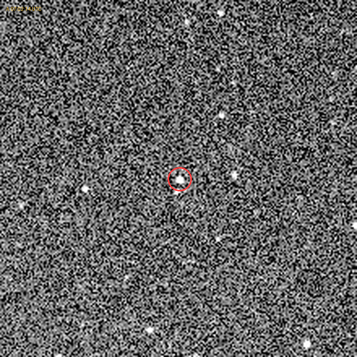
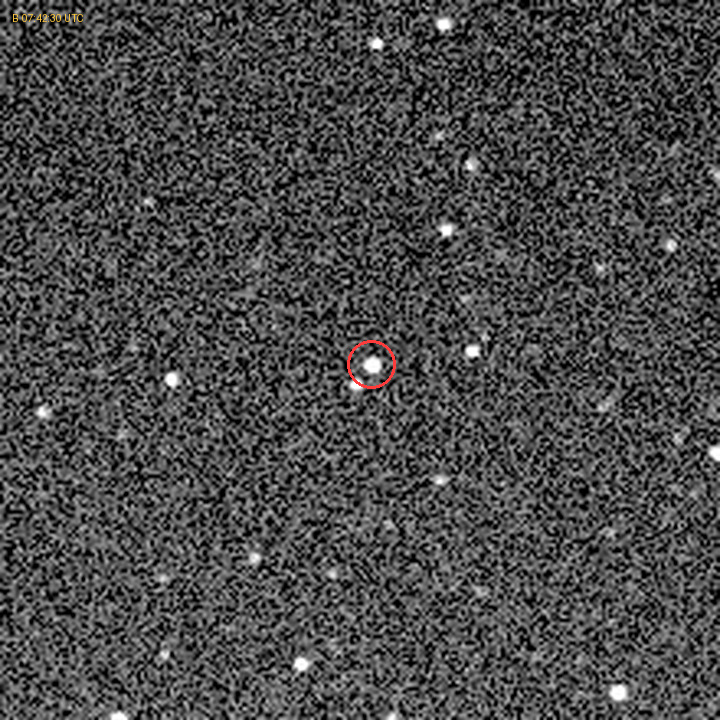
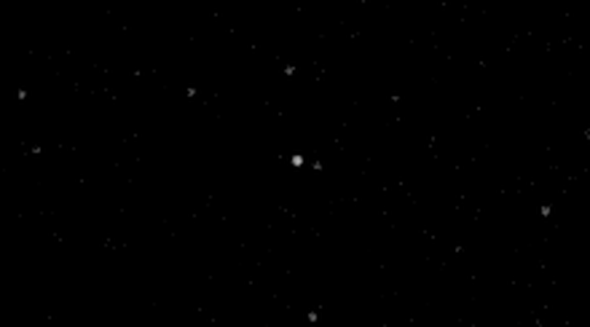
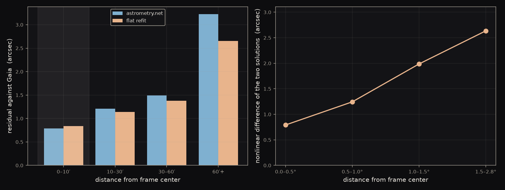
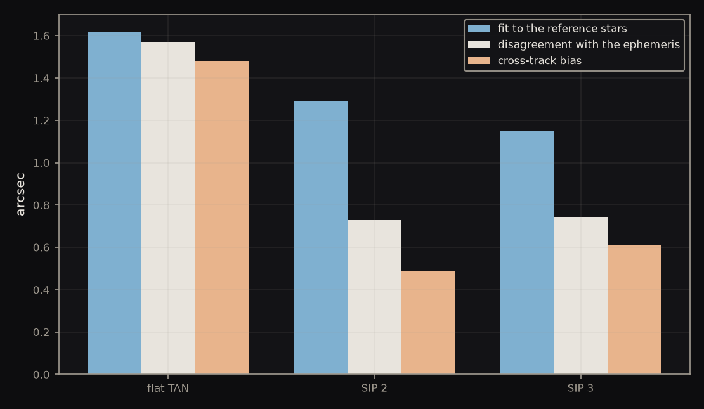
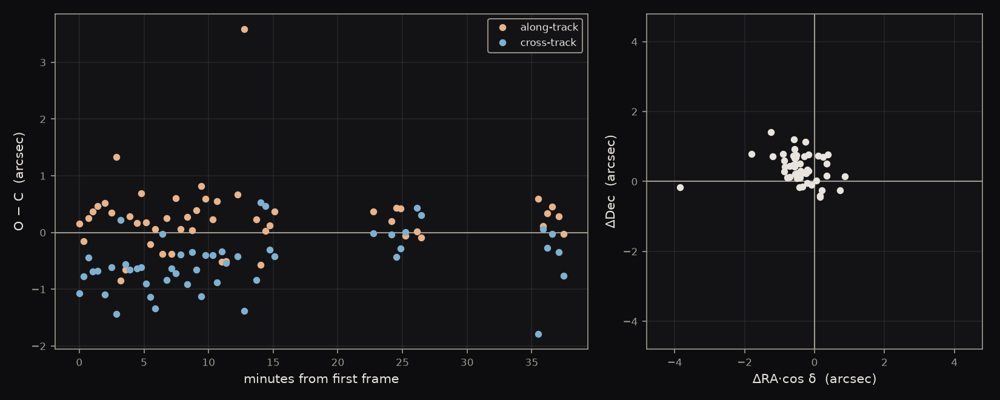
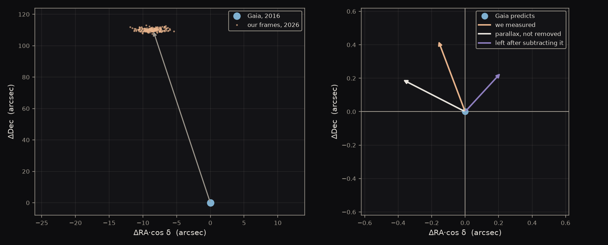
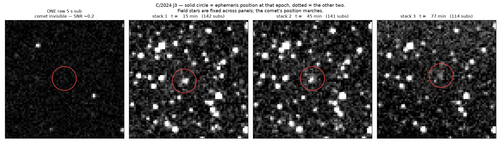
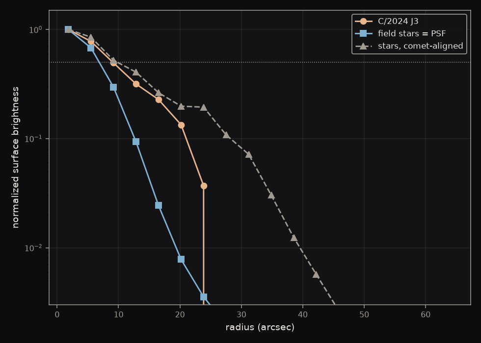
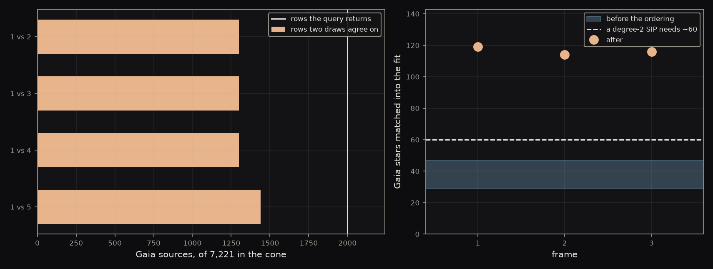

A 30 mm telescope photographed the asteroid 3 Juno fifty times in thirty-seven minutes and measured where it sat against the Gaia catalog. Every position landed within <strong>0.74″</strong> of what JPL Horizons predicted — a number that describes the telescope rather than the asteroid, and the error bar under everything that follows. The same method recovered a decade of Barnard's Star's motion to <strong>0.4%</strong>, and measured a <strong>28,000 km</strong> coma on a comet nobody had gone looking for.

## What a position is

### A position is only ever relative

There is no ruler in the sky. A telescope cannot report where something is; it can only report where something sits relative to other things in the same picture. Every astrometric measurement is therefore borrowed — you find objects whose positions are already known to great precision, and you measure your target against them.

The lender here is **Gaia DR3**, the European Space Agency's survey of nearly two billion stars, whose positions are good to fractions of a milliarcsecond. Next to that, our own errors are the entire story. We are not measuring Juno. We are measuring the gap between Juno and a catalog, and almost all of that gap is ours.

### Turning a picture into coordinates

A raw frame is a grid of pixels with no idea where it is pointing. Plate solving fixes that, and it works without recognizing a single constellation.

The software picks out the stars and takes them four at a time. For each quadruple it finds the two most widely separated stars, treats the line between them as its own private coordinate system, and writes down where the other two fall inside it — as fractions of that line, not as distances. Four numbers. Rotate the group, magnify it, slide it anywhere on the sensor, and those four numbers do not change, because every length in them has been divided by another length from the same group.

<figure class="medium">
<svg viewBox="0 0 640 240" style="width:100%;height:auto" role="img" aria-label="Left, four stars in a frame joined into a quadrilateral with the widest pair drawn as a dashed baseline. Right, the identical shape rotated and shrunk, its baseline and proportions unchanged.">
  <defs>
    <marker id="q-arr" markerUnits="userSpaceOnUse" markerWidth="10" markerHeight="10" refX="9" refY="4.5" orient="auto">
      <path d="M0,0 L10,4.5 L0,9 z" fill="#8b949e"/>
    </marker>
  </defs>

  <!-- The frame each quad is found in. Faint field stars are drawn as small
       muted dots so the four chosen ones read as a selection out of many. -->
  <g fill="#c9d1d9">
    <circle cx="82"  cy="42"  r="2"/><circle cx="196" cy="55"  r="2"/>
    <circle cx="40"  cy="112" r="2"/><circle cx="212" cy="148" r="2"/>
    <circle cx="88"  cy="205" r="2"/><circle cx="168" cy="212" r="2"/>
    <circle cx="140" cy="46"  r="2"/><circle cx="34"  cy="186" r="2"/>
  </g>

  <!-- Panel 1 and panel 2 hold the SAME quadrilateral, rotated 52 degrees and
       scaled to 0.740. The coordinates were computed rather than eyeballed, so
       the four side lengths really are in one common ratio -- which is the only
       thing this figure is claiming. -->
  <g fill="none" stroke="#4a86c8" stroke-width="2" stroke-linejoin="round">
    <polygon points="55,165 105,72 185,95 152,178"/>
    <polygon points="460,185 429,114 479,78 512,135"/>
  </g>
  <g fill="none" stroke="#1f2328" stroke-width="1.5" stroke-dasharray="5 4">
    <line x1="55" y1="165" x2="185" y2="95"/>
    <line x1="460" y1="185" x2="479" y2="78"/>
  </g>
  <g fill="#1f2328">
    <circle cx="55"  cy="165" r="5"/><circle cx="105" cy="72"  r="5"/>
    <circle cx="185" cy="95"  r="5"/><circle cx="152" cy="178" r="5"/>
    <circle cx="460" cy="185" r="5"/><circle cx="429" cy="114" r="5"/>
    <circle cx="479" cy="78"  r="5"/><circle cx="512" cy="135" r="5"/>
  </g>

  <line x1="270" y1="128" x2="360" y2="128" stroke="#8b949e" stroke-width="1.6" marker-end="url(#q-arr)"/>
</svg>
</figure>

Those four numbers are a fingerprint, and they are looked up in a pre-built index holding the fingerprint of every such group in the sky. One confident match anchors the whole frame. The dashed line in each shape is the baseline the other two stars are measured against; the shapes on either side of the arrow are the same four stars seen from a telescope turned halfway over and standing further back.

The answer that comes back is a **WCS**, a World Coordinate System: the function mapping any pixel in this frame to a point on the sky. Everything downstream is that function applied to one carefully measured pixel.

Each frame is solved from its own pixels. The mount writes an approximate pointing into every file, which is handed to the solver as a hint so it searches a few degrees of sky instead of the whole celestial sphere — the difference between half a minute and a failure. But the hint is only a starting place, and nothing about the answer depends on the mount having been right.

## The night

### Shooting fifty subs of a moving target

3 Juno is the third asteroid ever discovered, found in 1804, and at magnitude 9.1 it is an obvious dot in a single exposure. That was the point of choosing it. A first attempt at astrometry should fail on the arithmetic if it fails at all, not on whether the target is visible.

A **sub** is one exposure, straight off the sensor and untouched — short for sub-exposure, from the practice of adding many of them together to make a picture. Astrophotography usually treats subs as ingredients and keeps only the sum. Here they are the measurement, and stacking them would destroy it.

50 × 20 s subs over 37.5 min · median SNR 32 · <strong>6.2 px</strong> of motion against the fixed stars

Fifty separate exposures rather than one long one, because each is an independent measurement of the same quantity and the spread between them is the honest error bar. A single deep stack would have given a prettier picture and no way to know how much to trust it.

<figure></figure>
<figure></figure>

Those two frames are the first and last of the run, each solved independently and then cropped around the same sky coordinate rather than the same pixel. That is what locks the star field in place. The mount drifts by up to four arcminutes over a run, so cropping on pixels would set the whole field sliding and bury the thing we came to see.

<figure></figure>

Juno covered 22.6″ in those 37.5 minutes, a little over six pixels. It is a real displacement and it is also a reminder of scale: the Moon slides its own width against the background stars in an hour, which is 22.6″ in about forty seconds.

## Frame to position

### Refitting every frame against Gaia

The plate solver is built to answer where is this field quickly, not to deliver a sub-arcsecond frame, and it matches against an older and shallower catalog than Gaia. So each solution is used as a starting point and then improved: pull every Gaia star in the field, move each one to tonight, match them to what the frame actually shows, and fit a fresh mapping to those pairs.

<strong>50 of 50</strong> frames refit, on a median of <strong>115</strong> Gaia stars · WCS residual <strong>1.97″ → 1.30″</strong>

Moving the catalog stars to tonight is not a detail. Gaia's positions are quoted for the year 2016 and stars have been drifting ever since, so using them as printed would fit tonight's frame to where the sky was a decade ago. The catalog carries each star's own rate of drift for exactly this, and the whole of the Barnard's Star result below is what happens when that correction is large enough to see.

### Finding that the field is not flat

A frame is a curved patch of sky projected onto a flat sensor, and no lens does that perfectly. We measured our own residual against Gaia as a function of distance from the center of the frame, and it is not one number:

<figure></figure>

A factor of four from center to corner, in both solutions, rising monotonically. The shaded band on the left is the central ten arcminutes, where a deliberately centered target sits.

The right panel measures the same curvature a second way and without using any stars at all. Take the two plate solutions, ask where each one sends the same grid of bare pixels, and fit out everything a flat model is allowed to do — shift, rotation, magnification, shear. Whatever is left over cannot be absorbed by a flat model by construction, and it grows steadily with radius. That leftover is a real bend in the field, and it was measurable the whole time.

### Letting the model bend, but only so far

The fix is to let the mapping curve.

**SIP**, Simple Imaging Polynomial, is a distortion model bolted onto a WCS. Alongside the flat mapping it carries polynomial terms in pixel position, so the model can follow a bend in the field instead of averaging over it. Degree 2 costs twelve extra free parameters, degree 3 costs twenty, and every one of them has to be paid for out of matched stars.

Fitting a flat model to a curved field does not fail loudly. It strikes a compromise, and because the corners are where the disagreement is worst, the compromise it strikes pulls hardest at the center — which is exactly where a deliberately centered target sits. The question is only how much curvature to allow, and the answer is not the one that fits best.

<figure class="medium"></figure>

The blue bar is how well each model fits the stars it was fitted to, and it improves every time the model is allowed another parameter. That is not a result; a model with more freedom will always follow its own training data more closely. The other two bars are how well the same model then agrees with an ephemeris it has never seen, and they stop improving at degree 2 and get worse at degree 3.

median disagreement with the ephemeris <strong>1.57″ flat · 0.73″ at degree 2 · 0.74″ at degree 3</strong>

Fitting the reference stars more closely while agreeing with the sky less well is what absorbing noise as distortion looks like. Degree 3 has enough freedom to start modeling the scatter in the star positions as though it were a property of the lens. We took degree 2, and the better fit to the thing being calibrated on turned out to be the worse answer — which is the general shape of the mistake, not a fact about polynomials.

## Reading the result

### Differencing against the ephemeris

For each frame, the measured position is differenced against JPL Horizons' prediction for that exact instant. The difference is the **O−C**, observed minus computed.

An **ephemeris** is a table of where an object will be, computed forward from an orbit that was fitted to every observation of it ever made. Juno has been watched since 1804, so its orbit is known far better than one night with a small telescope could ever measure — which is what lets a prediction stand in for the truth here, and makes the disagreement between us a statement about the telescope.

<figure></figure>

O−C = 0.74″ median

Along-track +0.24″ (scatter 0.62″) · cross-track −0.55″ (scatter 0.50″)

Because Horizons knows Juno's orbit far better than we can measure it, essentially all of that is instrumental. The number is a description of the telescope, not of the asteroid.

### Resolving the residual along the track

The obvious way to report a position error is as a miss in right ascension and a miss in declination. It is the wrong basis, because it mixes two errors that have different causes and different fixes.

Resolve the residual instead along the direction the object is moving, and perpendicular to it.

<figure class="medium">
<svg viewBox="0 0 640 210" style="width:100%;height:auto" role="img" aria-label="An object's track running up to the right. The predicted position sits on the track and the measured position sits off it; the gap between them is drawn as two legs, one running along the track and one perpendicular to it. A hollow marker further up the track shows where a clock error would move the prediction — along the track, and no distance at all off it.">
  <defs>
    <marker id="t-arr" markerUnits="userSpaceOnUse" markerWidth="10" markerHeight="10" refX="9" refY="4.5" orient="auto">
      <path d="M0,0 L10,4.5 L0,9 z" fill="#8b949e"/>
    </marker>
  </defs>

  <!-- The track, and everything on it placed by computed offset rather than by
       eye: the along leg runs 150 units up the unit tangent from the predicted
       point and the cross leg 62 units up the normal, so the corner really is
       square. The hollow marker sits 250 units up the tangent -- clear of the
       along leg, because a clock error must not look like part of it. -->
  <line x1="60" y1="165" x2="580" y2="45" stroke="#8b949e" stroke-width="1.6" marker-end="url(#t-arr)"/>

  <line x1="258" y1="119" x2="404" y2="86" stroke="#4a86c8" stroke-width="3"/>
  <line x1="404" y1="86" x2="418" y2="146" stroke="#d1584a" stroke-width="3"/>
  <line x1="258" y1="119" x2="418" y2="146" stroke="#1f2328" stroke-width="1.4" stroke-dasharray="5 4"/>

  <circle cx="258" cy="119" r="7" fill="#1f2328"/>
  <circle cx="418" cy="146" r="7" fill="#1f2328"/>
  <circle cx="501" cy="63" r="6.5" fill="#ffffff" stroke="#57606a" stroke-width="2.2"/>
</svg>
</figure>

The filled dot on the track is where the ephemeris says Juno was; the filled dot off it is where we measured it. The blue leg is the along-track error and the red leg is the cross-track error.

1along-track error = rate × timing error

The split matters because a clock error can only ever produce the blue leg. If we believe an exposure happened a second later than it did, the object has moved on along its own path and we will say so — that is the hollow marker, sliding the prediction up the track and changing nothing perpendicular to it. Cross-track has no such term. A wrong clock cannot push an object sideways off its own orbit, so a systematic error across the track has to be the measurement or the mapping, and the decomposition tells you which drawer to look in before you start looking.

Ours reads +0.24″ along and −0.55″ across. The along-track figure being the smaller of the two says the clock is honest — although it is worth being clear about how weak that test is here. Juno moves 0.011″ per second, so the epoch could be ten seconds wrong and nothing in these residuals would notice. The clock has not been vindicated; it has not yet been asked a hard question.

### Asking whether the bias belongs to the asteroid

The cross-track number is the one that survived, and it has been chased through three explanations.

Most of it was the flat field model, and modeling the curvature removed two thirds of it — from −1.48″ under a flat fit to about half an arcsecond. What was left could still be one of two things: something about how we measure Juno specifically, or something wrong with the frame that everything in it inherits.

That is a testable difference, because the frame is full of other objects. We pushed ordinary Gaia field stars through the identical path on the identical frames — same brightness cut, same centroid box, same solution, resolved onto the same two axes — and compared each one to its own catalog position instead of to Horizons. If the frame is skewed, the stars will show the same lean as Juno. If it is not, they will not.

| measured the same way | rows | cross-track |
|---|---|---|
| 106 field stars | 2,120 | **−0.10″** |
| Juno | 50 | **−0.46″** |

the field is nearly clean, and Juno is not — a difference of <strong>0.36″</strong>, about <strong>2.5σ</strong>

So the residue points at the target rather than at the frame. It is a hint and not a verdict: 2.5σ is short of anything worth calling a result, which is why it is quoted with its uncertainty rather than as a finding.

The test needed three attempts to become trustworthy, and each failure is worth more than the answer. Holding out the control stars by a brightness threshold instead of by name starved the fit down to two matched stars, so it silently fell back to the unimproved solution and spent a day measuring the wrong thing while agreeing with itself perfectly. Searching a small cone found six candidate control stars where the full frame holds 136. And holding all the controls out at once dropped the fit below the number of stars a degree-2 SIP needs, so the controls bought a worse mapping than they were measuring — fixed by holding out a fifth of them at a time.

The common thread is that every one of those was a guard, written to remove a bias, that removed the measurement instead and did not announce it. Any cut that shrinks a set needs its surviving count printed, not assumed.

### Measuring the error bar instead of deriving it

The tempting move, having taken fifty measurements, is to divide the scatter by the square root of fifty and claim an error ten times smaller. It is wrong here, and the way it is wrong generalizes.

Dividing by √N assumes the measurements are independent. These are not. All fifty frames share a plate solution built the same way, a centroid algorithm with the same habits, and the same demosaic. Errors like that do not cancel when averaged — they are one error, fifty times.

So the error bar is measured rather than derived. Take 107 ordinary field stars whose true positions are already known, push them through the identical pipeline on the identical frames, average them the identical way, and see how far off they land:

0.27″

the median error on an averaged position from this instrument — 68th percentile 0.34″, 90th 0.55″. Dividing the frame-to-frame scatter by √N instead gives 0.08″, three times too small.

That number is the denominator for everything that follows. A result is only interesting if it is large compared to 0.27″, and any claim below it is noise wearing a decimal point.

## A star that moves

### Recovering ten years of Barnard's Star

Every star in the sky is moving; almost all of them are too far away for it to show within a human lifetime. Barnard's Star is six light years away and crossing our line of sight quickly, which gives it the largest **proper motion** known — 10.4 arcseconds per year, a full Moon's width every 180 years.

Gaia's catalog positions are quoted for 2016. So a decade of that motion has already accumulated, for free, inside a measurement anyone can look up. Photograph the star tonight, compare it with where the catalog left it, and the difference is ten years of stellar motion measured in one night.

<figure></figure>

110.53″ measured against 110.09″ predicted

from 205 frames — 0.40% in length and 4.0′ of arc in direction, at 1.6× the measurement floor.

The left panel is the whole displacement, with every frame's own answer drawn as a separate point so the scatter is visible rather than asserted. Read it as a consistency test rather than a discovery: the plate solution is itself built from Gaia stars moved to tonight, so the frame is Gaia's frame, and what has been shown is that the star sits where that frame says it should. That still exercises the solve, the centroid and the epoch arithmetic all at once, on a 30 mm telescope in a suburban backyard.

### Finding the parallax hiding in the leftover

The right panel is the same measurement magnified a thousand times, and it is where the honest complication lives.

**Parallax** is the apparent shift of a nearby object against a distant background when the observer moves. Earth's orbit moves the observer by 300 million km across six months, so a nearby star traces a small ellipse against the far ones — and the size of that ellipse is the only direct measurement of a star's distance there has ever been. Barnard's Star is close enough for the effect to reach 0.55″, twice our error floor.

Our measurement carries that shift and the catalog position it is compared against does not, because the correction we applied moves the star for its own drift and nothing else. So the parallax is not an error in the comparison, it is a term deliberately left in it, and it is the same size as the leftover we are trying to explain.

<figure class="medium">
<svg viewBox="0 0 700 200" style="width:100%;height:auto" role="img" aria-label="The Sun with Earth's orbit around it, Earth drawn at two opposite points six months apart. A sight line from each position passes the nearby star and continues to a distant field of background stars, the two arriving far apart — so the near star appears against one part of the background in January and another in July.">
  <!-- Sight lines are computed, not drawn by eye: each runs from an Earth
       position THROUGH the star and on to the background at x=660, so the
       separation on the right is the geometry's own answer rather than a
       decorative pair of lines. The two hollow rings mark where the near star
       APPEARS to sit from each end of the orbit. -->
  <ellipse cx="170" cy="140" rx="100" ry="30" fill="none" stroke="#d1d9e0" stroke-width="1.6"/>
  <circle cx="170" cy="140" r="12" fill="#e8b44a"/>

  <g stroke="#8b949e" stroke-width="1.3" stroke-dasharray="5 4">
    <line x1="70"  y1="140" x2="660" y2="83"/>
    <line x1="270" y1="140" x2="660" y2="19"/>
  </g>

  <circle cx="70"  cy="140" r="8" fill="#4a86c8"/>
  <circle cx="270" cy="140" r="8" fill="#4a86c8"/>
  <circle cx="360" cy="112" r="9" fill="#d1584a"/>

  <!-- the distant background the near star is seen against -->
  <g fill="#c9d1d9">
    <circle cx="636" cy="44"  r="2.5"/><circle cx="682" cy="62"  r="2"/>
    <circle cx="644" cy="112" r="2.5"/><circle cx="676" cy="140" r="2"/>
    <circle cx="668" cy="8"   r="2"/>  <circle cx="632" cy="168" r="2"/>
    <circle cx="690" cy="104" r="2.5"/><circle cx="654" cy="60"  r="2"/>
  </g>
  <g fill="none" stroke="#d1584a" stroke-width="2.2">
    <circle cx="660" cy="83" r="7"/>
    <circle cx="660" cy="19" r="7"/>
  </g>
</svg>
</figure>

Subtracting the parallax predicted for that night shrinks the leftover from 0.459″ to 0.319″, within 1.2× of the floor — where a randomly pointed correction of that size would on average have made things worse. That is weak support, and it is as far as one night goes.

residual <strong>0.459″</strong> · predicted parallax <strong>0.425″</strong> · what survives subtracting it <strong>0.319″</strong>

It is not a detection, and the reason is visible in the figure rather than in the arithmetic. The two arrows are **42° apart**, so most of what we measured does not lie along the parallax at all, and the neat agreement between the two lengths is partly an accident of that angle. A fixed instrumental offset of the same size would look identical from one night.

What separates them is the one thing the figure makes obvious: six months later Earth is on the other side of its orbit and the parallax vector reverses, while an instrumental offset points exactly where it pointed before. The two hypotheses predict opposite shifts, so a second epoch around February decides it. That observation has been scheduled and not yet made.

## The comet that turned up

### Finding a comet in frames taken for something else

Every frame already on disk carries the coordinates it was pointed at and the moment it was taken, and that is enough to ask a database what small bodies were in that patch of sky at that time. The question costs a few seconds per field and needs no plate solve, no stacking and no new observing.

Run across sixteen nights shot for other projects, it turned up three objects nobody had been looking for, among them the comet **C/2024 J3** sitting in a field taken for variable-star photometry. At magnitude 14 it is nowhere near visible in a single five-second exposure. Recovering it means stacking hundreds of frames, and the interesting part is how they are stacked.

<figure></figure>

The run is split into three time slices and each slice is stacked with the stars aligned. The field stars therefore sit still from panel to panel, and anything moving relative to them steps across — which is what the marked circle is doing. The first panel is a single raw sub, for scale: at a signal-to-noise ratio of about 0.2 there is nothing there to see at all.

comet at magnitude <strong>14.12</strong>, against a <strong>15.42</strong> limit · zero point from 218 Gaia stars at 0.225 mag scatter

### Telling a comet from an asteroid

Both are small bodies moving against the stars, and at this scale neither shows a disc. The distinction is physical: a comet is partly ice and sublimates as it warms, wrapping itself in a diffuse envelope of gas and dust, while an asteroid is inert rock and never does. So the test is whether the object is extended — genuinely wider than a point source can look through this telescope.

**FWHM**, full width at half maximum, is how wide a blur is: the diameter of the disc at the height where it has dropped to half its peak brightness. Every point source in a frame is spread into the same blur by the optics and the air, so the field stars measure it directly — they are known points, and whatever width they come out at is the instrument's own.

Three widths make the argument, all measured on the same stacks:

| | FWHM | what it is |
|---|---|---|
| C/2024 J3, comet-aligned | 18.2″ | the object |
| field stars, star-aligned | 14.5″ | the instrument |
| field stars, comet-aligned | 19.8″ | the control |

<figure></figure>

The third row is what makes this an argument rather than an assertion. In a stack aligned on the comet's motion the stars are the things being smeared, so they must come out wider than in a star-aligned stack — and they do. That confirms the alignment behaved as expected, and it brackets the comet between the two: wider than an unsmeared star, narrower than a smeared one.

The width ratio is the weaker half of the case. The shape of the profile is the stronger half, and it is what the figure is for: peak-normalized, the comet holds 0.317 of its brightness at 12.8″ where a star holds 0.094, and 0.228 at 16.5″ against 0.024. Between about 9″ and 24″ it is carrying light that a point source simply does not have. Blur cannot manufacture a halo; it can only spread the light that was already there.

Two blurs applied one on top of the other combine in quadrature, so the comet's intrinsic size is √(18.2² − 14.5²) = 11.1″. At 3.445 AU, where one arcsecond spans 2,499 km, that is a coma about **27,700 km** across — twice the diameter of the Earth. It is an upper bound rather than a measurement, because any error in the comet's predicted track smears the stack a little further.

### Failing to find a clean asteroid

A test that has only ever been run on comets is only half a test, and the asteroid half is where this project actually stands. Two candidates from the same sweep were tried and neither settled it.

(3366) Godel gave the right answer weakly. It profiled at 24.5″ against the instrument's 24.9″ on that night and the classification came back as not resolved, consistent with a point source — which is exactly what a rock should do. But at 2.8σ the object is barely detected at all, so part of what was profiled is background, and a negative from a marginal detection is not worth much.

(992) Swasey failed in the more instructive direction. It profiled at 99.8″ against the same 24.9″, and the classification duly reported a coma 145,291 km wide for a main-belt rock without hesitating. A star 181 times brighter sits 38″ away, and the profile does not fall off with radius at all — it rises, because past a certain distance from Swasey you are measuring the neighbor.

That is worth stating as physics rather than as a bug. A centroid is a center of mass, weighted by brightness instead of by mass, so a neighbor inside the measuring box drags the answer toward itself by an amount set by how bright it is and how far away:

2Δ = d · f / (1 + f)

with d the separation and f the neighbor's brightness as a fraction of the target's. Elsewhere in this run a field star 7.4 px from Juno at 14% of its brightness moved the reported position by 0.92 px — enough to turn a 1.74″ residual into 5.46″, and predicted by that expression to 0.6%. Nothing in the profile measurement checked for a neighbor before doing its arithmetic.

Between them the two failures wrote the specification the sweep can now screen for: an asteroid **brighter than about magnitude 14.5**, so it is detected solidly, with **no star brighter than magnitude 14 within two arcminutes**, so there is clean sky to measure the profile against. Bright enough to trust and alone enough to measure — Godel failed the first, Swasey the second.

## What the numbers cost to trust

### Chasing one missing line of a database query

For weeks this reduction was not reproducible. The identical command on the identical fifty frames returned between 35 and 40 refit frames and a cross-track bias that wandered across a quarter of an arcsecond — about the size of the statistical error itself, so every published number carried a second, invisible error bar as large as its first.

The explanation on file was that the plate solver samples star quadruples at random. It is a plausible story and it was wrong. Ten solves of one frame return the same field center to nine decimal places.

The real cause was one missing line in the query that fetches the Gaia stars. The server returns at most 2,000 rows, the patch of sky we ask about holds 7,221 stars, and nothing in the request said which 2,000 to send — so the server chose, and chose differently every time.

<figure></figure>

Two draws of the same query shared about 1,300 of their 2,000 rows. A third of the catalog our plate solution was fitted against was being redrawn on every call. Sorting the results before the cut fixed it in one line, and made the query nine times faster as a side effect.

The part worth keeping is what that one clause had been causing. It was upstream of four separate problems, each of which had been written down as its own defect:

- the reduction was not reproducible, for the reason above
- the frames looked like two different populations, because a threshold on star count was biting on a starved catalog
- the distortion model was unaffordable, since degree 2 costs twelve free parameters against the 29 to 47 matched stars a truncated catalog delivered — and about 118 once it did not
- and most of the cross-track bias, because that is what a flat model does to a curved field

The right panel is that third item, and it is the one that should have been the tell. The distortion model was never rejected on evidence. It was simply too expensive to fit, and the reason it was too expensive was a bug three steps upstream.

### What a position is worth

Three targets, one method, and the same 0.27″ underneath all of them.

Juno gives the number itself: a point source measured to 0.74″, which is a statement about a 30 mm telescope and not about an asteroid. Barnard's Star gives the one measurement here that beats that floor, and it does so by being relative — the star is measured against its own neighbors in the same frame, so the error the frame shares with them cancels instead of dominating. That is the only route a small instrument has past its own systematics, and it is why the proper motion lands at 0.4% while the absolute positions sit near an arcsecond.

The comet gives something different again: a physical size, in kilometers, for an object that is four pixels wide and was found by accident in somebody else's data.

0.74″ per position · <strong>0.27″</strong> averaged · 0.4% on a decade of proper motion · a 27,700 km coma

What the year of work actually produced, though, is none of those. Three of the four numbers above moved after the reduction was corrected, one of them by a factor of two, and two earlier results were withdrawn outright. Every one of those corrections came from the same move: measuring something already known through the identical pipeline and seeing what came back. Field stars gave the error floor, control stars tested where the bias lived, and a query run five times gave the reproducibility. None of it required a clear night.

