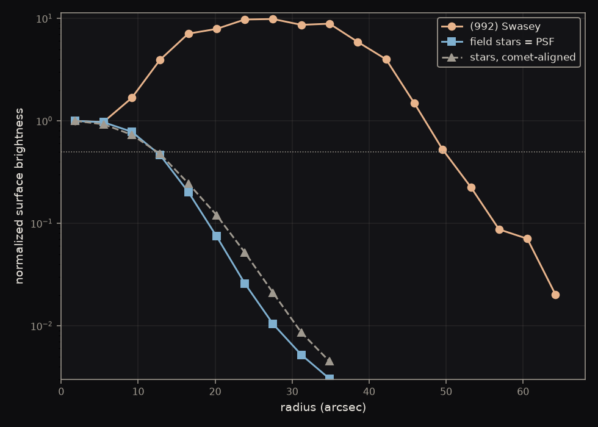

A 30 mm telescope photographed the asteroid 3 Juno fifty times in thirty-seven minutes and measured where it sat against the Gaia catalog. Every position landed within <strong>0.74″</strong> of what JPL Horizons predicted — a number that describes the telescope rather than the asteroid, and the error bar under everything that follows. The same method recovered a decade of Barnard's Star's motion to <strong>0.4%</strong>, and measured a <strong>28,000 km</strong> coma on a comet that no single frame shows at all.

## What a position is

### A position is only ever relative

There is no ruler in the sky. A telescope cannot report where something is; it can only report where something sits relative to other things in the same picture. Every astrometric measurement is therefore borrowed — you find objects whose positions are already known to great precision, and you measure your target against them.

So everything rests on what you borrow from, and the sky splits that question in two. Nearly every dot in a frame is a star, drifting in a straight line and so slowly that a catalog stays usable for years. A few dots are not: the bodies of our own solar system, which orbit, and whose apparent paths across our sky speed up, slow down and double back. Two populations, two kinds of motion, and two different authorities to borrow from.

**Gaia DR3** is the European Space Agency's survey of nearly two billion stars, whose positions are good to fractions of a milliarcsecond. It carries a second thing besides those positions: each star's own rate of drift across the sky. Because that drift is a straight line at a steady rate, two numbers describe a star forever — which is what makes a catalog published for the year 2016 usable on a frame taken tonight, by arithmetic anyone can do.

**JPL Horizons** answers the same question for the solar system, and it cannot do it with a catalog. An orbiting body has no steady drift to publish: over a year Juno's rate across the sky runs from −785″ to +1754″ a day and reverses twice, because Earth is orbiting too and periodically overtakes it. So what NASA's Jet Propulsion Laboratory stores is the orbit itself, fitted to every observation since 1804, and Horizons integrates it forward under the gravity of the Sun and planets to the instant and the spot on Earth you ask about.

Gaia is what the frame gets fitted to, so it builds the ruler. Horizons is what the moving target gets checked against, so it holds the answer. And the two are independent — Horizons knows nothing of our star field, and Gaia knows nothing of Juno — which is the only reason the comparison at the end of this page means anything.

### Choosing a target whose position is already known

3 Juno is the third asteroid ever discovered, found in 1804, and at magnitude 9.1 it is an obvious dot in a single twenty-second exposure. Juno has been watched for two centuries, so its orbit is known far better than one night with a small telescope could ever measure. That turns the measurement around. Whatever disagreement we find is not news about the asteroid; it is a description of the instrument that found it.

<figure class="medium"></figure>

## One frame, one position

### Turning a picture into coordinates

A raw frame is a grid of pixels with no idea where it is pointing. What has to come out of it is a function — give it any pixel, get back celestial coordinates — and nothing in the file provides one. It has to be worked out from the pattern of stars itself, and it can be, without recognizing a single constellation.

The difficulty is that three things are unknown at the same time: where the frame points, how much sky each pixel covers, and which way is north. So whatever we look the frame up by cannot depend on any of the three, or we would need the answer before we could search for it.

The way out is to measure the stars only against each other. The software picks out the stars and takes them four at a time. For each quadruple it finds the two most widely separated stars, treats the line between them as its own private coordinate system, and writes down where the other two fall inside it — as fractions of that line, not as distances. Four numbers. Rotate the group, magnify it, slide it anywhere on the sensor, and those four numbers do not change, because every length in them has been divided by another length from the same group.

<figure class="medium">
<svg viewBox="0 0 640 240" style="width:100%;height:auto" role="img" aria-label="Left, a field of stars with four of them picked out as larger dark dots among fainter ones. Right, those same four alone, joined into a quadrilateral with the widest pair drawn as a dashed baseline.">
  <defs>
    <marker id="q-arr" markerUnits="userSpaceOnUse" markerWidth="10" markerHeight="10" refX="9" refY="4.5" orient="auto">
      <path d="M0,0 L10,4.5 L0,9 z" fill="#8b949e"/>
    </marker>
  </defs>

  <!-- LEFT: the sky as the sensor has it. Faint field stars are drawn as small
       muted dots so the four chosen ones read as a selection out of many, and
       nothing is joined up — at this stage no geometry has been extracted. -->
  <g fill="#c9d1d9">
    <circle cx="82"  cy="42"  r="2"/><circle cx="196" cy="55"  r="2"/>
    <circle cx="40"  cy="112" r="2"/><circle cx="212" cy="148" r="2"/>
    <circle cx="88"  cy="205" r="2"/><circle cx="168" cy="212" r="2"/>
    <circle cx="140" cy="46"  r="2"/><circle cx="34"  cy="186" r="2"/>
    <circle cx="110" cy="125" r="2"/><circle cx="155" cy="140" r="2"/>
  </g>
  <g fill="#1f2328">
    <circle cx="55"  cy="165" r="5"/><circle cx="105" cy="72"  r="5"/>
    <circle cx="185" cy="95"  r="5"/><circle cx="152" cy="178" r="5"/>
  </g>

  <line x1="270" y1="128" x2="360" y2="128" stroke="#8b949e" stroke-width="1.6" marker-end="url(#q-arr)"/>

  <!-- RIGHT: the SAME four stars, same arrangement, translated +405 in x and
       nothing else — not rotated and not rescaled, because the claim here is
       extraction rather than invariance. The dashed line joins the widest pair,
       which is genuinely A-C at 147.6 units against the next longest at 115.9. -->
  <g fill="none" stroke="#4a86c8" stroke-width="2" stroke-linejoin="round">
    <polygon points="460,165 510,72 590,95 557,178"/>
  </g>
  <g fill="none" stroke="#1f2328" stroke-width="1.5" stroke-dasharray="5 4">
    <line x1="460" y1="165" x2="590" y2="95"/>
  </g>
  <g fill="#1f2328">
    <circle cx="460" cy="165" r="5"/><circle cx="510" cy="72"  r="5"/>
    <circle cx="590" cy="95"  r="5"/><circle cx="557" cy="178" r="5"/>
  </g>
</svg>
</figure>

That invariance is what makes the lookup possible at all: a quad's fingerprint is the same whatever telescope took it, however it was framed and whichever way up. So the four numbers can be looked up in a pre-built index holding the fingerprint of every such group in the sky, and one confident match anchors the whole frame — because knowing which four stars these are, and which pixels they landed on, pins down the pointing, the scale and the bearing together.

The answer that comes back is a **WCS**, a World Coordinate System: the function that turns any pixel in this frame into celestial coordinates. Right ascension and declination are the sky's address system and are there whether or not anyone photographs it — a WCS is what lets one particular photograph reach them.

### Solving the frame from its own pixels

**astrometry.net** is the free software that runs the quad method above. It matches the frame against an index of the sky to determine the rough patch of sky being looked at.

Its goal is identification, and that word is carrying weight. The solver works through quads until one match is unambiguous and then it stops, because the question it was asked has been answered. So what it hands back is anchored on however few stars it took to reach certainty, matched against a coarse internal index.

center <strong>RA 301.809° Dec −5.156°</strong> · <strong>3.669″</strong> per pixel · rotated <strong>179.92°</strong> · and a curvature term

That mapping is complete and it works: hand it any pixel in the frame and it hands back a celestial coordinate. The only question left is how close that coordinate is to the truth, and it can be asked directly, because the frame is full of stars whose real positions Gaia already knows. Put each one through this mapping and compare:

the solver's mapping lands <strong>2.14″</strong> from where Gaia puts the same stars

Two arcseconds is a fine answer to which patch of sky this is. It is a poor one for what comes next, because the thing this page exists to measure is the gap between where the frame puts Juno and where Horizons says Juno was — and that gap turns out to be under an arcsecond. A mapping already carrying two would swamp it.

### Refitting the frame against Gaia

Bringing that 2.14″ down is what this step is for. The mapping gets built again from every star the frame contains, against Gaia, rather than from the few that were enough to settle the identification. Five moves, each with a job:

- **Detect our own stars.** Find every source sitting 4σ above the background, each with a sub-pixel center. These are what the new mapping will be fitted to, so what matters is that there are many of them and that they are spread across the sensor.
- **Pull the Gaia stars.** Ask the catalog for everything in this patch of sky. This is the truth the frame is about to be held against.
- **Move them to tonight.** Carry each star along its own drift across the decade since 2016, so the catalog describes the sky actually in front of the telescope.
- **Pair the two lists.** Match each detection to its catalog star and reject anything more than 5 arcseconds apart — wide enough to cover the error being corrected, tight enough that no star is confused with a neighbor. A catalog star claimed by two detections is dropped entirely, because an ambiguous pair drags the fit rather than averaging out of it.
- **Fit the mapping.** Solve for the WCS that best carries those pixel positions onto those catalog positions, and keep it in place of the solver's.

That runs on all fifty frames of the night, on a median of 115 stars each. Measuring what it bought takes one precaution, though, and it is the same precaution the rest of this page keeps coming back to. Asking how far the new mapping puts the stars it was fitted to is asking a model to grade its own homework — the answer improves whether or not the mapping got better.

So the stars are split into five groups and the mapping is fitted five times, each time with one group left out. Every star is then scored against a mapping that had no part in placing it:

<strong>2.14″ → 1.36″</strong>, on <strong>1,033</strong> stars held out of the fit that measured them

The mapping that comes out of it:

center <strong>RA 301.809° Dec −5.156°</strong> · <strong>3.670″</strong> per pixel · rotated <strong>179.97°</strong> · and a curvature term

### Differencing against the ephemeris

That refitted WCS is the function this page set out to build: hand it a pixel, it hands back celestial coordinates, and it is now good to 1.36″. So the measurement is three steps. Find Juno's pixel. Push it through the function. Difference the answer against JPL Horizons' prediction for that exact instant.

**O−C** is that difference: observed minus computed, where we measured the object less where the ephemeris said it would be. It is the working currency of this kind of astronomy, because a position on its own only says you found something — an O−C says how well. Since Juno's orbit is known far better than a 30 mm telescope can measure it, essentially all of the difference is our instrument.

An **ephemeris** is a table of where an object was, computed for the instants you name and for the spot on Earth you are standing. Two corrections in there are worth naming, and both are absent from any star catalog. Juno's light took **15 minutes** to reach us that night, so the answer has to be where it was when the light left. And standing in Vancouver rather than at the Earth's center moves it **4.6″** — a parallax that matters here because Juno is close, and that is under a milliarcsecond for almost every star in the frame.

Under the mapping fitted so far — flat, a plane onto a plane — that difference comes out at:

O−C = <strong>1.57″</strong> median, on a flat mapping

That is the first honest number the method produces, and it is about twice as large as it needs to be. The reason is not in the asteroid. It is in the shape of the field.

## What limits a position

### Finding that the field is not flat

The sky is a sphere and the sensor is a flat rectangle, so something has to give. Nearly four degrees of curved sky is being pressed onto a plane, and no lens performs that trick perfectly — which means the error in the mapping is not one number across the frame. It is small in the middle and grows toward the corners.

Checking our own frames against Gaia says exactly that: the residual runs about **0.8″** within ten arcminutes of the center and rises past **3″** at the edges, climbing steadily the whole way out.

That matters more than the size of it suggests, because of where a flat model puts its compromise. Asked to fit a curved field with a plane, the fit splits the difference across the whole frame — and since the disagreement is worst at the corners, that is where it spends its effort. What it gives up is the middle, which is precisely where a deliberately centered target sits.

### Letting the model bend, but only so far

If the field bends, let the mapping bend with it. Instead of a plane, allow the model some curve, so it can follow the shape of the field rather than average over it.

**SIP**, Simple Imaging Polynomial, is how that curve gets written into a WCS: polynomial terms in pixel position, sitting alongside the flat mapping. Degree 2 costs twelve extra free parameters, degree 3 costs twenty, and every one of them is paid for out of matched stars.

Which leaves one question — how much bend to allow — and it carries a trap. Every extra term you grant the model lets it follow your reference stars more closely, always, whether or not that freedom corresponds to anything real in the lens. So how well it fits those stars cannot be what decides. The way out is to judge each model by something it never saw. Fit it on the stars, then ask how well it places Juno against Horizons.

<figure class="medium"></figure>

The blue bar is the: how well each model fits the stars it was fitted to, falling every time the model is given another parameter. The other two bars are the honest test. The middle one is the whole disagreement with Horizons. The third is the part of that disagreement running perpendicular to Juno's motion — the piece a distortion error would show up in, since a mis-shaped field pushes a target sideways rather than along its own path.

median disagreement with the ephemeris <strong>1.57″ flat · 0.73″ at degree 2 · 0.74″ at degree 3</strong>

### Measuring the error bar instead of deriving it

One frame gives one position. The run holds fifty, and they exist for this step rather than for the picture: each is an independent measurement of the same quantity, and the spread between them is the only honest error bar available. A single deep exposure would have given a prettier frame and no way to know how much to trust it.

50 × 20 s frames over 37.5 min · Juno arriving <strong>32×</strong> stronger than the noise around it

That last number is the **signal-to-noise ratio**, and it is why one frame is enough to measure from: Juno's light stands thirty-two times clear of the grain in the picture, so its center can be pinned down without help from any other frame. Hold on to it — the comet later in this page arrives at 0.2, and everything about how it has to be handled follows from that one difference.

The tempting move, having taken fifty measurements, is to divide the scatter by the square root of fifty and claim an error ten times smaller. It is wrong here, and the way it is wrong generalizes.

Dividing by √N assumes the measurements are independent. These are not. All fifty frames share a plate solution built the same way, a centroid algorithm with the same habits, and the same demosaic. Errors like that do not cancel when averaged — they are one error, fifty times.

So the error bar is measured rather than derived. Take 107 ordinary field stars whose true positions are already known, push them through the identical pipeline on the identical frames, average them the identical way, and see how far off they land:

0.27″

the median error on an averaged position from this instrument — 68th percentile 0.34″, 90th 0.55″. Dividing the frame-to-frame scatter by √N instead gives 0.08″, three times too small.

That number is the denominator for everything that follows. A result is only interesting if it is large compared to 0.27″, and any claim below it is noise wearing a decimal point.

## Motion in a night

### Watching Juno cross the field

Juno is the only thing in the frame that is not a star, and over half an hour it says so. Each frame was solved independently and then cropped around the same sky coordinate.

<figure class="medium"></figure>

<strong>24.5″</strong> between the night's first and last frame, 40.1 min apart — <strong>6.7 px</strong> on the sensor

Against a 0.27″ floor, six pixels is enormous, and that is the general lesson — motion is the easiest thing a small telescope measures, because it is the one quantity where the instrument's own errors mostly cancel.

### Resolving the residual along the track

Now that the object has a direction of travel, the leftover disagreement can be split along it. The obvious way to report a position error is as a miss in right ascension and a miss in declination. It is the wrong basis, because it mixes two errors that have different causes and different fixes.

Resolve the residual instead along the direction the object is moving, and perpendicular to it.

<figure class="medium">
<svg viewBox="0 0 640 210" style="width:100%;height:auto" role="img" aria-label="An object's track running up to the right. The predicted position sits on the track and the measured position sits off it; the gap between them is drawn as two legs, one running along the track and one perpendicular to it. A hollow marker further up the track shows where a clock error would move the prediction — along the track, and no distance at all off it.">
  <defs>
    <marker id="t-arr" markerUnits="userSpaceOnUse" markerWidth="10" markerHeight="10" refX="9" refY="4.5" orient="auto">
      <path d="M0,0 L10,4.5 L0,9 z" fill="#8b949e"/>
    </marker>
  </defs>

  <!-- The track, and everything on it placed by computed offset rather than by
       eye: the along leg runs 150 units up the unit tangent from the predicted
       point and the cross leg 62 units up the normal, so the corner really is
       square. The hollow marker sits 250 units up the tangent — clear of the
       along leg, because a clock error must not look like part of it. -->
  <line x1="60" y1="165" x2="580" y2="45" stroke="#8b949e" stroke-width="1.6" marker-end="url(#t-arr)"/>

  <line x1="258" y1="119" x2="404" y2="86" stroke="#4a86c8" stroke-width="3"/>
  <line x1="404" y1="86" x2="418" y2="146" stroke="#d1584a" stroke-width="3"/>
  <line x1="258" y1="119" x2="418" y2="146" stroke="#1f2328" stroke-width="1.4" stroke-dasharray="5 4"/>

  <circle cx="258" cy="119" r="7" fill="#1f2328"/>
  <circle cx="418" cy="146" r="7" fill="#1f2328"/>
  <circle cx="501" cy="63" r="6.5" fill="#ffffff" stroke="#57606a" stroke-width="2.2"/>
</svg>
</figure>

The filled dot on the track is where the ephemeris says Juno was; the filled dot off it is where we measured it. The blue leg is the along-track error and the red leg is the cross-track error.

1along-track error = rate × timing error

The split matters because a clock error can only ever produce the blue leg. If we believe an exposure happened a second later than it did, the object has moved on along its own path and we will say so — that is the hollow marker, sliding the prediction up the track and changing nothing perpendicular to it. Cross-track has no such term. A wrong clock cannot push an object sideways off its own orbit, so a systematic error across the track has to be the measurement or the mapping, and the decomposition tells you which drawer to look in before you start looking.

<figure></figure>

O−C = 0.74″ median

Along-track +0.24″ (scatter 0.62″) · cross-track −0.55″ (scatter 0.50″)

Because Horizons knows Juno's orbit far better than we can measure it, essentially all of that is instrumental. The number is a description of the telescope, not of the asteroid.

The along-track figure being the smaller of the two says the clock is honest — although it is worth being clear about how weak that test is here. Juno moves 0.011″ per second, so the epoch could be ten seconds wrong and nothing in these residuals would notice. The clock has not been vindicated; it has not yet been asked a hard question.

### Asking whether the bias belongs to the asteroid

The cross-track number is the one that survived, and it has been chased through three explanations.

Most of it was the flat field model, and modeling the curvature removed two thirds of it — from −1.48″ under a flat fit to about half an arcsecond. What was left could still be one of two things: something about how we measure Juno specifically, or something wrong with the frame that everything in it inherits.

That is a testable difference, because the frame is full of other objects. We pushed ordinary Gaia field stars through the identical path on the identical frames — same brightness cut, same centroid box, same solution, resolved onto the same two axes — and compared each one to its own catalog position instead of to Horizons. If the frame is skewed, the stars will show the same lean as Juno. If it is not, they will not.

| measured the same way | rows | cross-track |
|---|---|---|
| 106 field stars | 2,120 | **−0.10″** |
| Juno | 20 | **−0.46″** |

the field is nearly clean, and Juno is not — a difference of <strong>0.36″</strong>, about <strong>2.5σ</strong>

So the residue points at the target rather than at the frame. It is a hint and not a verdict: 2.5σ is short of anything worth calling a result, which is why it is quoted with its uncertainty rather than as a finding.

And it changes nothing already reported. The whole of it sits below the 0.74″ that every position on this page carries anyway — so this is structure noticed inside the error bar, not a correction to be applied on top of it.

## Motion in a decade

### Recovering ten years of Barnard's Star

Every star in the sky is moving; almost all of them are too far away for it to show within a human lifetime. Barnard's Star is six light years away and crossing our line of sight quickly, which gives it the largest **proper motion** known — 10.4 arcseconds per year, a full Moon's width every 180 years.

Gaia's catalog positions are quoted for 2016. So a decade of that motion has already accumulated, for free, inside a measurement anyone can look up. Photograph the star tonight, compare it with where the catalog left it, and the difference is ten years of stellar motion measured in one night.

<figure></figure>

110.53″ measured against 110.09″ predicted

from 205 frames — agreeing to <strong>0.40%</strong> in how far the star travelled and <strong>4.0′</strong> of arc in which way, at 1.6× the measurement floor.

The left panel is the whole displacement, with every frame's own answer drawn as a separate point so the scatter is visible rather than asserted. Read it as a consistency test rather than a discovery: the plate solution is itself built from Gaia stars moved to tonight, so the frame is Gaia's frame, and what has been shown is that the star sits where that frame says it should. That still exercises the solve, the centroid and the epoch arithmetic all at once, on a 30 mm telescope in a suburban backyard.

### Finding the parallax hiding in the leftover

The right panel is the same measurement magnified a thousand times, and it is where the honest complication lives.

**Parallax** is the apparent shift of a nearby object against a distant background when the observer moves. Earth's orbit moves the observer by 300 million km across six months, so a nearby star traces a small ellipse against the far ones — and the size of that ellipse is the only direct measurement of a star's distance there has ever been. Barnard's Star is close enough for the effect to reach 0.55″, twice our error floor.

Our measurement carries that shift and the catalog position it is compared against does not, because the correction we applied moves the star for its own drift and nothing else. So the parallax is not an error in the comparison, it is a term deliberately left in it, and it is the same size as the leftover we are trying to explain.

<figure class="medium">
<svg viewBox="0 0 700 200" style="width:100%;height:auto" role="img" aria-label="The Sun with Earth's orbit around it, Earth drawn at two opposite points six months apart. A sight line from each position passes the nearby star and continues to a distant field of background stars, the two arriving far apart — so the near star appears against one part of the background in January and another in July.">
  <!-- Sight lines are computed, not drawn by eye: each runs from an Earth
       position THROUGH the star and on to the background at x=660, so the
       separation on the right is the geometry's own answer rather than a
       decorative pair of lines. The two hollow rings mark where the near star
       APPEARS to sit from each end of the orbit. -->
  <ellipse cx="170" cy="140" rx="100" ry="30" fill="none" stroke="#d1d9e0" stroke-width="1.6"/>
  <circle cx="170" cy="140" r="12" fill="#e8b44a"/>

  <g stroke="#8b949e" stroke-width="1.3" stroke-dasharray="5 4">
    <line x1="70"  y1="140" x2="660" y2="83"/>
    <line x1="270" y1="140" x2="660" y2="19"/>
  </g>

  <circle cx="70"  cy="140" r="8" fill="#4a86c8"/>
  <circle cx="270" cy="140" r="8" fill="#4a86c8"/>
  <circle cx="360" cy="112" r="9" fill="#d1584a"/>

  <!-- the distant background the near star is seen against -->
  <g fill="#c9d1d9">
    <circle cx="636" cy="44"  r="2.5"/><circle cx="682" cy="62"  r="2"/>
    <circle cx="644" cy="112" r="2.5"/><circle cx="676" cy="140" r="2"/>
    <circle cx="668" cy="8"   r="2"/>  <circle cx="632" cy="168" r="2"/>
    <circle cx="690" cy="104" r="2.5"/><circle cx="654" cy="60"  r="2"/>
  </g>
  <g fill="none" stroke="#d1584a" stroke-width="2.2">
    <circle cx="660" cy="83" r="7"/>
    <circle cx="660" cy="19" r="7"/>
  </g>
</svg>
</figure>

Subtracting the parallax predicted for that night shrinks the leftover from 0.459″ to 0.319″, within 1.2× of the floor — where a randomly pointed correction of that size would on average have made things worse. That is weak support, and it is as far as one night goes.

residual <strong>0.459″</strong> · predicted parallax <strong>0.425″</strong> · what survives subtracting it <strong>0.319″</strong>

It is not a detection, and the reason is visible in the figure rather than in the arithmetic. The two arrows are **42° apart**, so most of what we measured does not lie along the parallax at all, and the neat agreement between the two lengths is partly an accident of that angle. A fixed instrumental offset of the same size would look identical from one night.

What separates them is the one thing the figure makes obvious: six months later Earth is on the other side of its orbit and the parallax vector reverses, while an instrumental offset points exactly where it pointed before. The two hypotheses predict opposite shifts, so a second epoch around February decides it. That observation has been scheduled and not yet made.

## Finding something to measure

### Sweeping nights that were shot for something else

Every frame carries its own pointing and its own timestamp in the header, and those two numbers are enough to ask a question without opening the image data at all: which known small bodies were inside this field at the moment it was taken?

**SkyBoT** answers exactly that. Give it a patch of sky and an instant and it returns every solar system object known to have been inside it, with a predicted brightness for each. The orbits have already been fitted and the positions already computed, so the answer costs a query rather than a night.

| object | predicted V | the night it was on |
|---|---|---|
| 3 Juno | 9.1 | its own run — the target |
| C/2024 J3 | 13.1 | a night shot on a variable star |
| (992) Swasey | 15.0 | the Juno run |
| (3366) Godel | 15.4 | the Juno run |

three of the four were already on disk and unnoticed, a comet among them

The second row is where the rest of this page comes from. Nobody pointed the telescope at a comet — it was sitting in a field shot for a variable star, and a header query is what noticed. The bottom two had been through the same frames as Juno itself without anyone seeing them.

## Measuring size, not position

### Recovering an object below the single-frame limit

Everything so far has asked where an object is. The same machinery answers how big it is, and the object that shows it is a comet.

**C/2024 J3** sits in a field shot at five seconds a frame, at magnitude 14 — nowhere near visible in a single exposure. At a signal-to-noise ratio of about 0.2 there is nothing there to see at all. Recovering it means stacking hundreds of frames, and the interesting part is how they are stacked.

<figure></figure>

The run is split into three time slices and each slice is stacked with the stars aligned. The field stars therefore sit still from panel to panel, and anything moving relative to them steps across — which is what the solid circle is doing. Each panel also carries the other two slices as dotted circles, so the whole track is visible from any one of them, and the first panel is a single raw frame for scale.

comet at magnitude <strong>14.12</strong>, against a <strong>15.42</strong> limit · zero point from 218 Gaia stars at 0.225 mag scatter

The **zero point** is what turns counts into a magnitude. A sensor does not measure brightness, it collects light, and how many counts that becomes depends on the aperture, the exposure, the optics and how clear the night was. So you photograph stars whose brightness is already known, see what they come out at, and that offset calibrates everything else in the frame. Position is borrowed from a catalog and so is brightness — 218 Gaia stars set this one, agreeing among themselves to 0.225 mag, which is the floor under the comet's 14.12.

### Telling a comet from an asteroid

Both are small bodies moving against the stars, and at this scale neither shows a disc. The distinction is physical: a comet is partly ice and sublimates as it warms, wrapping itself in a diffuse envelope of gas and dust, while an asteroid is inert rock and never does. So the test is whether the object is extended — genuinely wider than a point source can look through this telescope.

**FWHM**, full width at half maximum, is how wide a blur is: the diameter of the disc at the height where it has dropped to half its peak brightness. Every point source in a frame is spread into the same blur by the optics and the air, so the field stars measure it directly — they are known points, and whatever width they come out at is the instrument's own.

Measuring that takes both of the stacks, and the difference between them is what the argument turns on. Adding hundreds of frames together means choosing what to hold still. Line the **stars** up and they come out sharp, while the comet — which moved the whole time — smears into a streak. Line the frames up on the **comet's** own motion instead and it comes out sharp, while every star smears. Same frames, two stacks, and what is sharp in one is smeared in the other.

Three widths make the argument, all measured on those two stacks:

| | FWHM | what it is |
|---|---|---|
| C/2024 J3, comet-aligned | 18.2″ | the object |
| field stars, star-aligned | 14.5″ | the instrument |
| field stars, comet-aligned | 19.8″ | the control |

<figure></figure>

The third row is what makes this an argument rather than an assertion. In a stack aligned on the comet's motion the stars are the things being smeared, so they must come out wider than in a star-aligned stack — and they do. That confirms the alignment behaved as expected, and it brackets the comet between the two: wider than an unsmeared star, narrower than a smeared one.

The width ratio is the weaker half of the case. The shape of the profile is the stronger half, and it is what the figure is for: peak-normalized, the comet holds 0.317 of its brightness at 12.8″ where a star holds 0.094, and 0.228 at 16.5″ against 0.024. Between about 9″ and 24″ it is carrying light that a point source simply does not have. Blur cannot manufacture a halo; it can only spread the light that was already there.

Two blurs applied one on top of the other combine in quadrature, so the comet's intrinsic size is √(18.2² − 14.5²) = 11.1″. At 3.445 AU, where one arcsecond spans 2,499 km, that is a coma about **27,700 km** across — twice the diameter of the Earth. It is an upper bound rather than a measurement, because any error in the comet's predicted track smears the stack a little further.

### Setting the bar a width measurement has to clear

A width test that has only ever been run on comets is only half a test. It needs a negative — a rock that comes back unresolved — and two attempts at one show what the test requires in order to mean anything.

(3366) Godel gave the right answer weakly. It profiled at 24.5″ against the instrument's 24.9″ on that night and the classification came back as not resolved, consistent with a point source — which is exactly what a rock should do. But at 2.8σ the object is barely detected at all, so part of what was profiled is background, and a negative from a marginal detection is not worth much.

(992) Swasey failed in the more instructive direction. It profiled at 99.8″ against the same 24.9″, and the classification duly reported a coma 145,291 km wide for a main-belt rock without hesitating.

<figure></figure>

The two star curves fall, as a point source must. Swasey's climbs by a factor of ten and does not turn over until about 28″. That is not an object; it is the wing of a star 181 times brighter sitting 38″ away, and past a certain distance from Swasey you are simply measuring the neighbor. The half-maximum crossing the width is read from lands out at 50″, on the far side of the hump.

That is worth stating as physics rather than as a bug. A centroid is a center of mass, weighted by brightness instead of by mass, so a neighbor inside the measuring box drags the answer toward itself by an amount set by how bright it is and how far away:

2Δ = d · f / (1 + f)

with d the separation and f the neighbor's brightness as a fraction of the target's. Elsewhere in this run a field star 7.4 px from Juno at 14% of its brightness moved the reported position by 0.92 px — enough to turn a 1.74″ residual into 5.46″, and predicted by that expression to 0.6%. Nothing in the profile measurement checked for a neighbor before doing its arithmetic.

Between them the two attempts wrote the specification a candidate now has to meet: an asteroid **brighter than about magnitude 14.5**, so it is detected solidly, with **no star brighter than magnitude 14 within two arcminutes**, so there is clean sky to measure the profile against. Bright enough to trust and alone enough to measure — Godel failed the first, Swasey the second.

Both halves of that are things the header sweep can check before a night is spent on them, which is what the sweep is really for. It was worth running once to find out what was already on disk; it is worth keeping because it screens candidates against a specification that was not written yet when the frames were taken.

## What the numbers cost to trust

### Chasing one missing line of a database query

For weeks this reduction was not reproducible. The identical command on the identical fifty frames returned between 35 and 40 refit frames and a cross-track bias that wandered across a quarter of an arcsecond — about the size of the statistical error itself, so every published number carried a second, invisible error bar as large as its first.

The explanation on file was that the plate solver samples star quadruples at random. It is a plausible story and it was wrong. Ten solves of one frame return the same field center to nine decimal places.

The real cause was one missing line in the query that fetches the Gaia stars. The server returns at most 2,000 rows, the patch of sky we ask about holds 7,221 stars, and nothing in the request said which 2,000 to send — so the server chose, and chose differently every time.

<figure></figure>

Two draws of the same query shared about 1,300 of their 2,000 rows. A third of the catalog our plate solution was fitted against was being redrawn on every call. Sorting the results before the cut fixed it in one line, and made the query nine times faster as a side effect.

The part worth keeping is what that one clause had been causing. It was upstream of four separate problems, each of which had been written down as its own defect:

- the reduction was not reproducible, for the reason above
- the frames looked like two different populations, because a threshold on star count was biting on a starved catalog
- the distortion model was unaffordable, since degree 2 costs twelve free parameters against the 29 to 47 matched stars a truncated catalog delivered — and about 118 once it did not
- and most of the cross-track bias, because that is what a flat model does to a curved field

The right panel is that third item, and it is the one that should have been the tell. The distortion model was never rejected on evidence. It was simply too expensive to fit, and the reason it was too expensive was a bug three steps upstream.

One rule covers the whole family. Any cut that shrinks a set — a row limit, a brightness threshold, a search radius — needs its surviving count printed, not assumed. Every guard here was written to remove a bias, and each one removed the measurement instead without announcing it.

### What a position is worth

Three targets, one method, and the same 0.27″ underneath all of them.

Juno gives the number itself: a point source measured to 0.74″, which is a statement about a 30 mm telescope and not about an asteroid. Barnard's Star gives the one measurement here that beats that floor, and it does so by being relative — the star is measured against its own neighbors in the same frame, so the error the frame shares with them cancels instead of dominating. That is the only route a small instrument has past its own systematics, and it is why the proper motion lands at 0.4% while the absolute positions sit near an arcsecond.

The comet gives something different again: a physical size, in kilometers, for an object four pixels wide that no single frame shows at all.

0.74″ per position · <strong>0.27″</strong> averaged · 0.4% on a decade of proper motion · a 27,700 km coma

What the year of work actually produced, though, is none of those. Three of the four numbers above moved after the reduction was corrected, one of them by a factor of two, and two earlier results were withdrawn outright. Every one of those corrections came from the same move: measuring something already known through the identical pipeline and seeing what came back. Field stars gave the error floor, control stars tested where the bias lived, and a query run five times gave the reproducibility. None of it required a clear night.

