
A diffraction grating attached to the Seestar produces a small rainbow band for stars. Vega's spectrum clearly shows the hydrogen absorption lines that confirm it as spectral type <strong>A0V</strong>. Running the same pipeline on a cool giant, <strong>Xi Draconis</strong>, shows those lines gone entirely — the label has to come from magnesium and iron bands instead, and lands on <strong>K2–K3 III</strong>.

## The journey of light

### The star makes a continuum

Deep inside Vega the gas is hot and dense, and a photon cannot leave it without being absorbed and re-emitted many times, every interaction scrambling its energy and direction. The light becomes thermalized into equilibrium with the gas, and its spectrum is set by temperature alone.

This is a **blackbody**: one smooth emission curve carrying every wavelength at once. Every star radiates one. The shape of the curve tells you how hot the star is and nothing about what it is made of.

We see that light from the photosphere, the layer where photons finally stop being reabsorbed and get out — not the core, which is hotter still and sealed far below. The blackbody is the baseline. Everything the rest of this report measures is something that happened to it on the way out.

### Hydrogen makes the dark bands

In the photosphere's cooler upper reaches, hydrogen atoms in the n = 2 level absorb exactly the photons whose energy lifts them to n = 3, 4, 5 or 6 — the Balmer series, at 656.3, 486.1, 434.0 and 410.2 nm. Those wavelengths leave the star depleted, and the dark gaps they leave behind are our target measurement.

### Why Vega

Vega is the classic target for spectroscopy, because its hydrogen lines are about as deep as a star's get, and the reason is the physics that makes a spectral type mean a temperature. Populating n = 2 takes heat, but much more heat ionizes the hydrogen away entirely, so the number of atoms able to absorb at all peaks near 10,000 K — which is Vega's temperature almost exactly. Hotter stars and cooler ones both show weaker Balmer lines. Line strength therefore reads temperature, and that is what makes a classification possible from nothing but the depth of a few gaps.

## Setting up

### Attaching the diffraction grating

The Star Analyser 100 carries a hundred grooves per millimeter, so its groove spacing is 10,000 nm — the number the whole wavelength scale hangs on. We threaded it onto the front of the objective lens, so light from every star in the field passes through the rulings before it reaches the optics and the frame fills with parallel rainbows.

<figure></figure>
<figure></figure>
<figure></figure>

### Checking dispersion

We held it up to a laptop screen. Every white pixel split into three narrow bands, because a screen fakes white out of three colored emitters; sunlight through the same grating would give an unbroken rainbow.

<figure class="medium"></figure>

### Choosing the filter

We need to capture the entire spectrum, the Seestar has two filters available. Vega through the LP filter throws off a cyan stub because the red stub is offscreen. The IRCUT presents a full violet-to-red streak.

**LP** is a filter for photographing nebulae from a city. It was never meant to be pointed at a star. Nebular gas is thin enough to be near vacuum, so nothing thermalizes into a continuum: a nearby hot star ionizes it, electrons recombine and cascade down the energy levels, and every jump emits at one exact wavelength. A nebula's entire output is therefore a few bright lines, while streetlight skyglow is spread across all of them — so keeping two narrow windows, at Hα and at Hβ/OIII, discards most of the glow and almost none of the nebula.

**IRCUT** blocks everything past about 700 nm. A silicon pixel only registers a photon carrying enough energy to lift an electron across the silicon bandgap, and that gap of 1.12 eV corresponds to a wavelength of 1100 nm: anything shorter is detected, anything longer passes through the sensor unseen. So the chip responds all the way out to 1100 nm while the eye stops near 700. Cutting at 700 nm is what puts the red end of our spectrum there.

<figure></figure>
<figure></figure>
<figure></figure>

The IRCUT does more than set where our red end falls. The near-infrared beyond it — which the sensor sees and we cannot — causes two problems of its own if allowed to pass through.

The first is focus. A lens bends light by refraction, and the refractive index of glass is not a single number — it falls as wavelength rises, so blue is bent harder than red. A lens's focal length is set by that index, so if the index changes with color then the focal length does too, and every wavelength comes to its own focus at its own distance behind the glass. Designers cancel this by cementing two glasses whose dispersions pull in opposite directions, which drags a chosen pair of wavelengths back to a common focus; the correction holds across the visible band it was built for and lapses outside it. Near-infrared sits far enough outside that its focus can be millimeters adrift, so with the visible image sharp the infrared is still a wide converging cone when it reaches the sensor and lands as a broad disc — the halo around every star in the camera's captured image.

The second is color, and it needs the sensor introduced first.

**The Bayer mosaic** is how a camera sensor records color at all. Silicon cannot tell one wavelength from another — a pixel counts photons and reports a single number — so color has to be built in front of it. A tiny dyed filter is laid over every pixel in a repeating 2 × 2 tile: green and red on one row, blue and green on the next, which is the pattern named after Bryce Bayer. Green gets two of the four because the eye is most sensitive there. Every pixel therefore records one color only, and full-color images are reconstructed afterwards by guessing each pixel's two missing channels from its neighbors.

<figure class="medium">
<svg viewBox="0 0 660 152" style="width:100%;height:auto" role="img" aria-label="A grid of red, green and blue filters laid over the sensor in a repeating two-by-two tile of green, red, blue, green; one tile enlarged; and the four bare numbers the sensor actually stores for it">
  <defs>
    <!-- The mosaic drawn once as a tile and repeated, so the pattern is
         guaranteed regular rather than hand-placed 60 times. -->
    <pattern id="bayer" width="44" height="44" patternUnits="userSpaceOnUse">
      <rect x="0"  y="0"  width="22" height="22" fill="#4a9d5b"/>
      <rect x="22" y="0"  width="22" height="22" fill="#d1584a"/>
      <rect x="0"  y="22" width="22" height="22" fill="#4a86c8"/>
      <rect x="22" y="22" width="22" height="22" fill="#4a9d5b"/>
    </pattern>
    <marker id="fl" markerUnits="userSpaceOnUse" markerWidth="9" markerHeight="9" refX="8" refY="4" orient="auto"><path d="M0,0 L9,4 L0,8 z" fill="#8b949e"/></marker>
  </defs>

  <rect x="20" y="10" width="220" height="132" fill="url(#bayer)"/>
  <!-- The ringed tile is painted explicitly rather than left to the pattern.
       Where a pattern's tiling starts depends on the renderer's anchoring, so
       relying on it would risk ringing a tile that does not match the enlarged
       one beside it -- the one thing this figure must get right. -->
  <g>
    <rect x="132" y="44" width="22" height="22" fill="#4a9d5b"/>
    <rect x="154" y="44" width="22" height="22" fill="#d1584a"/>
    <rect x="132" y="66" width="22" height="22" fill="#4a86c8"/>
    <rect x="154" y="66" width="22" height="22" fill="#4a9d5b"/>
  </g>
  <rect x="132" y="44" width="44" height="44" fill="none" stroke="#1f2328" stroke-width="2.5"/>

  <line x1="258" y1="76" x2="300" y2="76" stroke="#8b949e" stroke-width="1.6" marker-end="url(#fl)"/>

  <g>
    <rect x="316" y="24" width="52" height="52" fill="#4a9d5b"/>
    <rect x="368" y="24" width="52" height="52" fill="#d1584a"/>
    <rect x="316" y="76" width="52" height="52" fill="#4a86c8"/>
    <rect x="368" y="76" width="52" height="52" fill="#4a9d5b"/>
  </g>
  <g font-family="-apple-system, sans-serif" font-size="17" font-weight="600" fill="#ffffff" text-anchor="middle">
    <text x="342" y="56">G</text><text x="394" y="56">R</text>
    <text x="342" y="108">B</text><text x="394" y="108">G</text>
  </g>

  <line x1="438" y1="76" x2="480" y2="76" stroke="#8b949e" stroke-width="1.6" marker-end="url(#fl)"/>

  <g fill="#eceff2" stroke="#d1d9e0" stroke-width="1.2">
    <rect x="496" y="24" width="52" height="52"/>
    <rect x="548" y="24" width="52" height="52"/>
    <rect x="496" y="76" width="52" height="52"/>
    <rect x="548" y="76" width="52" height="52"/>
  </g>
  <g font-family="ui-monospace, Menlo, monospace" font-size="13" fill="#57606a" text-anchor="middle">
    <text x="522" y="55">1204</text><text x="574" y="55">812</text>
    <text x="522" y="107">640</text><text x="574" y="107">1190</text>
  </g>
</svg>
</figure>

The pattern on the left repeats across the whole chip, and the middle is the one tile ringed inside it. Every pixel sees the world through exactly one of those dyes, and what comes back is the panel on the right — four bare numbers with no color attached to them. The color exists only in the pattern, which is why it has to be reconstructed and why that reconstruction is a convenience for photographs and a hazard for measurements. It comes back twice below. What matters here is that the filters are dyes, and a dye absorbs because its molecules have transitions at particular wavelengths — transitions that sit in the visible. In the near-infrared they have nothing to absorb with, so red, green and blue are all transparent to it alike. Infrared therefore reaches every pixel whatever filter is over it and adds the same pedestal to all three channels. Since color is read from the ratios between channels, an equal addition to each drags every ratio toward gray, and nothing in the frame says how much of a pixel was infrared, so it cannot be subtracted afterwards.

### Aiming the telescope

We want to capture the whole spectrum on our photograph, we use only the first order m = 1.

1d · sin θ = m · λ

2θ = asin( λ / d )

A lens sorts light by **direction**. Parallel rays are brought together at a single point in the focal plane. Rays arriving at a different angle meet at a different point. That is the whole reason a star photographs as a dot: its rays arrive parallel, so they all end up in one place.

Now put the grating in front of it. Starlight arrives as one parallel beam. The grating splits it into several parallel beams, one per wavelength, each leaving at its own angle θ — and each beam is still parallel within itself. The lens then does the only thing it does, and sends each beam to its own point. The undeflected beam lands on the axis, and that is the zero-order dot. The beam tilted by θ lands a distance s away from it.

3s = f · tan θ

That f is the telescope's focal length, and the tan comes from the lens's angle-to-position mapping rather than from a ray crossing a gap. The grating's distance from the lens does not matter.

<figure>
<svg viewBox="0 0 680 300" style="width:100%;height:auto" role="img" aria-label="Starlight arrives parallel at the grating on the right, which splits it into two parallel beams at different angles; the objective lens then brings each beam to its own point on the sensor, the tilted one landing s away from the axis">
  <defs><marker id="ray" markerWidth="8" markerHeight="8" refX="7" refY="3" orient="auto">
    <path d="M0,0 L8,3 L0,6 z" fill="context-stroke"/></marker></defs>

  <g fill="none" stroke="#1f2328" stroke-width="1.6">
    <line x1="600" y1="70" x2="600" y2="250"/>
    <line x1="100" y1="45" x2="100" y2="265"/>
  </g>
  <ellipse cx="430" cy="160" rx="9" ry="90" fill="none" stroke="#1f2328" stroke-width="1.6"/>

  <g stroke="#57606a" stroke-width="1.6" marker-end="url(#ray)">
    <line x1="672" y1="170" x2="616" y2="170"/>
    <line x1="672" y1="200" x2="616" y2="200"/>
    <line x1="672" y1="230" x2="616" y2="230"/>
  </g>

  <g stroke="#8b949e" stroke-width="1.3">
    <line x1="600" y1="170" x2="430" y2="170"/>
    <line x1="600" y1="200" x2="430" y2="200"/>
    <line x1="600" y1="230" x2="430" y2="230"/>
    <line x1="430" y1="170" x2="101" y2="200"/>
    <line x1="430" y1="200" x2="101" y2="200"/>
    <line x1="430" y1="230" x2="101" y2="200"/>
  </g>

  <g stroke="#b3576b" stroke-width="1.5">
    <line x1="600" y1="170" x2="430" y2="128"/>
    <line x1="600" y1="200" x2="430" y2="158"/>
    <line x1="600" y1="230" x2="430" y2="188"/>
    <line x1="430" y1="128" x2="101" y2="105"/>
    <line x1="430" y1="158" x2="101" y2="105"/>
    <line x1="430" y1="188" x2="101" y2="105"/>
  </g>

  <path d="M 540 200 A 60 60 0 0 1 545 185" fill="none" stroke="#b3576b" stroke-width="1.4"/>
  <circle cx="100" cy="200" r="4.5" fill="#656d76"/>
  <circle cx="100" cy="105" r="4.5" fill="#b3576b"/>

  <g stroke="#8b949e" stroke-width="1.1">
    <line x1="100" y1="278" x2="430" y2="278"/>
    <line x1="100" y1="273" x2="100" y2="283"/><line x1="430" y1="273" x2="430" y2="283"/>
    <line x1="68" y1="105" x2="68" y2="200"/>
    <line x1="63" y1="105" x2="73" y2="105"/><line x1="63" y1="200" x2="73" y2="200"/>
  </g>

  <g font-family="ui-monospace, Menlo, monospace" font-size="15" fill="#1f2328">
    <text x="528" y="195" text-anchor="end">θ</text>
    <text x="265" y="293" text-anchor="middle">f</text>
    <text x="40" y="157">s</text>
  </g>
  <g font-family="-apple-system, sans-serif" font-size="12.5" fill="#656d76">
    <text x="600" y="60" text-anchor="middle">grating</text>
    <text x="430" y="60" text-anchor="middle">objective lens</text>
    <text x="100" y="36" text-anchor="middle">sensor</text>
    <text x="660" y="252" text-anchor="end">starlight, parallel</text>
    <text x="114" y="98">m = 1 · this wavelength</text>
    <text x="114" y="245">m = 0 · the zero-order dot</text>
  </g>
</svg>
</figure>

Dividing by the pixel size, p = 2.9 µm, puts the distance in pixels rather than millimeters.

4px = s / p

Substituting 2 into 3 and 3 into 4 leaves f and p appearing only as a ratio, so they collapse into a single constant A = f / p. With d = 1 / (100 grooves per mm) = 10,000 nm, one free parameter carries the entire wavelength scale:

5px(λ) = A · tan( asin( λ / 10,000 nm ) )

Neither half of A is ours to measure, and the two are known in very different ways.

The pixel pitch p is a manufacturing dimension. A sensor's pixel grid is etched into silicon by the same photolithography that prints a processor, so the spacing is fixed when the wafer is patterned and is identical on every copy of the chip ever made. Nothing about the telescope, the night or the focus can move it. Ours is the IMX585, and its pitch — the distance from the center of one pixel to the center of the next, which is also the width of one pixel since they tile without gaps — is **2.9 µm**. That number is taken from the sensor's specification and never questioned again.

The focal length f is a different kind of number entirely. It is not a single part you can measure with calipers — it is a property of the assembled optics, set by where the lens elements actually sit and how far they end up from the sensor once the thing is screwed together and focused. The Seestar writes a value into every frame's header, `FOCALLEN = 160 mm`, but that is the figure the instrument was designed to, not a measurement of the one in front of us. Good enough to aim with. Not good enough to build a wavelength scale on, which is what the rest of this step is about.

6A = f / p = 160 mm ÷ 2.9 µm = 55,172 px

Hα's wavelength is not ours to measure either. It is fixed by atomic physics at 656.3 nm, the energy gap between hydrogen's n = 3 and n = 2 levels, identical in every hydrogen atom anywhere. So both numbers going in are known before the telescope is even pointed:

7px(656.3 nm) = 55,172 · tan( asin( 0.06563 ) ) = 3,629 px

**That is the answer this step exists to produce: Hα should land about 3,600 px from the star.** The sensor's long side is 3,840 px. So the spectrum only just fits, and only if the star sits hard against a short edge — center it and Hα falls off the chip entirely. Running the same relation at 400 nm, where IRCUT starts transmitting, puts the blue end at 2,209 px, so the usable spectrum occupies roughly 2,200 to 3,900 px measured out from the star.

Every number there rests on a focal length nobody verified, which is fine for framing — that needs a few pixels of accuracy at most. But the nameplate is wrong, and two things we did measure both say so:

| Source | rests on | implies |
|---|---|---|
| nameplate | a spec sheet | 160.0 mm |
| plate scale, 3.669″/px | plate solving, no grating involved | 163.0 mm |
| A = 56,016, fitted later | the four dark bands themselves | 162.4 mm |

The other two rows need a word each.

**Plate solving** is matching the pattern of stars in a frame against a catalog of known positions. Once it matches, you know where the scope was pointing and — the useful part here — how much sky each pixel covers, which is 3.669 arcseconds. That converts straight into a focal length, because a telescope maps *direction* onto *position*: light arriving at angle θ off-axis lands f · tan θ from the center of the frame. Arcseconds per pixel and the 2.9 µm pixel size therefore give f, and it comes out at 163.0 mm.

**The Balmer fit** runs the same relation backwards. Instead of assuming a focal length and predicting where the lines will fall, it measures where they actually fell — the pixel distance from the zero-order dot out to each of the four dark bands — and then solves for the one A that places all four at their known wavelengths at once. That happens properly a few steps below, and it lands on A = 56,016. Multiplied by the 2.9 µm pixel size, that is a focal length of 162.4 mm.

Both measure the same f by completely unrelated means — one from the positions of cataloged stars, one from hydrogen — and they agree with each other to 0.4% while both sit about 2% off the header value. That is why the wavelength scale gets re-fitted further down, on wavelengths fixed by atomic physics rather than by a manufacturer's figure.

### Gathering light

**An exposure** is how long the sensor is left collecting light for one frame. Longer gathers more photons and buries the sensor's own read noise, but every pixel has a ceiling. Once a pixel fills, further photons go unrecorded and its reading stops meaning anything — it is saturated, and no processing recovers what it did not count.

**A sub** — short for sub-exposure — is one of those frames, saved as its own file rather than as part of a finished picture. Stacking many afterwards averages the random noise down while the real signal adds up, which is how something faint survives being photographed at all.

We gathered light from Vega and its spectrum in subs of five second exposures. Thirty were taken; twenty-five held their trace well enough to be used, and those were stacked.

<figure></figure>

The dot on the left is the **zero order** — light the grating did not bend, every color together. Its position does not depend on wavelength, so it is the origin everything else is measured from. The streak running away from it is the **first order**, blue bent least and so nearest the star, red bent most and furthest.

Look closely at that streak and it is not a smooth rainbow. Four dark gaps interrupt it, arrowed above, and those gaps are the whole experiment: hydrogen in Vega's upper atmosphere absorbing its own wavelengths on the way out. The arrows are not placed by eye — each sits where the grating geometry says that line must fall, and each lands on a real dip in the streak's brightness to within a pixel, Hγ the deepest at 83% of the light either side of it. The whole measurement is already present in this single unprocessed frame. Everything after is turning it into numbers good enough to compare against a catalog.

Vega is why one streak dominates the frame. It is the star the magnitude scale was originally pinned to, defined as magnitude zero and sitting at 0.03 on the modern scale, and it outshines its brightest neighbors in Lyra fifty times. Squint at the dark parts of the frame, though, and fainter parallel streaks are there too. Every star is a point source, the grating sits ahead of the optics, and so every star in the field gets dispersed into its own spectrum.

## Frame to spectrum

### Measuring the blur

The goal of this step is to measure how wide a point of light comes out on our sensor, and then to hold that number against what the atmosphere alone would have done. If our blur is the bigger of the two, waiting for a better night will not help our imaging.

It matters for the spectrum because of what a spectrum actually is. It is not really a rainbow — it is a **stack of images of the light source**, one for every wavelength, each shifted a little further along by the grating. With no slit anywhere in our setup the source is the star's own image, so every wavelength paints its own copy of that blob, and the blob's width sets the finest wavelength difference we can hope to separate.

**The point spread function**, or PSF, is the shape a single point of light comes out as. Every star is a true point — even the nearest is far too small for any telescope to show as a disc — so every bit of width in a star's image was added on the way, by the air, the optics, the focus and the tracking. The PSF is that added shape. It is essentially the same for every star in a frame, because it belongs to the instrument and the night rather than to any one star, and that is what makes it measurable: measure it on any star and you know what happens to all of them. Its width is what this step exists to produce.

**Seeing** is atmospheric turbulence, and it is one of the things that widens the PSF. Warm and cool air pockets have slightly different refractive indices, so they refract light by slightly different amounts, and parts of the beam arrive traveling in slightly different directions. Focusing is just a lens sorting light by the direction it came from — so a beam arriving from a spread of directions gets sent to a spread of points instead of one, and the star spreads into a blob that dances as the air keeps moving. Two to four arcseconds in a backyard, half of one on a mountaintop.

**A resolution element** is the smallest gap between two things that still reads as two. The grating turns a wavelength difference into a distance on the sensor, but each wavelength arrives as a blob rather than a point, so two wavelengths shifted by less than the blob is wide overlap into one smudge.

**A slit** fixes that by changing what the source *is*. Put a narrow slit at the focus and only the light falling through it carries on to the grating, so each wavelength now paints an image of the **slit** instead of an image of the star. Slit width is something you choose, unlike seeing — narrow it and every wavelength's image narrows with it, so wavelengths can sit closer together before they merge. The price is every photon that missed the slit, which is most of them. We have no slit, so we are stuck with whatever blob the sky, the focus and the tracking hand us.

Seeing has to be measured on a frame with no grating on the scope, because once the grating is fitted every star in the field is a streak and there are no point sources left to measure. We used this frame of Vega, taken before the grating went on, where every star is still a point.

<figure class="medium">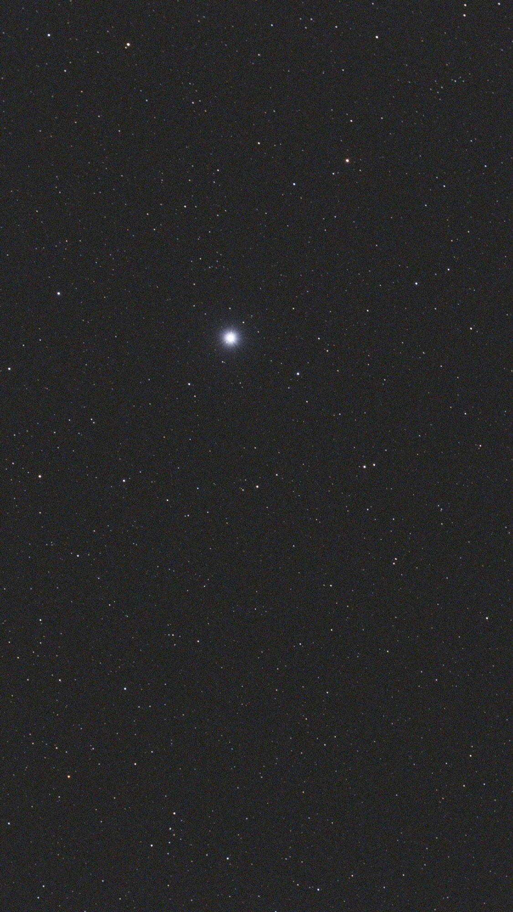</figure>

The stars in that frame are the ruler, but the frame cannot be measured raw as it comes off the sensor.

**Binning** is adding up a block of neighboring pixels and treating the total as a single larger pixel. Binning 2 × 2 turns every square of four into one, so the frame comes out half as wide and half as tall — and one binned pixel covers exactly one tile of the Bayer mosaic, which turns out to matter here.

Binning is normally done to trade resolution for signal, and the reason that trade is favorable is worth slowing down for. Starlight adds coherently: every pixel's share of the star pushes the total the same way, so four pixels summed give four times the signal. Read noise does not behave like that. It is a random wobble in each pixel, as likely to be positive as negative, so adding four of them lets some cancel against the others. Four random ±1 errors do not give ±4; they typically give about ±2. In general n independent random errors combine to √n rather than n — they add in quadrature, the same rule that makes a right triangle's hypotenuse √(a² + b²) instead of a + b. So four binned pixels carry **four times** the starlight and only **twice** the noise, and the ratio between them — the thing that decides whether anything is measurable at all — doubles. The cost is detail: half the width and half the height, gone for good.

Here binning is doing a different job, and the lost detail is affordable because the thing being measured is a star's blob width several pixels across rather than anything finer.

The problem it solves is the mosaic met back at the filter step. Because every pixel sits under its own dye, neighboring pixels are not equally sensitive, and a green one and a red one report different numbers for the same starlight. What we are trying to measure is a *shape* — how the brightness falls away from the star's center — and a shape is read by comparing each pixel against the next one along. Do that on the raw mosaic and you measure the star's profile multiplied by the filter pattern, rather than the profile itself.

Binning is the obvious way out, and it is where we started. Because a 2 × 2 block covers one whole tile, it always catches one red, one blue and two green wherever it lands — so every binned pixel sums the identical set of filters, and a sensitivity that varied from pixel to pixel becomes one flat factor applied everywhere. A constant factor cannot distort a shape, and normalizing each star to its own peak divides it out completely. That is why the block is 2 × 2 and not some other size: it matches the mosaic's period exactly.

<figure class="medium">
<svg viewBox="0 0 700 200" style="width:100%;height:auto" role="img" aria-label="Left, one two-by-two mosaic tile of green, red, blue and green summed into a single gray pixel. Right, a patch of the mosaic becoming a grid of identical binned pixels, the same area at half the resolution">
  <defs>
    <marker id="ba" markerUnits="userSpaceOnUse" markerWidth="9" markerHeight="9" refX="8" refY="4" orient="auto"><path d="M0,0 L9,4 L0,8 z" fill="#8b949e"/></marker>
  </defs>
  <g shape-rendering="crispEdges">
    <rect x="22"   y="70"   width="30" height="30" fill="#4a9d5b"/>
    <rect x="52" y="70"   width="30" height="30" fill="#d1584a"/>
    <rect x="22"   y="100" width="30" height="30" fill="#4a86c8"/>
    <rect x="52" y="100" width="30" height="30" fill="#4a9d5b"/>
    <rect x="130" y="70" width="60" height="60" fill="#7d8a80"/>
  </g>
  <rect x="22" y="70" width="60" height="60" fill="none" stroke="#1f2328" stroke-width="2"/>
  <rect x="130" y="70" width="60" height="60" fill="none" stroke="#1f2328" stroke-width="2"/>
  <line x1="94" y1="100" x2="124" y2="100" stroke="#8b949e" stroke-width="1.6" marker-end="url(#ba)"/>
  <g shape-rendering="crispEdges">
    <rect x="270" y="20" width="6" height="6" fill="#4a9d5b"/><rect x="278" y="20" width="6" height="6" fill="#d1584a"/><rect x="286" y="20" width="6" height="6" fill="#4a9d5b"/><rect x="294" y="20" width="6" height="6" fill="#d1584a"/><rect x="302" y="20" width="6" height="6" fill="#4a9d5b"/><rect x="310" y="20" width="6" height="6" fill="#d1584a"/><rect x="318" y="20" width="6" height="6" fill="#4a9d5b"/><rect x="326" y="20" width="6" height="6" fill="#d1584a"/><rect x="334" y="20" width="6" height="6" fill="#4a9d5b"/><rect x="342" y="20" width="6" height="6" fill="#d1584a"/><rect x="350" y="20" width="6" height="6" fill="#4a9d5b"/><rect x="358" y="20" width="6" height="6" fill="#d1584a"/><rect x="366" y="20" width="6" height="6" fill="#4a9d5b"/><rect x="374" y="20" width="6" height="6" fill="#d1584a"/><rect x="382" y="20" width="6" height="6" fill="#4a9d5b"/><rect x="390" y="20" width="6" height="6" fill="#d1584a"/><rect x="398" y="20" width="6" height="6" fill="#4a9d5b"/><rect x="406" y="20" width="6" height="6" fill="#d1584a"/><rect x="414" y="20" width="6" height="6" fill="#4a9d5b"/><rect x="422" y="20" width="6" height="6" fill="#d1584a"/>
    <rect x="270" y="28" width="6" height="6" fill="#4a86c8"/><rect x="278" y="28" width="6" height="6" fill="#4a9d5b"/><rect x="286" y="28" width="6" height="6" fill="#4a86c8"/><rect x="294" y="28" width="6" height="6" fill="#4a9d5b"/><rect x="302" y="28" width="6" height="6" fill="#4a86c8"/><rect x="310" y="28" width="6" height="6" fill="#4a9d5b"/><rect x="318" y="28" width="6" height="6" fill="#4a86c8"/><rect x="326" y="28" width="6" height="6" fill="#4a9d5b"/><rect x="334" y="28" width="6" height="6" fill="#4a86c8"/><rect x="342" y="28" width="6" height="6" fill="#4a9d5b"/><rect x="350" y="28" width="6" height="6" fill="#4a86c8"/><rect x="358" y="28" width="6" height="6" fill="#4a9d5b"/><rect x="366" y="28" width="6" height="6" fill="#4a86c8"/><rect x="374" y="28" width="6" height="6" fill="#4a9d5b"/><rect x="382" y="28" width="6" height="6" fill="#4a86c8"/><rect x="390" y="28" width="6" height="6" fill="#4a9d5b"/><rect x="398" y="28" width="6" height="6" fill="#4a86c8"/><rect x="406" y="28" width="6" height="6" fill="#4a9d5b"/><rect x="414" y="28" width="6" height="6" fill="#4a86c8"/><rect x="422" y="28" width="6" height="6" fill="#4a9d5b"/>
    <rect x="270" y="36" width="6" height="6" fill="#4a9d5b"/><rect x="278" y="36" width="6" height="6" fill="#d1584a"/><rect x="286" y="36" width="6" height="6" fill="#4a9d5b"/><rect x="294" y="36" width="6" height="6" fill="#d1584a"/><rect x="302" y="36" width="6" height="6" fill="#4a9d5b"/><rect x="310" y="36" width="6" height="6" fill="#d1584a"/><rect x="318" y="36" width="6" height="6" fill="#4a9d5b"/><rect x="326" y="36" width="6" height="6" fill="#d1584a"/><rect x="334" y="36" width="6" height="6" fill="#4a9d5b"/><rect x="342" y="36" width="6" height="6" fill="#d1584a"/><rect x="350" y="36" width="6" height="6" fill="#4a9d5b"/><rect x="358" y="36" width="6" height="6" fill="#d1584a"/><rect x="366" y="36" width="6" height="6" fill="#4a9d5b"/><rect x="374" y="36" width="6" height="6" fill="#d1584a"/><rect x="382" y="36" width="6" height="6" fill="#4a9d5b"/><rect x="390" y="36" width="6" height="6" fill="#d1584a"/><rect x="398" y="36" width="6" height="6" fill="#4a9d5b"/><rect x="406" y="36" width="6" height="6" fill="#d1584a"/><rect x="414" y="36" width="6" height="6" fill="#4a9d5b"/><rect x="422" y="36" width="6" height="6" fill="#d1584a"/>
    <rect x="270" y="44" width="6" height="6" fill="#4a86c8"/><rect x="278" y="44" width="6" height="6" fill="#4a9d5b"/><rect x="286" y="44" width="6" height="6" fill="#4a86c8"/><rect x="294" y="44" width="6" height="6" fill="#4a9d5b"/><rect x="302" y="44" width="6" height="6" fill="#4a86c8"/><rect x="310" y="44" width="6" height="6" fill="#4a9d5b"/><rect x="318" y="44" width="6" height="6" fill="#4a86c8"/><rect x="326" y="44" width="6" height="6" fill="#4a9d5b"/><rect x="334" y="44" width="6" height="6" fill="#4a86c8"/><rect x="342" y="44" width="6" height="6" fill="#4a9d5b"/><rect x="350" y="44" width="6" height="6" fill="#4a86c8"/><rect x="358" y="44" width="6" height="6" fill="#4a9d5b"/><rect x="366" y="44" width="6" height="6" fill="#4a86c8"/><rect x="374" y="44" width="6" height="6" fill="#4a9d5b"/><rect x="382" y="44" width="6" height="6" fill="#4a86c8"/><rect x="390" y="44" width="6" height="6" fill="#4a9d5b"/><rect x="398" y="44" width="6" height="6" fill="#4a86c8"/><rect x="406" y="44" width="6" height="6" fill="#4a9d5b"/><rect x="414" y="44" width="6" height="6" fill="#4a86c8"/><rect x="422" y="44" width="6" height="6" fill="#4a9d5b"/>
    <rect x="270" y="52" width="6" height="6" fill="#4a9d5b"/><rect x="278" y="52" width="6" height="6" fill="#d1584a"/><rect x="286" y="52" width="6" height="6" fill="#4a9d5b"/><rect x="294" y="52" width="6" height="6" fill="#d1584a"/><rect x="302" y="52" width="6" height="6" fill="#4a9d5b"/><rect x="310" y="52" width="6" height="6" fill="#d1584a"/><rect x="318" y="52" width="6" height="6" fill="#4a9d5b"/><rect x="326" y="52" width="6" height="6" fill="#d1584a"/><rect x="334" y="52" width="6" height="6" fill="#4a9d5b"/><rect x="342" y="52" width="6" height="6" fill="#d1584a"/><rect x="350" y="52" width="6" height="6" fill="#4a9d5b"/><rect x="358" y="52" width="6" height="6" fill="#d1584a"/><rect x="366" y="52" width="6" height="6" fill="#4a9d5b"/><rect x="374" y="52" width="6" height="6" fill="#d1584a"/><rect x="382" y="52" width="6" height="6" fill="#4a9d5b"/><rect x="390" y="52" width="6" height="6" fill="#d1584a"/><rect x="398" y="52" width="6" height="6" fill="#4a9d5b"/><rect x="406" y="52" width="6" height="6" fill="#d1584a"/><rect x="414" y="52" width="6" height="6" fill="#4a9d5b"/><rect x="422" y="52" width="6" height="6" fill="#d1584a"/>
    <rect x="270" y="60" width="6" height="6" fill="#4a86c8"/><rect x="278" y="60" width="6" height="6" fill="#4a9d5b"/><rect x="286" y="60" width="6" height="6" fill="#4a86c8"/><rect x="294" y="60" width="6" height="6" fill="#4a9d5b"/><rect x="302" y="60" width="6" height="6" fill="#4a86c8"/><rect x="310" y="60" width="6" height="6" fill="#4a9d5b"/><rect x="318" y="60" width="6" height="6" fill="#4a86c8"/><rect x="326" y="60" width="6" height="6" fill="#4a9d5b"/><rect x="334" y="60" width="6" height="6" fill="#4a86c8"/><rect x="342" y="60" width="6" height="6" fill="#4a9d5b"/><rect x="350" y="60" width="6" height="6" fill="#4a86c8"/><rect x="358" y="60" width="6" height="6" fill="#4a9d5b"/><rect x="366" y="60" width="6" height="6" fill="#4a86c8"/><rect x="374" y="60" width="6" height="6" fill="#4a9d5b"/><rect x="382" y="60" width="6" height="6" fill="#4a86c8"/><rect x="390" y="60" width="6" height="6" fill="#4a9d5b"/><rect x="398" y="60" width="6" height="6" fill="#4a86c8"/><rect x="406" y="60" width="6" height="6" fill="#4a9d5b"/><rect x="414" y="60" width="6" height="6" fill="#4a86c8"/><rect x="422" y="60" width="6" height="6" fill="#4a9d5b"/>
    <rect x="270" y="68" width="6" height="6" fill="#4a9d5b"/><rect x="278" y="68" width="6" height="6" fill="#d1584a"/><rect x="286" y="68" width="6" height="6" fill="#4a9d5b"/><rect x="294" y="68" width="6" height="6" fill="#d1584a"/><rect x="302" y="68" width="6" height="6" fill="#4a9d5b"/><rect x="310" y="68" width="6" height="6" fill="#d1584a"/><rect x="318" y="68" width="6" height="6" fill="#4a9d5b"/><rect x="326" y="68" width="6" height="6" fill="#d1584a"/><rect x="334" y="68" width="6" height="6" fill="#4a9d5b"/><rect x="342" y="68" width="6" height="6" fill="#d1584a"/><rect x="350" y="68" width="6" height="6" fill="#4a9d5b"/><rect x="358" y="68" width="6" height="6" fill="#d1584a"/><rect x="366" y="68" width="6" height="6" fill="#4a9d5b"/><rect x="374" y="68" width="6" height="6" fill="#d1584a"/><rect x="382" y="68" width="6" height="6" fill="#4a9d5b"/><rect x="390" y="68" width="6" height="6" fill="#d1584a"/><rect x="398" y="68" width="6" height="6" fill="#4a9d5b"/><rect x="406" y="68" width="6" height="6" fill="#d1584a"/><rect x="414" y="68" width="6" height="6" fill="#4a9d5b"/><rect x="422" y="68" width="6" height="6" fill="#d1584a"/>
    <rect x="270" y="76" width="6" height="6" fill="#4a86c8"/><rect x="278" y="76" width="6" height="6" fill="#4a9d5b"/><rect x="286" y="76" width="6" height="6" fill="#4a86c8"/><rect x="294" y="76" width="6" height="6" fill="#4a9d5b"/><rect x="302" y="76" width="6" height="6" fill="#4a86c8"/><rect x="310" y="76" width="6" height="6" fill="#4a9d5b"/><rect x="318" y="76" width="6" height="6" fill="#4a86c8"/><rect x="326" y="76" width="6" height="6" fill="#4a9d5b"/><rect x="334" y="76" width="6" height="6" fill="#4a86c8"/><rect x="342" y="76" width="6" height="6" fill="#4a9d5b"/><rect x="350" y="76" width="6" height="6" fill="#4a86c8"/><rect x="358" y="76" width="6" height="6" fill="#4a9d5b"/><rect x="366" y="76" width="6" height="6" fill="#4a86c8"/><rect x="374" y="76" width="6" height="6" fill="#4a9d5b"/><rect x="382" y="76" width="6" height="6" fill="#4a86c8"/><rect x="390" y="76" width="6" height="6" fill="#4a9d5b"/><rect x="398" y="76" width="6" height="6" fill="#4a86c8"/><rect x="406" y="76" width="6" height="6" fill="#4a9d5b"/><rect x="414" y="76" width="6" height="6" fill="#4a86c8"/><rect x="422" y="76" width="6" height="6" fill="#4a9d5b"/>
    <rect x="270" y="84" width="6" height="6" fill="#4a9d5b"/><rect x="278" y="84" width="6" height="6" fill="#d1584a"/><rect x="286" y="84" width="6" height="6" fill="#4a9d5b"/><rect x="294" y="84" width="6" height="6" fill="#d1584a"/><rect x="302" y="84" width="6" height="6" fill="#4a9d5b"/><rect x="310" y="84" width="6" height="6" fill="#d1584a"/><rect x="318" y="84" width="6" height="6" fill="#4a9d5b"/><rect x="326" y="84" width="6" height="6" fill="#d1584a"/><rect x="334" y="84" width="6" height="6" fill="#4a9d5b"/><rect x="342" y="84" width="6" height="6" fill="#d1584a"/><rect x="350" y="84" width="6" height="6" fill="#4a9d5b"/><rect x="358" y="84" width="6" height="6" fill="#d1584a"/><rect x="366" y="84" width="6" height="6" fill="#4a9d5b"/><rect x="374" y="84" width="6" height="6" fill="#d1584a"/><rect x="382" y="84" width="6" height="6" fill="#4a9d5b"/><rect x="390" y="84" width="6" height="6" fill="#d1584a"/><rect x="398" y="84" width="6" height="6" fill="#4a9d5b"/><rect x="406" y="84" width="6" height="6" fill="#d1584a"/><rect x="414" y="84" width="6" height="6" fill="#4a9d5b"/><rect x="422" y="84" width="6" height="6" fill="#d1584a"/>
    <rect x="270" y="92" width="6" height="6" fill="#4a86c8"/><rect x="278" y="92" width="6" height="6" fill="#4a9d5b"/><rect x="286" y="92" width="6" height="6" fill="#4a86c8"/><rect x="294" y="92" width="6" height="6" fill="#4a9d5b"/><rect x="302" y="92" width="6" height="6" fill="#4a86c8"/><rect x="310" y="92" width="6" height="6" fill="#4a9d5b"/><rect x="318" y="92" width="6" height="6" fill="#4a86c8"/><rect x="326" y="92" width="6" height="6" fill="#4a9d5b"/><rect x="334" y="92" width="6" height="6" fill="#4a86c8"/><rect x="342" y="92" width="6" height="6" fill="#4a9d5b"/><rect x="350" y="92" width="6" height="6" fill="#4a86c8"/><rect x="358" y="92" width="6" height="6" fill="#4a9d5b"/><rect x="366" y="92" width="6" height="6" fill="#4a86c8"/><rect x="374" y="92" width="6" height="6" fill="#4a9d5b"/><rect x="382" y="92" width="6" height="6" fill="#4a86c8"/><rect x="390" y="92" width="6" height="6" fill="#4a9d5b"/><rect x="398" y="92" width="6" height="6" fill="#4a86c8"/><rect x="406" y="92" width="6" height="6" fill="#4a9d5b"/><rect x="414" y="92" width="6" height="6" fill="#4a86c8"/><rect x="422" y="92" width="6" height="6" fill="#4a9d5b"/>
    <rect x="270" y="100" width="6" height="6" fill="#4a9d5b"/><rect x="278" y="100" width="6" height="6" fill="#d1584a"/><rect x="286" y="100" width="6" height="6" fill="#4a9d5b"/><rect x="294" y="100" width="6" height="6" fill="#d1584a"/><rect x="302" y="100" width="6" height="6" fill="#4a9d5b"/><rect x="310" y="100" width="6" height="6" fill="#d1584a"/><rect x="318" y="100" width="6" height="6" fill="#4a9d5b"/><rect x="326" y="100" width="6" height="6" fill="#d1584a"/><rect x="334" y="100" width="6" height="6" fill="#4a9d5b"/><rect x="342" y="100" width="6" height="6" fill="#d1584a"/><rect x="350" y="100" width="6" height="6" fill="#4a9d5b"/><rect x="358" y="100" width="6" height="6" fill="#d1584a"/><rect x="366" y="100" width="6" height="6" fill="#4a9d5b"/><rect x="374" y="100" width="6" height="6" fill="#d1584a"/><rect x="382" y="100" width="6" height="6" fill="#4a9d5b"/><rect x="390" y="100" width="6" height="6" fill="#d1584a"/><rect x="398" y="100" width="6" height="6" fill="#4a9d5b"/><rect x="406" y="100" width="6" height="6" fill="#d1584a"/><rect x="414" y="100" width="6" height="6" fill="#4a9d5b"/><rect x="422" y="100" width="6" height="6" fill="#d1584a"/>
    <rect x="270" y="108" width="6" height="6" fill="#4a86c8"/><rect x="278" y="108" width="6" height="6" fill="#4a9d5b"/><rect x="286" y="108" width="6" height="6" fill="#4a86c8"/><rect x="294" y="108" width="6" height="6" fill="#4a9d5b"/><rect x="302" y="108" width="6" height="6" fill="#4a86c8"/><rect x="310" y="108" width="6" height="6" fill="#4a9d5b"/><rect x="318" y="108" width="6" height="6" fill="#4a86c8"/><rect x="326" y="108" width="6" height="6" fill="#4a9d5b"/><rect x="334" y="108" width="6" height="6" fill="#4a86c8"/><rect x="342" y="108" width="6" height="6" fill="#4a9d5b"/><rect x="350" y="108" width="6" height="6" fill="#4a86c8"/><rect x="358" y="108" width="6" height="6" fill="#4a9d5b"/><rect x="366" y="108" width="6" height="6" fill="#4a86c8"/><rect x="374" y="108" width="6" height="6" fill="#4a9d5b"/><rect x="382" y="108" width="6" height="6" fill="#4a86c8"/><rect x="390" y="108" width="6" height="6" fill="#4a9d5b"/><rect x="398" y="108" width="6" height="6" fill="#4a86c8"/><rect x="406" y="108" width="6" height="6" fill="#4a9d5b"/><rect x="414" y="108" width="6" height="6" fill="#4a86c8"/><rect x="422" y="108" width="6" height="6" fill="#4a9d5b"/>
    <rect x="270" y="116" width="6" height="6" fill="#4a9d5b"/><rect x="278" y="116" width="6" height="6" fill="#d1584a"/><rect x="286" y="116" width="6" height="6" fill="#4a9d5b"/><rect x="294" y="116" width="6" height="6" fill="#d1584a"/><rect x="302" y="116" width="6" height="6" fill="#4a9d5b"/><rect x="310" y="116" width="6" height="6" fill="#d1584a"/><rect x="318" y="116" width="6" height="6" fill="#4a9d5b"/><rect x="326" y="116" width="6" height="6" fill="#d1584a"/><rect x="334" y="116" width="6" height="6" fill="#4a9d5b"/><rect x="342" y="116" width="6" height="6" fill="#d1584a"/><rect x="350" y="116" width="6" height="6" fill="#4a9d5b"/><rect x="358" y="116" width="6" height="6" fill="#d1584a"/><rect x="366" y="116" width="6" height="6" fill="#4a9d5b"/><rect x="374" y="116" width="6" height="6" fill="#d1584a"/><rect x="382" y="116" width="6" height="6" fill="#4a9d5b"/><rect x="390" y="116" width="6" height="6" fill="#d1584a"/><rect x="398" y="116" width="6" height="6" fill="#4a9d5b"/><rect x="406" y="116" width="6" height="6" fill="#d1584a"/><rect x="414" y="116" width="6" height="6" fill="#4a9d5b"/><rect x="422" y="116" width="6" height="6" fill="#d1584a"/>
    <rect x="270" y="124" width="6" height="6" fill="#4a86c8"/><rect x="278" y="124" width="6" height="6" fill="#4a9d5b"/><rect x="286" y="124" width="6" height="6" fill="#4a86c8"/><rect x="294" y="124" width="6" height="6" fill="#4a9d5b"/><rect x="302" y="124" width="6" height="6" fill="#4a86c8"/><rect x="310" y="124" width="6" height="6" fill="#4a9d5b"/><rect x="318" y="124" width="6" height="6" fill="#4a86c8"/><rect x="326" y="124" width="6" height="6" fill="#4a9d5b"/><rect x="334" y="124" width="6" height="6" fill="#4a86c8"/><rect x="342" y="124" width="6" height="6" fill="#4a9d5b"/><rect x="350" y="124" width="6" height="6" fill="#4a86c8"/><rect x="358" y="124" width="6" height="6" fill="#4a9d5b"/><rect x="366" y="124" width="6" height="6" fill="#4a86c8"/><rect x="374" y="124" width="6" height="6" fill="#4a9d5b"/><rect x="382" y="124" width="6" height="6" fill="#4a86c8"/><rect x="390" y="124" width="6" height="6" fill="#4a9d5b"/><rect x="398" y="124" width="6" height="6" fill="#4a86c8"/><rect x="406" y="124" width="6" height="6" fill="#4a9d5b"/><rect x="414" y="124" width="6" height="6" fill="#4a86c8"/><rect x="422" y="124" width="6" height="6" fill="#4a9d5b"/>
    <rect x="270" y="132" width="6" height="6" fill="#4a9d5b"/><rect x="278" y="132" width="6" height="6" fill="#d1584a"/><rect x="286" y="132" width="6" height="6" fill="#4a9d5b"/><rect x="294" y="132" width="6" height="6" fill="#d1584a"/><rect x="302" y="132" width="6" height="6" fill="#4a9d5b"/><rect x="310" y="132" width="6" height="6" fill="#d1584a"/><rect x="318" y="132" width="6" height="6" fill="#4a9d5b"/><rect x="326" y="132" width="6" height="6" fill="#d1584a"/><rect x="334" y="132" width="6" height="6" fill="#4a9d5b"/><rect x="342" y="132" width="6" height="6" fill="#d1584a"/><rect x="350" y="132" width="6" height="6" fill="#4a9d5b"/><rect x="358" y="132" width="6" height="6" fill="#d1584a"/><rect x="366" y="132" width="6" height="6" fill="#4a9d5b"/><rect x="374" y="132" width="6" height="6" fill="#d1584a"/><rect x="382" y="132" width="6" height="6" fill="#4a9d5b"/><rect x="390" y="132" width="6" height="6" fill="#d1584a"/><rect x="398" y="132" width="6" height="6" fill="#4a9d5b"/><rect x="406" y="132" width="6" height="6" fill="#d1584a"/><rect x="414" y="132" width="6" height="6" fill="#4a9d5b"/><rect x="422" y="132" width="6" height="6" fill="#d1584a"/>
    <rect x="270" y="140" width="6" height="6" fill="#4a86c8"/><rect x="278" y="140" width="6" height="6" fill="#4a9d5b"/><rect x="286" y="140" width="6" height="6" fill="#4a86c8"/><rect x="294" y="140" width="6" height="6" fill="#4a9d5b"/><rect x="302" y="140" width="6" height="6" fill="#4a86c8"/><rect x="310" y="140" width="6" height="6" fill="#4a9d5b"/><rect x="318" y="140" width="6" height="6" fill="#4a86c8"/><rect x="326" y="140" width="6" height="6" fill="#4a9d5b"/><rect x="334" y="140" width="6" height="6" fill="#4a86c8"/><rect x="342" y="140" width="6" height="6" fill="#4a9d5b"/><rect x="350" y="140" width="6" height="6" fill="#4a86c8"/><rect x="358" y="140" width="6" height="6" fill="#4a9d5b"/><rect x="366" y="140" width="6" height="6" fill="#4a86c8"/><rect x="374" y="140" width="6" height="6" fill="#4a9d5b"/><rect x="382" y="140" width="6" height="6" fill="#4a86c8"/><rect x="390" y="140" width="6" height="6" fill="#4a9d5b"/><rect x="398" y="140" width="6" height="6" fill="#4a86c8"/><rect x="406" y="140" width="6" height="6" fill="#4a9d5b"/><rect x="414" y="140" width="6" height="6" fill="#4a86c8"/><rect x="422" y="140" width="6" height="6" fill="#4a9d5b"/>
    <rect x="270" y="148" width="6" height="6" fill="#4a9d5b"/><rect x="278" y="148" width="6" height="6" fill="#d1584a"/><rect x="286" y="148" width="6" height="6" fill="#4a9d5b"/><rect x="294" y="148" width="6" height="6" fill="#d1584a"/><rect x="302" y="148" width="6" height="6" fill="#4a9d5b"/><rect x="310" y="148" width="6" height="6" fill="#d1584a"/><rect x="318" y="148" width="6" height="6" fill="#4a9d5b"/><rect x="326" y="148" width="6" height="6" fill="#d1584a"/><rect x="334" y="148" width="6" height="6" fill="#4a9d5b"/><rect x="342" y="148" width="6" height="6" fill="#d1584a"/><rect x="350" y="148" width="6" height="6" fill="#4a9d5b"/><rect x="358" y="148" width="6" height="6" fill="#d1584a"/><rect x="366" y="148" width="6" height="6" fill="#4a9d5b"/><rect x="374" y="148" width="6" height="6" fill="#d1584a"/><rect x="382" y="148" width="6" height="6" fill="#4a9d5b"/><rect x="390" y="148" width="6" height="6" fill="#d1584a"/><rect x="398" y="148" width="6" height="6" fill="#4a9d5b"/><rect x="406" y="148" width="6" height="6" fill="#d1584a"/><rect x="414" y="148" width="6" height="6" fill="#4a9d5b"/><rect x="422" y="148" width="6" height="6" fill="#d1584a"/>
    <rect x="270" y="156" width="6" height="6" fill="#4a86c8"/><rect x="278" y="156" width="6" height="6" fill="#4a9d5b"/><rect x="286" y="156" width="6" height="6" fill="#4a86c8"/><rect x="294" y="156" width="6" height="6" fill="#4a9d5b"/><rect x="302" y="156" width="6" height="6" fill="#4a86c8"/><rect x="310" y="156" width="6" height="6" fill="#4a9d5b"/><rect x="318" y="156" width="6" height="6" fill="#4a86c8"/><rect x="326" y="156" width="6" height="6" fill="#4a9d5b"/><rect x="334" y="156" width="6" height="6" fill="#4a86c8"/><rect x="342" y="156" width="6" height="6" fill="#4a9d5b"/><rect x="350" y="156" width="6" height="6" fill="#4a86c8"/><rect x="358" y="156" width="6" height="6" fill="#4a9d5b"/><rect x="366" y="156" width="6" height="6" fill="#4a86c8"/><rect x="374" y="156" width="6" height="6" fill="#4a9d5b"/><rect x="382" y="156" width="6" height="6" fill="#4a86c8"/><rect x="390" y="156" width="6" height="6" fill="#4a9d5b"/><rect x="398" y="156" width="6" height="6" fill="#4a86c8"/><rect x="406" y="156" width="6" height="6" fill="#4a9d5b"/><rect x="414" y="156" width="6" height="6" fill="#4a86c8"/><rect x="422" y="156" width="6" height="6" fill="#4a9d5b"/>
    <rect x="270" y="164" width="6" height="6" fill="#4a9d5b"/><rect x="278" y="164" width="6" height="6" fill="#d1584a"/><rect x="286" y="164" width="6" height="6" fill="#4a9d5b"/><rect x="294" y="164" width="6" height="6" fill="#d1584a"/><rect x="302" y="164" width="6" height="6" fill="#4a9d5b"/><rect x="310" y="164" width="6" height="6" fill="#d1584a"/><rect x="318" y="164" width="6" height="6" fill="#4a9d5b"/><rect x="326" y="164" width="6" height="6" fill="#d1584a"/><rect x="334" y="164" width="6" height="6" fill="#4a9d5b"/><rect x="342" y="164" width="6" height="6" fill="#d1584a"/><rect x="350" y="164" width="6" height="6" fill="#4a9d5b"/><rect x="358" y="164" width="6" height="6" fill="#d1584a"/><rect x="366" y="164" width="6" height="6" fill="#4a9d5b"/><rect x="374" y="164" width="6" height="6" fill="#d1584a"/><rect x="382" y="164" width="6" height="6" fill="#4a9d5b"/><rect x="390" y="164" width="6" height="6" fill="#d1584a"/><rect x="398" y="164" width="6" height="6" fill="#4a9d5b"/><rect x="406" y="164" width="6" height="6" fill="#d1584a"/><rect x="414" y="164" width="6" height="6" fill="#4a9d5b"/><rect x="422" y="164" width="6" height="6" fill="#d1584a"/>
    <rect x="270" y="172" width="6" height="6" fill="#4a86c8"/><rect x="278" y="172" width="6" height="6" fill="#4a9d5b"/><rect x="286" y="172" width="6" height="6" fill="#4a86c8"/><rect x="294" y="172" width="6" height="6" fill="#4a9d5b"/><rect x="302" y="172" width="6" height="6" fill="#4a86c8"/><rect x="310" y="172" width="6" height="6" fill="#4a9d5b"/><rect x="318" y="172" width="6" height="6" fill="#4a86c8"/><rect x="326" y="172" width="6" height="6" fill="#4a9d5b"/><rect x="334" y="172" width="6" height="6" fill="#4a86c8"/><rect x="342" y="172" width="6" height="6" fill="#4a9d5b"/><rect x="350" y="172" width="6" height="6" fill="#4a86c8"/><rect x="358" y="172" width="6" height="6" fill="#4a9d5b"/><rect x="366" y="172" width="6" height="6" fill="#4a86c8"/><rect x="374" y="172" width="6" height="6" fill="#4a9d5b"/><rect x="382" y="172" width="6" height="6" fill="#4a86c8"/><rect x="390" y="172" width="6" height="6" fill="#4a9d5b"/><rect x="398" y="172" width="6" height="6" fill="#4a86c8"/><rect x="406" y="172" width="6" height="6" fill="#4a9d5b"/><rect x="414" y="172" width="6" height="6" fill="#4a86c8"/><rect x="422" y="172" width="6" height="6" fill="#4a9d5b"/>
    <rect x="500" y="20" width="14" height="14" fill="#7d8a80"/><rect x="516" y="20" width="14" height="14" fill="#7d8a80"/><rect x="532" y="20" width="14" height="14" fill="#7d8a80"/><rect x="548" y="20" width="14" height="14" fill="#7d8a80"/><rect x="564" y="20" width="14" height="14" fill="#7d8a80"/><rect x="580" y="20" width="14" height="14" fill="#7d8a80"/><rect x="596" y="20" width="14" height="14" fill="#7d8a80"/><rect x="612" y="20" width="14" height="14" fill="#7d8a80"/><rect x="628" y="20" width="14" height="14" fill="#7d8a80"/><rect x="644" y="20" width="14" height="14" fill="#7d8a80"/>
    <rect x="500" y="36" width="14" height="14" fill="#7d8a80"/><rect x="516" y="36" width="14" height="14" fill="#7d8a80"/><rect x="532" y="36" width="14" height="14" fill="#7d8a80"/><rect x="548" y="36" width="14" height="14" fill="#7d8a80"/><rect x="564" y="36" width="14" height="14" fill="#7d8a80"/><rect x="580" y="36" width="14" height="14" fill="#7d8a80"/><rect x="596" y="36" width="14" height="14" fill="#7d8a80"/><rect x="612" y="36" width="14" height="14" fill="#7d8a80"/><rect x="628" y="36" width="14" height="14" fill="#7d8a80"/><rect x="644" y="36" width="14" height="14" fill="#7d8a80"/>
    <rect x="500" y="52" width="14" height="14" fill="#7d8a80"/><rect x="516" y="52" width="14" height="14" fill="#7d8a80"/><rect x="532" y="52" width="14" height="14" fill="#7d8a80"/><rect x="548" y="52" width="14" height="14" fill="#7d8a80"/><rect x="564" y="52" width="14" height="14" fill="#7d8a80"/><rect x="580" y="52" width="14" height="14" fill="#7d8a80"/><rect x="596" y="52" width="14" height="14" fill="#7d8a80"/><rect x="612" y="52" width="14" height="14" fill="#7d8a80"/><rect x="628" y="52" width="14" height="14" fill="#7d8a80"/><rect x="644" y="52" width="14" height="14" fill="#7d8a80"/>
    <rect x="500" y="68" width="14" height="14" fill="#7d8a80"/><rect x="516" y="68" width="14" height="14" fill="#7d8a80"/><rect x="532" y="68" width="14" height="14" fill="#7d8a80"/><rect x="548" y="68" width="14" height="14" fill="#7d8a80"/><rect x="564" y="68" width="14" height="14" fill="#7d8a80"/><rect x="580" y="68" width="14" height="14" fill="#7d8a80"/><rect x="596" y="68" width="14" height="14" fill="#7d8a80"/><rect x="612" y="68" width="14" height="14" fill="#7d8a80"/><rect x="628" y="68" width="14" height="14" fill="#7d8a80"/><rect x="644" y="68" width="14" height="14" fill="#7d8a80"/>
    <rect x="500" y="84" width="14" height="14" fill="#7d8a80"/><rect x="516" y="84" width="14" height="14" fill="#7d8a80"/><rect x="532" y="84" width="14" height="14" fill="#7d8a80"/><rect x="548" y="84" width="14" height="14" fill="#7d8a80"/><rect x="564" y="84" width="14" height="14" fill="#7d8a80"/><rect x="580" y="84" width="14" height="14" fill="#7d8a80"/><rect x="596" y="84" width="14" height="14" fill="#7d8a80"/><rect x="612" y="84" width="14" height="14" fill="#7d8a80"/><rect x="628" y="84" width="14" height="14" fill="#7d8a80"/><rect x="644" y="84" width="14" height="14" fill="#7d8a80"/>
    <rect x="500" y="100" width="14" height="14" fill="#7d8a80"/><rect x="516" y="100" width="14" height="14" fill="#7d8a80"/><rect x="532" y="100" width="14" height="14" fill="#7d8a80"/><rect x="548" y="100" width="14" height="14" fill="#7d8a80"/><rect x="564" y="100" width="14" height="14" fill="#7d8a80"/><rect x="580" y="100" width="14" height="14" fill="#7d8a80"/><rect x="596" y="100" width="14" height="14" fill="#7d8a80"/><rect x="612" y="100" width="14" height="14" fill="#7d8a80"/><rect x="628" y="100" width="14" height="14" fill="#7d8a80"/><rect x="644" y="100" width="14" height="14" fill="#7d8a80"/>
    <rect x="500" y="116" width="14" height="14" fill="#7d8a80"/><rect x="516" y="116" width="14" height="14" fill="#7d8a80"/><rect x="532" y="116" width="14" height="14" fill="#7d8a80"/><rect x="548" y="116" width="14" height="14" fill="#7d8a80"/><rect x="564" y="116" width="14" height="14" fill="#7d8a80"/><rect x="580" y="116" width="14" height="14" fill="#7d8a80"/><rect x="596" y="116" width="14" height="14" fill="#7d8a80"/><rect x="612" y="116" width="14" height="14" fill="#7d8a80"/><rect x="628" y="116" width="14" height="14" fill="#7d8a80"/><rect x="644" y="116" width="14" height="14" fill="#7d8a80"/>
    <rect x="500" y="132" width="14" height="14" fill="#7d8a80"/><rect x="516" y="132" width="14" height="14" fill="#7d8a80"/><rect x="532" y="132" width="14" height="14" fill="#7d8a80"/><rect x="548" y="132" width="14" height="14" fill="#7d8a80"/><rect x="564" y="132" width="14" height="14" fill="#7d8a80"/><rect x="580" y="132" width="14" height="14" fill="#7d8a80"/><rect x="596" y="132" width="14" height="14" fill="#7d8a80"/><rect x="612" y="132" width="14" height="14" fill="#7d8a80"/><rect x="628" y="132" width="14" height="14" fill="#7d8a80"/><rect x="644" y="132" width="14" height="14" fill="#7d8a80"/>
    <rect x="500" y="148" width="14" height="14" fill="#7d8a80"/><rect x="516" y="148" width="14" height="14" fill="#7d8a80"/><rect x="532" y="148" width="14" height="14" fill="#7d8a80"/><rect x="548" y="148" width="14" height="14" fill="#7d8a80"/><rect x="564" y="148" width="14" height="14" fill="#7d8a80"/><rect x="580" y="148" width="14" height="14" fill="#7d8a80"/><rect x="596" y="148" width="14" height="14" fill="#7d8a80"/><rect x="612" y="148" width="14" height="14" fill="#7d8a80"/><rect x="628" y="148" width="14" height="14" fill="#7d8a80"/><rect x="644" y="148" width="14" height="14" fill="#7d8a80"/>
    <rect x="500" y="164" width="14" height="14" fill="#7d8a80"/><rect x="516" y="164" width="14" height="14" fill="#7d8a80"/><rect x="532" y="164" width="14" height="14" fill="#7d8a80"/><rect x="548" y="164" width="14" height="14" fill="#7d8a80"/><rect x="564" y="164" width="14" height="14" fill="#7d8a80"/><rect x="580" y="164" width="14" height="14" fill="#7d8a80"/><rect x="596" y="164" width="14" height="14" fill="#7d8a80"/><rect x="612" y="164" width="14" height="14" fill="#7d8a80"/><rect x="628" y="164" width="14" height="14" fill="#7d8a80"/><rect x="644" y="164" width="14" height="14" fill="#7d8a80"/>
  </g>
  <line x1="440" y1="98" x2="472" y2="98" stroke="#8b949e" stroke-width="1.6" marker-end="url(#ba)"/>
</svg>
</figure>

The rest is bookkeeping. Local maxima are picked out, keeping only stars bright enough to measure, faint enough not to saturate, and far enough from the edge to have room around them. Each is cut out in a 25 × 25 box — binned pixels, so 50 × 50 of the sensor's own — and normalized to its own peak so a bright star and a faint one count equally, and the boxes are averaged together. The width of that stacked profile at half its height is the number.

That last step needs a word, because a star has no edge. Its brightness fades away smoothly into the sky, so there is no distance at which it stops and no width to read off directly. **Full width at half maximum** picks a repeatable place to measure instead: find the peak, drop to half of it, and measure straight across. Half is not arbitrary — it is roughly where the profile is steepest, and therefore where the crossing point is best determined. Up near the peak or out in the tail the curve is nearly flat, so a tiny error in brightness would slide the crossing a long way sideways and the width would come out different every time.

<figure>
<svg viewBox="0 0 790 300" style="width:100%;height:auto" role="img" aria-label="A star field with a faint and a bright star ringed; each cut out as a grid of binned pixels; the marked row of each turned into a profile in its own color; and both redrawn dashed at a common peak with their black average between them, measured at half maximum against a pixel scale">
  <!-- Grays, bar heights and curves all come from one Gaussian evaluated once,
       so the picture cannot drift from the arithmetic it illustrates. Grids are
       11 x 11 rather than the real 25 x 25 so single pixels stay visible.
       Blue is the faint star, orange the bright one, solid black their average,
       gray the measurement. The dashed pair on the right are the SAME two
       functions as the solid pair left of them -- identical half-width, only
       the height rescaled, which is what normalizing to a common peak does.
       The faint star is drawn at 0.6 of the bright one's peak and no lower:
       squash a Gaussian much further and it stops reading as the same curve
       when redrawn at full height, even though its half-width has not moved. -->
  <defs>
    <marker id="fa" markerUnits="userSpaceOnUse" markerWidth="9" markerHeight="9" refX="8" refY="4" orient="auto"><path d="M0,0 L9,4 L0,8 z" fill="#8b949e"/></marker>
    <marker id="wR" markerUnits="userSpaceOnUse" markerWidth="8" markerHeight="8" refX="8" refY="3.5" orient="auto"><path d="M0,0 L8,3.5 L0,7 z" fill="#8b949e"/></marker>
    <marker id="wL" markerUnits="userSpaceOnUse" markerWidth="8" markerHeight="8" refX="0" refY="3.5" orient="auto"><path d="M8,0 L0,3.5 L8,7 z" fill="#8b949e"/></marker>
  </defs>
  <rect x="10" y="99" width="120" height="92" fill="#14161a"/>
  <g fill="#e8e4dd">
    <circle cx="30" cy="117" r="1.4"/>
    <circle cx="58" cy="109" r="1.1"/>
    <circle cx="104" cy="123" r="1.6"/>
    <circle cx="24" cy="167" r="1.2"/>
    <circle cx="86" cy="177" r="1.3"/>
    <circle cx="118" cy="159" r="1.0"/>
    <circle cx="46" cy="185" r="1.5"/>
    <circle cx="112" cy="185" r="1.1"/>
    <circle cx="44" cy="139" r="2.2"/><circle cx="92" cy="149" r="5.6"/>
  </g>
  <circle cx="44" cy="139" r="8" fill="none" stroke="#3f7fb8" stroke-width="1.8"/>
  <circle cx="92" cy="149" r="11" fill="none" stroke="#d1732a" stroke-width="1.8"/>
  <line x1="156" y1="122" x2="214" y2="82"  stroke="#8b949e" stroke-width="1.4" marker-end="url(#fa)"/>
  <line x1="156" y1="168" x2="214" y2="208" stroke="#8b949e" stroke-width="1.4" marker-end="url(#fa)"/>
  <g shape-rendering="crispEdges">
    <rect x="240" y="15" width="9" height="9" fill="rgb(18,18,18)"/><rect x="249" y="15" width="9" height="9" fill="rgb(18,18,18)"/><rect x="258" y="15" width="9" height="9" fill="rgb(18,18,18)"/><rect x="267" y="15" width="9" height="9" fill="rgb(18,18,18)"/><rect x="276" y="15" width="9" height="9" fill="rgb(19,19,19)"/><rect x="285" y="15" width="9" height="9" fill="rgb(19,19,19)"/><rect x="294" y="15" width="9" height="9" fill="rgb(19,19,19)"/><rect x="303" y="15" width="9" height="9" fill="rgb(18,18,18)"/><rect x="312" y="15" width="9" height="9" fill="rgb(18,18,18)"/><rect x="321" y="15" width="9" height="9" fill="rgb(18,18,18)"/><rect x="330" y="15" width="9" height="9" fill="rgb(18,18,18)"/>
    <rect x="240" y="24" width="9" height="9" fill="rgb(18,18,18)"/><rect x="249" y="24" width="9" height="9" fill="rgb(18,18,18)"/><rect x="258" y="24" width="9" height="9" fill="rgb(19,19,19)"/><rect x="267" y="24" width="9" height="9" fill="rgb(22,22,22)"/><rect x="276" y="24" width="9" height="9" fill="rgb(25,25,25)"/><rect x="285" y="24" width="9" height="9" fill="rgb(26,26,26)"/><rect x="294" y="24" width="9" height="9" fill="rgb(25,25,25)"/><rect x="303" y="24" width="9" height="9" fill="rgb(22,22,22)"/><rect x="312" y="24" width="9" height="9" fill="rgb(19,19,19)"/><rect x="321" y="24" width="9" height="9" fill="rgb(18,18,18)"/><rect x="330" y="24" width="9" height="9" fill="rgb(18,18,18)"/>
    <rect x="240" y="33" width="9" height="9" fill="rgb(18,18,18)"/><rect x="249" y="33" width="9" height="9" fill="rgb(19,19,19)"/><rect x="258" y="33" width="9" height="9" fill="rgb(24,24,24)"/><rect x="267" y="33" width="9" height="9" fill="rgb(32,32,32)"/><rect x="276" y="33" width="9" height="9" fill="rgb(42,42,42)"/><rect x="285" y="33" width="9" height="9" fill="rgb(47,47,47)"/><rect x="294" y="33" width="9" height="9" fill="rgb(42,42,42)"/><rect x="303" y="33" width="9" height="9" fill="rgb(32,32,32)"/><rect x="312" y="33" width="9" height="9" fill="rgb(24,24,24)"/><rect x="321" y="33" width="9" height="9" fill="rgb(19,19,19)"/><rect x="330" y="33" width="9" height="9" fill="rgb(18,18,18)"/>
    <rect x="240" y="42" width="9" height="9" fill="rgb(18,18,18)"/><rect x="249" y="42" width="9" height="9" fill="rgb(22,22,22)"/><rect x="258" y="42" width="9" height="9" fill="rgb(32,32,32)"/><rect x="267" y="42" width="9" height="9" fill="rgb(52,52,52)"/><rect x="276" y="42" width="9" height="9" fill="rgb(76,76,76)"/><rect x="285" y="42" width="9" height="9" fill="rgb(87,87,87)"/><rect x="294" y="42" width="9" height="9" fill="rgb(76,76,76)"/><rect x="303" y="42" width="9" height="9" fill="rgb(52,52,52)"/><rect x="312" y="42" width="9" height="9" fill="rgb(32,32,32)"/><rect x="321" y="42" width="9" height="9" fill="rgb(22,22,22)"/><rect x="330" y="42" width="9" height="9" fill="rgb(18,18,18)"/>
    <rect x="240" y="51" width="9" height="9" fill="rgb(19,19,19)"/><rect x="249" y="51" width="9" height="9" fill="rgb(25,25,25)"/><rect x="258" y="51" width="9" height="9" fill="rgb(42,42,42)"/><rect x="267" y="51" width="9" height="9" fill="rgb(76,76,76)"/><rect x="276" y="51" width="9" height="9" fill="rgb(116,116,116)"/><rect x="285" y="51" width="9" height="9" fill="rgb(135,135,135)"/><rect x="294" y="51" width="9" height="9" fill="rgb(116,116,116)"/><rect x="303" y="51" width="9" height="9" fill="rgb(76,76,76)"/><rect x="312" y="51" width="9" height="9" fill="rgb(42,42,42)"/><rect x="321" y="51" width="9" height="9" fill="rgb(25,25,25)"/><rect x="330" y="51" width="9" height="9" fill="rgb(19,19,19)"/>
    <rect x="240" y="60" width="9" height="9" fill="rgb(19,19,19)"/><rect x="249" y="60" width="9" height="9" fill="rgb(26,26,26)"/><rect x="258" y="60" width="9" height="9" fill="rgb(47,47,47)"/><rect x="267" y="60" width="9" height="9" fill="rgb(87,87,87)"/><rect x="276" y="60" width="9" height="9" fill="rgb(135,135,135)"/><rect x="285" y="60" width="9" height="9" fill="rgb(157,157,157)"/><rect x="294" y="60" width="9" height="9" fill="rgb(135,135,135)"/><rect x="303" y="60" width="9" height="9" fill="rgb(87,87,87)"/><rect x="312" y="60" width="9" height="9" fill="rgb(47,47,47)"/><rect x="321" y="60" width="9" height="9" fill="rgb(26,26,26)"/><rect x="330" y="60" width="9" height="9" fill="rgb(19,19,19)"/>
    <rect x="240" y="69" width="9" height="9" fill="rgb(19,19,19)"/><rect x="249" y="69" width="9" height="9" fill="rgb(25,25,25)"/><rect x="258" y="69" width="9" height="9" fill="rgb(42,42,42)"/><rect x="267" y="69" width="9" height="9" fill="rgb(76,76,76)"/><rect x="276" y="69" width="9" height="9" fill="rgb(116,116,116)"/><rect x="285" y="69" width="9" height="9" fill="rgb(135,135,135)"/><rect x="294" y="69" width="9" height="9" fill="rgb(116,116,116)"/><rect x="303" y="69" width="9" height="9" fill="rgb(76,76,76)"/><rect x="312" y="69" width="9" height="9" fill="rgb(42,42,42)"/><rect x="321" y="69" width="9" height="9" fill="rgb(25,25,25)"/><rect x="330" y="69" width="9" height="9" fill="rgb(19,19,19)"/>
    <rect x="240" y="78" width="9" height="9" fill="rgb(18,18,18)"/><rect x="249" y="78" width="9" height="9" fill="rgb(22,22,22)"/><rect x="258" y="78" width="9" height="9" fill="rgb(32,32,32)"/><rect x="267" y="78" width="9" height="9" fill="rgb(52,52,52)"/><rect x="276" y="78" width="9" height="9" fill="rgb(76,76,76)"/><rect x="285" y="78" width="9" height="9" fill="rgb(87,87,87)"/><rect x="294" y="78" width="9" height="9" fill="rgb(76,76,76)"/><rect x="303" y="78" width="9" height="9" fill="rgb(52,52,52)"/><rect x="312" y="78" width="9" height="9" fill="rgb(32,32,32)"/><rect x="321" y="78" width="9" height="9" fill="rgb(22,22,22)"/><rect x="330" y="78" width="9" height="9" fill="rgb(18,18,18)"/>
    <rect x="240" y="87" width="9" height="9" fill="rgb(18,18,18)"/><rect x="249" y="87" width="9" height="9" fill="rgb(19,19,19)"/><rect x="258" y="87" width="9" height="9" fill="rgb(24,24,24)"/><rect x="267" y="87" width="9" height="9" fill="rgb(32,32,32)"/><rect x="276" y="87" width="9" height="9" fill="rgb(42,42,42)"/><rect x="285" y="87" width="9" height="9" fill="rgb(47,47,47)"/><rect x="294" y="87" width="9" height="9" fill="rgb(42,42,42)"/><rect x="303" y="87" width="9" height="9" fill="rgb(32,32,32)"/><rect x="312" y="87" width="9" height="9" fill="rgb(24,24,24)"/><rect x="321" y="87" width="9" height="9" fill="rgb(19,19,19)"/><rect x="330" y="87" width="9" height="9" fill="rgb(18,18,18)"/>
    <rect x="240" y="96" width="9" height="9" fill="rgb(18,18,18)"/><rect x="249" y="96" width="9" height="9" fill="rgb(18,18,18)"/><rect x="258" y="96" width="9" height="9" fill="rgb(19,19,19)"/><rect x="267" y="96" width="9" height="9" fill="rgb(22,22,22)"/><rect x="276" y="96" width="9" height="9" fill="rgb(25,25,25)"/><rect x="285" y="96" width="9" height="9" fill="rgb(26,26,26)"/><rect x="294" y="96" width="9" height="9" fill="rgb(25,25,25)"/><rect x="303" y="96" width="9" height="9" fill="rgb(22,22,22)"/><rect x="312" y="96" width="9" height="9" fill="rgb(19,19,19)"/><rect x="321" y="96" width="9" height="9" fill="rgb(18,18,18)"/><rect x="330" y="96" width="9" height="9" fill="rgb(18,18,18)"/>
    <rect x="240" y="105" width="9" height="9" fill="rgb(18,18,18)"/><rect x="249" y="105" width="9" height="9" fill="rgb(18,18,18)"/><rect x="258" y="105" width="9" height="9" fill="rgb(18,18,18)"/><rect x="267" y="105" width="9" height="9" fill="rgb(18,18,18)"/><rect x="276" y="105" width="9" height="9" fill="rgb(19,19,19)"/><rect x="285" y="105" width="9" height="9" fill="rgb(19,19,19)"/><rect x="294" y="105" width="9" height="9" fill="rgb(19,19,19)"/><rect x="303" y="105" width="9" height="9" fill="rgb(18,18,18)"/><rect x="312" y="105" width="9" height="9" fill="rgb(18,18,18)"/><rect x="321" y="105" width="9" height="9" fill="rgb(18,18,18)"/><rect x="330" y="105" width="9" height="9" fill="rgb(18,18,18)"/>
    <rect x="240" y="176" width="9" height="9" fill="rgb(22,22,22)"/><rect x="249" y="176" width="9" height="9" fill="rgb(27,27,27)"/><rect x="258" y="176" width="9" height="9" fill="rgb(34,34,34)"/><rect x="267" y="176" width="9" height="9" fill="rgb(42,42,42)"/><rect x="276" y="176" width="9" height="9" fill="rgb(49,49,49)"/><rect x="285" y="176" width="9" height="9" fill="rgb(51,51,51)"/><rect x="294" y="176" width="9" height="9" fill="rgb(49,49,49)"/><rect x="303" y="176" width="9" height="9" fill="rgb(42,42,42)"/><rect x="312" y="176" width="9" height="9" fill="rgb(34,34,34)"/><rect x="321" y="176" width="9" height="9" fill="rgb(27,27,27)"/><rect x="330" y="176" width="9" height="9" fill="rgb(22,22,22)"/>
    <rect x="240" y="185" width="9" height="9" fill="rgb(27,27,27)"/><rect x="249" y="185" width="9" height="9" fill="rgb(37,37,37)"/><rect x="258" y="185" width="9" height="9" fill="rgb(51,51,51)"/><rect x="267" y="185" width="9" height="9" fill="rgb(67,67,67)"/><rect x="276" y="185" width="9" height="9" fill="rgb(80,80,80)"/><rect x="285" y="185" width="9" height="9" fill="rgb(85,85,85)"/><rect x="294" y="185" width="9" height="9" fill="rgb(80,80,80)"/><rect x="303" y="185" width="9" height="9" fill="rgb(67,67,67)"/><rect x="312" y="185" width="9" height="9" fill="rgb(51,51,51)"/><rect x="321" y="185" width="9" height="9" fill="rgb(37,37,37)"/><rect x="330" y="185" width="9" height="9" fill="rgb(27,27,27)"/>
    <rect x="240" y="194" width="9" height="9" fill="rgb(34,34,34)"/><rect x="249" y="194" width="9" height="9" fill="rgb(51,51,51)"/><rect x="258" y="194" width="9" height="9" fill="rgb(76,76,76)"/><rect x="267" y="194" width="9" height="9" fill="rgb(103,103,103)"/><rect x="276" y="194" width="9" height="9" fill="rgb(125,125,125)"/><rect x="285" y="194" width="9" height="9" fill="rgb(134,134,134)"/><rect x="294" y="194" width="9" height="9" fill="rgb(125,125,125)"/><rect x="303" y="194" width="9" height="9" fill="rgb(103,103,103)"/><rect x="312" y="194" width="9" height="9" fill="rgb(76,76,76)"/><rect x="321" y="194" width="9" height="9" fill="rgb(51,51,51)"/><rect x="330" y="194" width="9" height="9" fill="rgb(34,34,34)"/>
    <rect x="240" y="203" width="9" height="9" fill="rgb(42,42,42)"/><rect x="249" y="203" width="9" height="9" fill="rgb(67,67,67)"/><rect x="258" y="203" width="9" height="9" fill="rgb(103,103,103)"/><rect x="267" y="203" width="9" height="9" fill="rgb(143,143,143)"/><rect x="276" y="203" width="9" height="9" fill="rgb(175,175,175)"/><rect x="285" y="203" width="9" height="9" fill="rgb(188,188,188)"/><rect x="294" y="203" width="9" height="9" fill="rgb(175,175,175)"/><rect x="303" y="203" width="9" height="9" fill="rgb(143,143,143)"/><rect x="312" y="203" width="9" height="9" fill="rgb(103,103,103)"/><rect x="321" y="203" width="9" height="9" fill="rgb(67,67,67)"/><rect x="330" y="203" width="9" height="9" fill="rgb(42,42,42)"/>
    <rect x="240" y="212" width="9" height="9" fill="rgb(49,49,49)"/><rect x="249" y="212" width="9" height="9" fill="rgb(80,80,80)"/><rect x="258" y="212" width="9" height="9" fill="rgb(125,125,125)"/><rect x="267" y="212" width="9" height="9" fill="rgb(175,175,175)"/><rect x="276" y="212" width="9" height="9" fill="rgb(216,216,216)"/><rect x="285" y="212" width="9" height="9" fill="rgb(232,232,232)"/><rect x="294" y="212" width="9" height="9" fill="rgb(216,216,216)"/><rect x="303" y="212" width="9" height="9" fill="rgb(175,175,175)"/><rect x="312" y="212" width="9" height="9" fill="rgb(125,125,125)"/><rect x="321" y="212" width="9" height="9" fill="rgb(80,80,80)"/><rect x="330" y="212" width="9" height="9" fill="rgb(49,49,49)"/>
    <rect x="240" y="221" width="9" height="9" fill="rgb(51,51,51)"/><rect x="249" y="221" width="9" height="9" fill="rgb(85,85,85)"/><rect x="258" y="221" width="9" height="9" fill="rgb(134,134,134)"/><rect x="267" y="221" width="9" height="9" fill="rgb(188,188,188)"/><rect x="276" y="221" width="9" height="9" fill="rgb(232,232,232)"/><rect x="285" y="221" width="9" height="9" fill="rgb(250,250,250)"/><rect x="294" y="221" width="9" height="9" fill="rgb(232,232,232)"/><rect x="303" y="221" width="9" height="9" fill="rgb(188,188,188)"/><rect x="312" y="221" width="9" height="9" fill="rgb(134,134,134)"/><rect x="321" y="221" width="9" height="9" fill="rgb(85,85,85)"/><rect x="330" y="221" width="9" height="9" fill="rgb(51,51,51)"/>
    <rect x="240" y="230" width="9" height="9" fill="rgb(49,49,49)"/><rect x="249" y="230" width="9" height="9" fill="rgb(80,80,80)"/><rect x="258" y="230" width="9" height="9" fill="rgb(125,125,125)"/><rect x="267" y="230" width="9" height="9" fill="rgb(175,175,175)"/><rect x="276" y="230" width="9" height="9" fill="rgb(216,216,216)"/><rect x="285" y="230" width="9" height="9" fill="rgb(232,232,232)"/><rect x="294" y="230" width="9" height="9" fill="rgb(216,216,216)"/><rect x="303" y="230" width="9" height="9" fill="rgb(175,175,175)"/><rect x="312" y="230" width="9" height="9" fill="rgb(125,125,125)"/><rect x="321" y="230" width="9" height="9" fill="rgb(80,80,80)"/><rect x="330" y="230" width="9" height="9" fill="rgb(49,49,49)"/>
    <rect x="240" y="239" width="9" height="9" fill="rgb(42,42,42)"/><rect x="249" y="239" width="9" height="9" fill="rgb(67,67,67)"/><rect x="258" y="239" width="9" height="9" fill="rgb(103,103,103)"/><rect x="267" y="239" width="9" height="9" fill="rgb(143,143,143)"/><rect x="276" y="239" width="9" height="9" fill="rgb(175,175,175)"/><rect x="285" y="239" width="9" height="9" fill="rgb(188,188,188)"/><rect x="294" y="239" width="9" height="9" fill="rgb(175,175,175)"/><rect x="303" y="239" width="9" height="9" fill="rgb(143,143,143)"/><rect x="312" y="239" width="9" height="9" fill="rgb(103,103,103)"/><rect x="321" y="239" width="9" height="9" fill="rgb(67,67,67)"/><rect x="330" y="239" width="9" height="9" fill="rgb(42,42,42)"/>
    <rect x="240" y="248" width="9" height="9" fill="rgb(34,34,34)"/><rect x="249" y="248" width="9" height="9" fill="rgb(51,51,51)"/><rect x="258" y="248" width="9" height="9" fill="rgb(76,76,76)"/><rect x="267" y="248" width="9" height="9" fill="rgb(103,103,103)"/><rect x="276" y="248" width="9" height="9" fill="rgb(125,125,125)"/><rect x="285" y="248" width="9" height="9" fill="rgb(134,134,134)"/><rect x="294" y="248" width="9" height="9" fill="rgb(125,125,125)"/><rect x="303" y="248" width="9" height="9" fill="rgb(103,103,103)"/><rect x="312" y="248" width="9" height="9" fill="rgb(76,76,76)"/><rect x="321" y="248" width="9" height="9" fill="rgb(51,51,51)"/><rect x="330" y="248" width="9" height="9" fill="rgb(34,34,34)"/>
    <rect x="240" y="257" width="9" height="9" fill="rgb(27,27,27)"/><rect x="249" y="257" width="9" height="9" fill="rgb(37,37,37)"/><rect x="258" y="257" width="9" height="9" fill="rgb(51,51,51)"/><rect x="267" y="257" width="9" height="9" fill="rgb(67,67,67)"/><rect x="276" y="257" width="9" height="9" fill="rgb(80,80,80)"/><rect x="285" y="257" width="9" height="9" fill="rgb(85,85,85)"/><rect x="294" y="257" width="9" height="9" fill="rgb(80,80,80)"/><rect x="303" y="257" width="9" height="9" fill="rgb(67,67,67)"/><rect x="312" y="257" width="9" height="9" fill="rgb(51,51,51)"/><rect x="321" y="257" width="9" height="9" fill="rgb(37,37,37)"/><rect x="330" y="257" width="9" height="9" fill="rgb(27,27,27)"/>
    <rect x="240" y="266" width="9" height="9" fill="rgb(22,22,22)"/><rect x="249" y="266" width="9" height="9" fill="rgb(27,27,27)"/><rect x="258" y="266" width="9" height="9" fill="rgb(34,34,34)"/><rect x="267" y="266" width="9" height="9" fill="rgb(42,42,42)"/><rect x="276" y="266" width="9" height="9" fill="rgb(49,49,49)"/><rect x="285" y="266" width="9" height="9" fill="rgb(51,51,51)"/><rect x="294" y="266" width="9" height="9" fill="rgb(49,49,49)"/><rect x="303" y="266" width="9" height="9" fill="rgb(42,42,42)"/><rect x="312" y="266" width="9" height="9" fill="rgb(34,34,34)"/><rect x="321" y="266" width="9" height="9" fill="rgb(27,27,27)"/><rect x="330" y="266" width="9" height="9" fill="rgb(22,22,22)"/>
  </g>
  <rect x="240" y="60" width="99" height="9" fill="none" stroke="#3f7fb8" stroke-width="1.8"/>
  <rect x="240" y="221" width="99" height="9" fill="none" stroke="#d1732a" stroke-width="1.8"/>
  <line x1="345" y1="64" x2="367" y2="64" stroke="#8b949e" stroke-width="1.4" marker-end="url(#fa)"/>
  <line x1="345" y1="225" x2="367" y2="225" stroke="#8b949e" stroke-width="1.4" marker-end="url(#fa)"/>
  <g fill="#3f7fb8" fill-opacity="0.28">
    <rect x="375" y="113.4" width="9" height="0.6"/>
    <rect x="384" y="111.0" width="9" height="3.0"/>
    <rect x="393" y="103.9" width="9" height="10.1"/>
    <rect x="402" y="90.0" width="9" height="24.0"/>
    <rect x="411" y="73.6" width="9" height="40.4"/>
    <rect x="420" y="66.0" width="9" height="48.0"/>
    <rect x="429" y="73.6" width="9" height="40.4"/>
    <rect x="438" y="90.0" width="9" height="24.0"/>
    <rect x="447" y="103.9" width="9" height="10.1"/>
    <rect x="456" y="111.0" width="9" height="3.0"/>
    <rect x="465" y="113.4" width="9" height="0.6"/>
  </g>
  <polyline points="379.5,113.4 388.5,111.0 397.5,103.9 406.5,90.0 415.5,73.6 424.5,66.0 433.5,73.6 442.5,90.0 451.5,103.9 460.5,111.0 469.5,113.4" fill="none" stroke="#3f7fb8" stroke-width="2"/>
  <line x1="375" y1="114" x2="474" y2="114" stroke="#d1d9e0" stroke-width="1.2"/>
  <g fill="#d1732a" fill-opacity="0.28">
    <rect x="375" y="263.3" width="9" height="11.7"/>
    <rect x="384" y="251.6" width="9" height="23.4"/>
    <rect x="393" y="235.0" width="9" height="40.0"/>
    <rect x="402" y="216.2" width="9" height="58.8"/>
    <rect x="411" y="200.9" width="9" height="74.1"/>
    <rect x="420" y="195.0" width="9" height="80.0"/>
    <rect x="429" y="200.9" width="9" height="74.1"/>
    <rect x="438" y="216.2" width="9" height="58.8"/>
    <rect x="447" y="235.0" width="9" height="40.0"/>
    <rect x="456" y="251.6" width="9" height="23.4"/>
    <rect x="465" y="263.3" width="9" height="11.7"/>
  </g>
  <polyline points="379.5,263.3 388.5,251.6 397.5,235.0 406.5,216.2 415.5,200.9 424.5,195.0 433.5,200.9 442.5,216.2 451.5,235.0 460.5,251.6 469.5,263.3" fill="none" stroke="#d1732a" stroke-width="2"/>
  <line x1="375" y1="275" x2="474" y2="275" stroke="#d1d9e0" stroke-width="1.2"/>
  <line x1="502" y1="118" x2="562" y2="150" stroke="#8b949e" stroke-width="1.4" marker-end="url(#fa)"/>
  <line x1="502" y1="240" x2="562" y2="182" stroke="#8b949e" stroke-width="1.4" marker-end="url(#fa)"/>
  <polyline points="589.5,193.9 598.5,190.0 607.5,178.1 616.5,155.0 625.5,127.7 634.5,115.0 643.5,127.7 652.5,155.0 661.5,178.1 670.5,190.0 679.5,193.9" fill="none" stroke="#3f7fb8" stroke-width="1.8" stroke-dasharray="5 3"/>
  <polyline points="589.5,183.3 598.5,171.6 607.5,155.0 616.5,136.2 625.5,120.9 634.5,115.0 643.5,120.9 652.5,136.2 661.5,155.0 670.5,171.6 679.5,183.3" fill="none" stroke="#d1732a" stroke-width="1.8" stroke-dasharray="5 3"/>
  <polyline points="589.5,188.6 598.5,180.8 607.5,166.5 616.5,145.6 625.5,124.3 634.5,115.0 643.5,124.3 652.5,145.6 661.5,166.5 670.5,180.8 679.5,188.6" fill="none" stroke="#1f2328" stroke-width="2.6"/>
  <line x1="577" y1="195" x2="692" y2="195" stroke="#d1d9e0" stroke-width="1.2"/>
  <line x1="577" y1="155.0" x2="692" y2="155.0" stroke="#8b949e" stroke-width="1.1" stroke-dasharray="4 3"/>
  <line x1="612.5" y1="155.0" x2="656.5" y2="155.0" stroke="#8b949e" stroke-width="1.7" marker-end="url(#wR)" marker-start="url(#wL)"/>
  <text x="698" y="159.0" text-anchor="start" font-family="-apple-system, sans-serif" font-size="13" font-weight="600" fill="#8b949e">FWHM</text>
  <path d="M585,195 V202 M594,195 V202 M603,195 V202 M612,195 V202 M621,195 V202 M630,195 V202 M639,195 V202 M648,195 V202 M657,195 V202 M666,195 V202 M675,195 V202 M684,195 V202" stroke="#b6bec7" stroke-width="1" fill="none"/>
  <line x1="585" y1="202" x2="684" y2="202" stroke="#b6bec7" stroke-width="1"/>
</svg>
</figure>

Two stars from the frame, one faint and one bright, each taken through the whole thing. Their boxes are nothing but pixels, and the bright one plainly covers more of them — the apparent-size effect, visible directly. The outlined row is the one being read, and the bars beside it are those same pixel values stood on end with a line through their tops. That is all a profile is: a row of brightnesses turned on its side.

The two come out at wildly different heights, because one star sent far more light. Divide each by its own peak and their shapes can be compared directly — the dashed curves on the right — and the solid black line between them is their average, with its width arrowed at half maximum against a scale of single pixels. The disagreement between the two is drawn larger than it really is; at the true separation all three curves collapse into one stroke and there is nothing to see.

Choosing half also settles the contradiction those two boxes put on display. Bright stars plainly show as bigger blobs than faint ones, and yet every star is a point source and the optics blur them all by exactly the same amount. Both are true. The instrument hands every star the same profile shape, and brightness only scales that shape taller or shorter. A bright star is the same bell with a higher peak, so it stays above the sky background much further out into its wings, and the part you can see is wider. Apparent size on an image is a brightness measurement in disguise; it says nothing about the optics, which is what we are actually trying to measure here.

Half maximum sidesteps it because the level is not a fixed brightness — it is half of whatever that particular star peaked at. Scale a profile up and the peak and the half-maximum level rise together, so the two crossing points stay exactly where they were and the width does not move. A star ten times brighter gives the same answer. That is what lets a thousand stars of wildly different brightness land on one number. The exception is a star bright enough to clip flat at the top, which has no true peak left to take half of, and that is why the selection kept only stars faint enough not to saturate.

4.0 native pixels, or 14.7″

the median across four hundred field stars, at 3.669 arcseconds per pixel.

That is four to seven times the two to four arcseconds a backyard sky delivers, which answers the question this step opened with. The blur is not the atmosphere — if it were, a better night would fix it. It is optics, focus and tracking, and it is the same for every star in the frame because it belongs to the instrument rather than to the sky. Waiting for steadier air would change nothing.

For the spectrum that width is the resolution element, and at 14.7″ it is wide enough to blend neighboring wavelengths into one another. It is why the spectral type came out solid while the subclass stayed marginal — the A in A0V is safe, the 0 much less so.

### Splitting the Bayer planes

The blur step met the mosaic as a problem in *space* — the filter pattern printing itself onto a star's profile. Here the pattern prints itself onto the spectrum.

<figure class="medium">
<svg viewBox="0 0 700 200" style="width:100%;height:auto" role="img" aria-label="Left, a patch of the mosaic drawn with the spectrum running left to right, so each sensor column stands as a vertical stripe. Two neighboring stripes are outlined: a green-and-red column and the blue-and-green column next to it. An arrow beneath shows the direction along the spectrum. Right, the resulting trace stepping between a green-and-red level and a lower blue-and-green level once every column.">
  <defs>
    <marker id="sa" markerUnits="userSpaceOnUse" markerWidth="9" markerHeight="9" refX="8" refY="4" orient="auto"><path d="M0,0 L9,4 L0,8 z" fill="#8b949e"/></marker>
  </defs>
  <g shape-rendering="crispEdges">
    <rect x="40" y="46" width="13" height="13" fill="#4a9d5b"/><rect x="40" y="59" width="13" height="13" fill="#d1584a"/><rect x="40" y="72" width="13" height="13" fill="#4a9d5b"/><rect x="40" y="85" width="13" height="13" fill="#d1584a"/><rect x="40" y="98" width="13" height="13" fill="#4a9d5b"/><rect x="40" y="111" width="13" height="13" fill="#d1584a"/><rect x="40" y="124" width="13" height="13" fill="#4a9d5b"/><rect x="40" y="137" width="13" height="13" fill="#d1584a"/><rect x="40" y="150" width="13" height="13" fill="#4a9d5b"/>
    <rect x="53" y="46" width="13" height="13" fill="#4a86c8"/><rect x="53" y="59" width="13" height="13" fill="#4a9d5b"/><rect x="53" y="72" width="13" height="13" fill="#4a86c8"/><rect x="53" y="85" width="13" height="13" fill="#4a9d5b"/><rect x="53" y="98" width="13" height="13" fill="#4a86c8"/><rect x="53" y="111" width="13" height="13" fill="#4a9d5b"/><rect x="53" y="124" width="13" height="13" fill="#4a86c8"/><rect x="53" y="137" width="13" height="13" fill="#4a9d5b"/><rect x="53" y="150" width="13" height="13" fill="#4a86c8"/>
    <rect x="66" y="46" width="13" height="13" fill="#4a9d5b"/><rect x="66" y="59" width="13" height="13" fill="#d1584a"/><rect x="66" y="72" width="13" height="13" fill="#4a9d5b"/><rect x="66" y="85" width="13" height="13" fill="#d1584a"/><rect x="66" y="98" width="13" height="13" fill="#4a9d5b"/><rect x="66" y="111" width="13" height="13" fill="#d1584a"/><rect x="66" y="124" width="13" height="13" fill="#4a9d5b"/><rect x="66" y="137" width="13" height="13" fill="#d1584a"/><rect x="66" y="150" width="13" height="13" fill="#4a9d5b"/>
    <rect x="79" y="46" width="13" height="13" fill="#4a86c8"/><rect x="79" y="59" width="13" height="13" fill="#4a9d5b"/><rect x="79" y="72" width="13" height="13" fill="#4a86c8"/><rect x="79" y="85" width="13" height="13" fill="#4a9d5b"/><rect x="79" y="98" width="13" height="13" fill="#4a86c8"/><rect x="79" y="111" width="13" height="13" fill="#4a9d5b"/><rect x="79" y="124" width="13" height="13" fill="#4a86c8"/><rect x="79" y="137" width="13" height="13" fill="#4a9d5b"/><rect x="79" y="150" width="13" height="13" fill="#4a86c8"/>
    <rect x="92" y="46" width="13" height="13" fill="#4a9d5b"/><rect x="92" y="59" width="13" height="13" fill="#d1584a"/><rect x="92" y="72" width="13" height="13" fill="#4a9d5b"/><rect x="92" y="85" width="13" height="13" fill="#d1584a"/><rect x="92" y="98" width="13" height="13" fill="#4a9d5b"/><rect x="92" y="111" width="13" height="13" fill="#d1584a"/><rect x="92" y="124" width="13" height="13" fill="#4a9d5b"/><rect x="92" y="137" width="13" height="13" fill="#d1584a"/><rect x="92" y="150" width="13" height="13" fill="#4a9d5b"/>
    <rect x="105" y="46" width="13" height="13" fill="#4a86c8"/><rect x="105" y="59" width="13" height="13" fill="#4a9d5b"/><rect x="105" y="72" width="13" height="13" fill="#4a86c8"/><rect x="105" y="85" width="13" height="13" fill="#4a9d5b"/><rect x="105" y="98" width="13" height="13" fill="#4a86c8"/><rect x="105" y="111" width="13" height="13" fill="#4a9d5b"/><rect x="105" y="124" width="13" height="13" fill="#4a86c8"/><rect x="105" y="137" width="13" height="13" fill="#4a9d5b"/><rect x="105" y="150" width="13" height="13" fill="#4a86c8"/>
    <rect x="118" y="46" width="13" height="13" fill="#4a9d5b"/><rect x="118" y="59" width="13" height="13" fill="#d1584a"/><rect x="118" y="72" width="13" height="13" fill="#4a9d5b"/><rect x="118" y="85" width="13" height="13" fill="#d1584a"/><rect x="118" y="98" width="13" height="13" fill="#4a9d5b"/><rect x="118" y="111" width="13" height="13" fill="#d1584a"/><rect x="118" y="124" width="13" height="13" fill="#4a9d5b"/><rect x="118" y="137" width="13" height="13" fill="#d1584a"/><rect x="118" y="150" width="13" height="13" fill="#4a9d5b"/>
    <rect x="131" y="46" width="13" height="13" fill="#4a86c8"/><rect x="131" y="59" width="13" height="13" fill="#4a9d5b"/><rect x="131" y="72" width="13" height="13" fill="#4a86c8"/><rect x="131" y="85" width="13" height="13" fill="#4a9d5b"/><rect x="131" y="98" width="13" height="13" fill="#4a86c8"/><rect x="131" y="111" width="13" height="13" fill="#4a9d5b"/><rect x="131" y="124" width="13" height="13" fill="#4a86c8"/><rect x="131" y="137" width="13" height="13" fill="#4a9d5b"/><rect x="131" y="150" width="13" height="13" fill="#4a86c8"/>
    <rect x="144" y="46" width="13" height="13" fill="#4a9d5b"/><rect x="144" y="59" width="13" height="13" fill="#d1584a"/><rect x="144" y="72" width="13" height="13" fill="#4a9d5b"/><rect x="144" y="85" width="13" height="13" fill="#d1584a"/><rect x="144" y="98" width="13" height="13" fill="#4a9d5b"/><rect x="144" y="111" width="13" height="13" fill="#d1584a"/><rect x="144" y="124" width="13" height="13" fill="#4a9d5b"/><rect x="144" y="137" width="13" height="13" fill="#d1584a"/><rect x="144" y="150" width="13" height="13" fill="#4a9d5b"/>
    <rect x="157" y="46" width="13" height="13" fill="#4a86c8"/><rect x="157" y="59" width="13" height="13" fill="#4a9d5b"/><rect x="157" y="72" width="13" height="13" fill="#4a86c8"/><rect x="157" y="85" width="13" height="13" fill="#4a9d5b"/><rect x="157" y="98" width="13" height="13" fill="#4a86c8"/><rect x="157" y="111" width="13" height="13" fill="#4a9d5b"/><rect x="157" y="124" width="13" height="13" fill="#4a86c8"/><rect x="157" y="137" width="13" height="13" fill="#4a9d5b"/><rect x="157" y="150" width="13" height="13" fill="#4a86c8"/>
    <rect x="170" y="46" width="13" height="13" fill="#4a9d5b"/><rect x="170" y="59" width="13" height="13" fill="#d1584a"/><rect x="170" y="72" width="13" height="13" fill="#4a9d5b"/><rect x="170" y="85" width="13" height="13" fill="#d1584a"/><rect x="170" y="98" width="13" height="13" fill="#4a9d5b"/><rect x="170" y="111" width="13" height="13" fill="#d1584a"/><rect x="170" y="124" width="13" height="13" fill="#4a9d5b"/><rect x="170" y="137" width="13" height="13" fill="#d1584a"/><rect x="170" y="150" width="13" height="13" fill="#4a9d5b"/>
    <rect x="183" y="46" width="13" height="13" fill="#4a86c8"/><rect x="183" y="59" width="13" height="13" fill="#4a9d5b"/><rect x="183" y="72" width="13" height="13" fill="#4a86c8"/><rect x="183" y="85" width="13" height="13" fill="#4a9d5b"/><rect x="183" y="98" width="13" height="13" fill="#4a86c8"/><rect x="183" y="111" width="13" height="13" fill="#4a9d5b"/><rect x="183" y="124" width="13" height="13" fill="#4a86c8"/><rect x="183" y="137" width="13" height="13" fill="#4a9d5b"/><rect x="183" y="150" width="13" height="13" fill="#4a86c8"/>
    <rect x="196" y="46" width="13" height="13" fill="#4a9d5b"/><rect x="196" y="59" width="13" height="13" fill="#d1584a"/><rect x="196" y="72" width="13" height="13" fill="#4a9d5b"/><rect x="196" y="85" width="13" height="13" fill="#d1584a"/><rect x="196" y="98" width="13" height="13" fill="#4a9d5b"/><rect x="196" y="111" width="13" height="13" fill="#d1584a"/><rect x="196" y="124" width="13" height="13" fill="#4a9d5b"/><rect x="196" y="137" width="13" height="13" fill="#d1584a"/><rect x="196" y="150" width="13" height="13" fill="#4a9d5b"/>
    <rect x="209" y="46" width="13" height="13" fill="#4a86c8"/><rect x="209" y="59" width="13" height="13" fill="#4a9d5b"/><rect x="209" y="72" width="13" height="13" fill="#4a86c8"/><rect x="209" y="85" width="13" height="13" fill="#4a9d5b"/><rect x="209" y="98" width="13" height="13" fill="#4a86c8"/><rect x="209" y="111" width="13" height="13" fill="#4a9d5b"/><rect x="209" y="124" width="13" height="13" fill="#4a86c8"/><rect x="209" y="137" width="13" height="13" fill="#4a9d5b"/><rect x="209" y="150" width="13" height="13" fill="#4a86c8"/>
    <rect x="222" y="46" width="13" height="13" fill="#4a9d5b"/><rect x="222" y="59" width="13" height="13" fill="#d1584a"/><rect x="222" y="72" width="13" height="13" fill="#4a9d5b"/><rect x="222" y="85" width="13" height="13" fill="#d1584a"/><rect x="222" y="98" width="13" height="13" fill="#4a9d5b"/><rect x="222" y="111" width="13" height="13" fill="#d1584a"/><rect x="222" y="124" width="13" height="13" fill="#4a9d5b"/><rect x="222" y="137" width="13" height="13" fill="#d1584a"/><rect x="222" y="150" width="13" height="13" fill="#4a9d5b"/>
  </g>
  <rect x="118" y="46" width="13" height="117" fill="none" stroke="#1f2328" stroke-width="2"/>
  <rect x="131" y="46" width="13" height="117" fill="none" stroke="#1f2328" stroke-width="2"/>
  <text x="104" y="30" font-family="-apple-system, sans-serif" font-size="12" font-weight="600" fill="#1f2328" text-anchor="end">G R</text>
  <line x1="107" y1="26" x2="124" y2="42" stroke="#8b949e" stroke-width="1"/>
  <text x="158" y="30" font-family="-apple-system, sans-serif" font-size="12" font-weight="600" fill="#1f2328" text-anchor="start">B G</text>
  <line x1="155" y1="26" x2="138" y2="42" stroke="#8b949e" stroke-width="1"/>
  <line x1="40" y1="179" x2="235" y2="179" stroke="#8b949e" stroke-width="1.6" marker-end="url(#sa)"/>
  <line x1="392" y1="78" x2="604" y2="78" stroke="#d1d9e0" stroke-width="1" stroke-dasharray="4 3"/>
  <line x1="392" y1="132" x2="604" y2="132" stroke="#d1d9e0" stroke-width="1" stroke-dasharray="4 3"/>
  <polyline points="400.0,78 424.5,132 449.0,78 473.5,132 498.0,78 522.5,132 547.0,78 571.5,132 596.0,78" fill="none" stroke="#1f2328" stroke-width="1.8" stroke-linejoin="round"/>
  <circle cx="400.0" cy="78" r="3" fill="#4a9d5b"/>
  <circle cx="424.5" cy="132" r="3" fill="#4a86c8"/>
  <circle cx="449.0" cy="78" r="3" fill="#4a9d5b"/>
  <circle cx="473.5" cy="132" r="3" fill="#4a86c8"/>
  <circle cx="498.0" cy="78" r="3" fill="#4a9d5b"/>
  <circle cx="522.5" cy="132" r="3" fill="#4a86c8"/>
  <circle cx="547.0" cy="78" r="3" fill="#4a9d5b"/>
  <circle cx="571.5" cy="132" r="3" fill="#4a86c8"/>
  <circle cx="596.0" cy="78" r="3" fill="#4a9d5b"/>
  <text x="610" y="83" font-family="-apple-system, sans-serif" font-size="13" font-weight="600" fill="#4a9d5b">G R</text>
  <text x="610" y="137" font-family="-apple-system, sans-serif" font-size="13" font-weight="600" fill="#4a86c8">B G</text>
</svg>
</figure>

Extracting the spectrum without splitting the colors means drawing a box across the streak on the raw mosaic and adding up everything inside it. Each box lies along one column of the sensor, and stepping along the spectrum moves to the next column, so the sequence alternates GR and BG. Reading along, those two levels taken in turn produce a sawtooth.

**Debayering** is undoing the mosaic — separating those interleaved grids back into three full images, one per color. The usual way fills in each pixel's two missing channels by interpolating from its neighbors, which invents numbers that were never measured. That is fine for a photograph and not okay here.

Read independently, the three color filters produce their own spectrum reading.

<figure>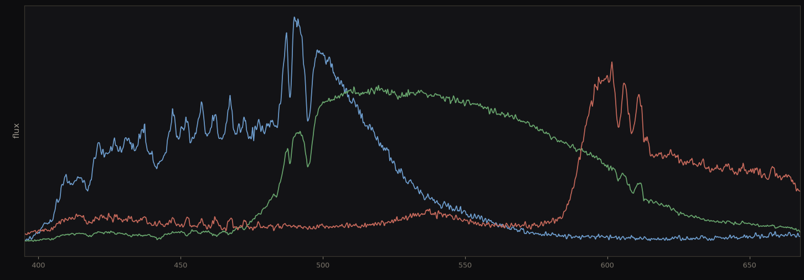</figure>

If we read each column one at a time, we get the combined RG or BG flux — two curves, with the trace hopping between them. Green flux is in both and is common, the difference between the values is R − B. That is the dangerous part, and it is why the sawtooth of the mosaic flux cannot be smoothed away. Its size is not fixed — it swells and shrinks across the spectrum on the same scale as real hydrogen absorption.

<figure>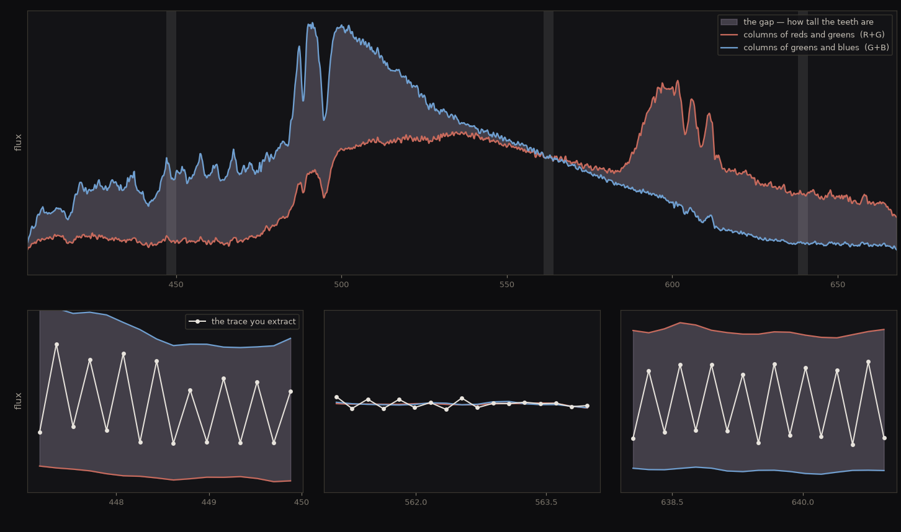</figure>

Instead of the mosaic flux, we instead build the total flux spectrum by combining the three individual color planes. The extra green is dealt with by averaging its two pixels into one, so every number in the sum is still a number that was measured and not interpolated. The two mountains continue to be the blue and red filters peaking.

<figure>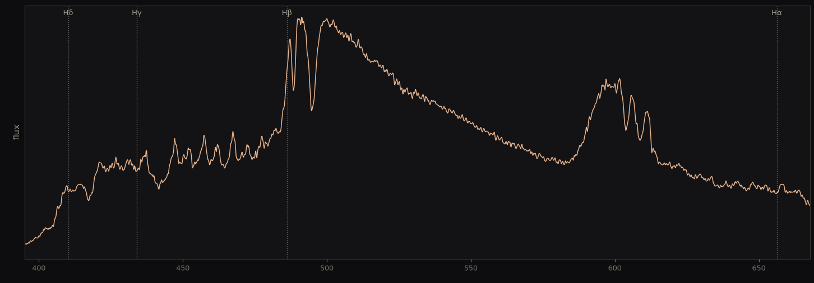</figure>

We can see the drastic difference splitting the colors produces by focusing on one region where we know there is no hydrogen absorption. The sawtooth of the raw mosaic is enormous — neighboring columns disagree by 52% of their average. The split planes carry none at all: 1.2%, and what is left there is noise.

<figure></figure>

It is worth sizing the effect against what we are trying to measure. Vega's own Hα line, once the reduction is finished, is a dip of 32%. In this window the mosaic on its own moves neighboring columns by more than that: writing features into the spectrum larger than the real physical phenomenon we were trying to measure.

### Finding the dot and the streak

Two things have to be pinned down before any wavelength can be read: where the spectrum starts, and which way it runs. The position of the star is determined by the wings, not the peak. Ten pixels of this dot sit exactly on 65,535, the sensor's ceiling, so choosing the maximum is a random cointoss. The wings  fall away smoothly, and a flux centroid on those gives a star location precise to within a pixel.

<figure>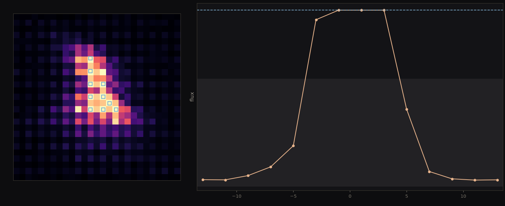</figure>

The streak's direction is the direction out of the dot along which the light is brightest, refined by following how far the light sits off that line as you go out. With a center and an angle, the frame is resampled along that axis.

<figure></figure>

The dot is centered at (816.4, 143.9) and the streak ran at −3.86°. Every column is now one wavelength and the four Balmer lines land where the grating equation says they should.

### Collapsing to 1-D

With the streak straight, every column holds one wavelength, so adding a column up collapses the rainbow to one number per wavelength. The three color planes are added back together first — they were split apart only to stop the mosaic printing itself onto the trace, and all three carry part of the same starlight.

<figure></figure>

We had to decide how wide to sum the brightness, and the obvious argument turns out to be the wrong one. It says narrow is better: past the edge of the star each extra row adds sky noise and no signal, so noise grows as √rows while signal has stopped. That is true only when the sky is what limits you, and on a star bright enough to saturate its own zero order it is not.

Measured on the finished spectrum the continuum noise runs **0.025 at one pixel either side, 0.020 at two, 0.017 at nine**, and then flattens. Nine is what we use. Narrow loses because the trace wanders a fraction of a pixel from row to row: a three-pixel box turns that wander into noise, and a nineteen-pixel box does not.

### Fitting the wavelength scale

The grating equation helped us place both the star and its spectrum in the same image frame. The equation needed only a single parameter A to help our aim be roughly correct. Reading the spectrum needs more precision and we now derive A from atomic physics using the known wavelength of the hydrogen bands.

| Line | Wavelength, from atomic physics | Distance from the dot, measured |
|---|---|---|
| Hδ | 410.174 nm | 2,305 px |
| Hγ | 434.047 nm | 2,441 px |
| Hβ | 486.135 nm | 2,735 px |
| Hα | 656.281 nm | 3,693 px |

<figure></figure>

**Root mean square**, written rms, is how a set of errors gets averaged into one number. Square each one, take the mean of the squares, then square-root it. Squaring first does two things: it stops a miss to the left cancelling a miss to the right, and it counts one large error for more than several small ones. So an rms of 0.185 nm means the typical line lands about that far from where atomic physics says it should.

Least squares over the four data points settles on <strong>A = 56,016 px</strong>, reproducing the four lines to <strong>0.185 nm rms</strong> on the combined spectrum. <code>A × 2.9 µm = 162.4 mm</code> as compared to a 163 mm plate-scale focal length.

## Reading the star

### Dividing out the continuum

We want to measure hydrogen absorption, and absorption only means something against what would have been there without it. On the raw trace that comparison is not available: Hβ's dip sits partway up a filter mountain and Hα's sits on a falling tail. Flatten the background and the question becomes answerable — every line is a dip below 1.0, and its depth is the fraction of light the star's hydrogen removed.

**The continuum** is the smooth background upon which we can observe hydrogen absorption lines. **Normalizing** means dividing the spectrum by that background so it lies flat at 1.0 and every absorption line becomes a visible dip below it. We measure the continuum from the data itself, with a running median.

At each wavelength take every sample within a fixed window either side, call their median the continuum there, and divide. A median rather than a mean because the absorption lines are dips, and a mean would be dragged down into every line it passed.

The window has to be wide compared to a line and narrow compared to the instrument, so the lines survive and everything else flattens. We use 43 nm, against a Balmer line about 10 nm across.

<figure>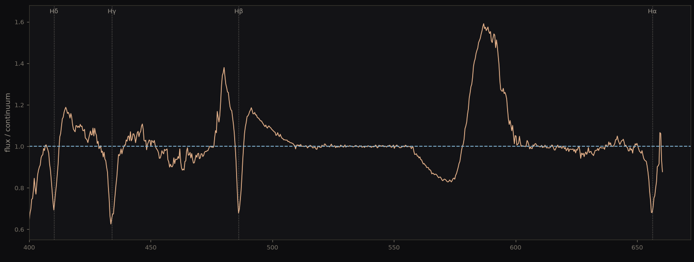</figure>

The two mountains are gone. So is the blackbody **Planck curve** where Vega declines across the visible range. The median treats that as one more broad thing to divide away. What is left is the shape everyone recognizes — a flat line at 1.0 with the four Balmer lines cut into it.

Two features did not flatten both are color filters handing over where they overlap. This is a challenge unique to the spectroscopy work: the spectrum has already been wavelength-segregated and the color filters do not help but hinder. A monochrome sensor that only counts photons would work better for this purpose.

The artifacts cost us two absorption lines, and they fail differently. Hβ lands on the handover, so the continuum beside it sits at 1.16 rather than 1.0. Hδ sits where the continuum averages a fair 1.03 but scatters by 0.16. Hγ and Hα are more workable: a level within 3% of 1.0, and scatter near 0.03.

### Measuring equivalent width, not depth

Depth is the obvious measurement and the wrong one: seeing makes a line shallower and wider at once, though the total light removed has not changed. Equivalent width measures the total area of the dip. Normalized against the local continuum, it also needs no flux calibration to be comparable to reference catalogs.

EW = ∫ ( 1 − F(λ) / F_continuum ) dλ

We measured it on Hγ, one of the two lines the color filters left alone, and swept the integration width outward until there was no area left to add. An equivalent width of 13.1 Å says the line removes as much light as a completely black band **1.31 nm wide** would.

<figure></figure>

Left, the shaded area is the measurement — everything Hγ took out of the flat 1.0. Right, that same area recomputed as the window widens: Hγ and Hα climb and then flatten, and the plateau is the number.

The two broken lines fail in plain sight on that right panel. Hβ crosses zero near 4.5 nm and keeps falling, because widening its window sweeps up the manufactured peaks on either side for negative area. Hδ turns over and drifts.

<strong>Hγ ≈ 13.1 Å and Hα ≈ 11.7 Å</strong> both converged.

### Classifying against a reference

The Pickles atlas publishes Balmer equivalent widths for 131 spectral types. We used χ² to rank the types in terms of goodness of fit to our two measured hydrogen absorption lines.

**Spectral type** is a star's label in the Morgan–Keenan system, and it has three parts. A letter for temperature, running O B A F G K M from hottest to coolest. A digit subdividing that letter, 0 the hottest end of its range and 9 the coolest. And a Roman numeral for luminosity class, V meaning a main-sequence star still burning hydrogen in its core. A0V is therefore a main-sequence star at the hot end of A.

χ² = Σ over lines ( EW_ours − EW_template )² / σ²

χ² adds up how far our two hydrogen absorption numbers sit from a spectral type's, divided by σ — the uncertainty on our own equivalent widths. σ is the root-mean-square of how far our two lines miss the closest type, A0V: 0.79 Å at Hγ and 1.91 Å at Hα, which comes to **1.46 Å**. Nothing is fitted to our data: each spectral type is a fixed hypothesis, and the lowest χ² is the closest one.

**Two chi-squareds.** The version taught for counts divides by the expected count, `(O − E)² / E`, because counts are Poisson and a Poisson variance equals its mean — the expected value hands you the variance for free. An equivalent width is not a count, so nothing hands us a variance and σ has to be supplied. Same statistic, and both are really (observed − expected)² divided by the variance; only the route to the variance differs.

<figure></figure>

All 131 spectral types on a log scale, hot to cool. The field sits around χ² = 117 while A0V sits at 2.00, some sixty times closer, and the axis has to be logarithmic to show it. The pile-up on the right is the cool half of the diagram, where every type reads a Balmer width of zero and so is wrong by the same amount.

| Rank | Type | χ² | Δχ² |
|---|---|---|---|
| 1 | A0V | 2.00 | 0.00 |
| 2 | A3V | 2.94 | 0.94 |
| 3 | A0IV | 3.74 | 1.74 |

The minimum is deep against the field and shallow against its neighbors, and both readings are the answer. Being that far clear of the field settles the letter. But A3V sits 0.94 behind, inside 1σ, so the number after it does not settle — which is exactly what ±3 subclasses means, and why the earlier blur measurement mattered.

One of the two numbers carries a caveat. Hγ reads 13.11 Å against the A0V template's 13.90, within 6%. Hα reads 11.71 Å against 9.80, high by 19%. Hα sits near the edge of the frame, so its continuum window runs off the end and part of the estimate is padding rather than measurement. Hγ is the absorption line doing the honest work here.

Taken character by character, the three parts of the label are not equally earned. The A was always safe. The V holds only in the coarse sense: a giant or a supergiant is ruled out easily, since A0III and A0I fall at χ² 9.2 and 70.6, but A0IV differs from A0V by only 0.30 Å at Hγ against our 1.46 Å uncertainty, so Hα alone separates them and Hα is the hydrogen line carrying the bias. The 0 never settled at all.

Vega = A0V

±3 subclasses, equivalent-width uncertainty 1.46 Å. Confirmed by catalog: SIMBAD lists A0V.

## Running it again on a cooler star

### A second star on the same pipeline

We ran the identical pipeline on a very different star. **Xi Draconis**, also called Grumium, is a K2III giant at magnitude 3.75 — about 4,400 K against Vega's 9,600 K.

<figure class="medium"></figure>

Every step ran unchanged: the same grating, the same split Bayer planes, the same trace, the same running-median continuum. Only one number was refitted, `A`, because the barrel had been unscrewed and remounted in between. It came back at **56,081 px** against Vega's 56,016 — a shift of 0.12%.

<figure>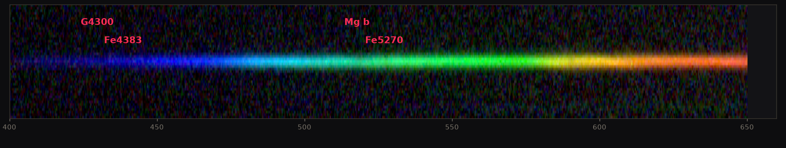</figure>

Marked in red are the four features this star gets classified on. They are **metal bands** rather than hydrogen lines, and they are labelled without rules drawn over them so the streak can be judged by eye.

**Metal**, to an astronomer, means any element heavier than helium — carbon, magnesium and iron all count, which is not what a chemist means by the word. Stars are so overwhelmingly hydrogen and helium that everything else gets swept into one category.

**Band** rather than line because at our resolution none of these is a single transition. Each is dozens of neighboring lines blurred into one broad trough. Mg b is a triplet of magnesium lines near 517 nm; Fe4383 and Fe5270 are iron blends. G4300 is not strictly a metal at all — it is the CH molecule, which only exists in a star cool enough for molecules to survive, and that is exactly why it shows up here and not in Vega.

G4300 and Fe4383 sit out in the thin blue end, Mg b and Fe5270 in the bright green, and that difference decides which of them turns out to be worth anything.

<figure>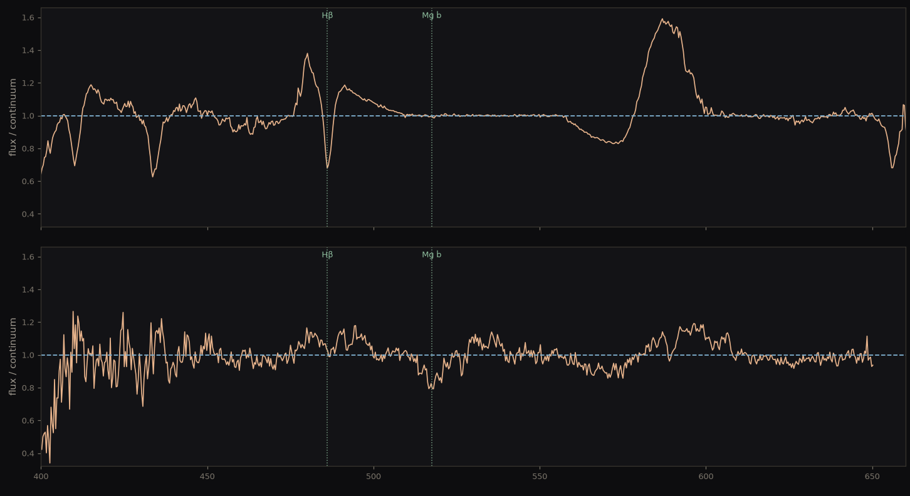</figure>

At **Hβ**, the top plunges and the bottom is flat: 32.1% deep on Vega, 1.1% on Xi Draconis. At **Mg b**, the magnesium band at 517 nm, it reverses: 1.4% on Vega, 20.8% on Xi Draconis. Nothing in the reduction changed between those two panels, so the swap belongs to the stars.

The bottom trace is visibly noisier, and honestly so — 19 subs against Vega's 25, on a star magnitude 3.75 against Vega's 0.03, which is nearly four magnitudes and a factor of about 30 in brightness. It also stops at 651 nm rather than 660, which costs us Hα entirely.

### Why the hydrogen is gone, not faint

The tempting reading is that we underexposed. It is worth being clear that no exposure time would fix this, because the atoms that produce a Balmer line are not there.

A Balmer photon is absorbed by a hydrogen atom already sitting in the **n = 2** level, 10.2 eV above the ground state. How many atoms are up there is set by temperature alone, through the Boltzmann factor.

n₂ / n₁ = ( g₂ / g₁ ) · exp( −E / kT )

with E = 10.2 eV and g₂ / g₁ = 4, the ratio of how many quantum states each level offers. Two constants and a temperature — nothing here is fitted to anything we measured.

<figure>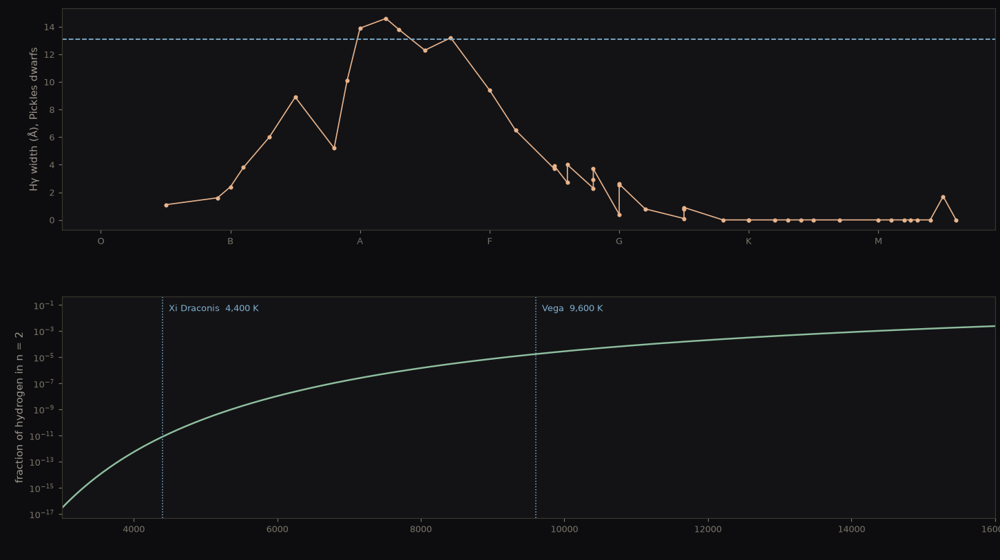</figure>

Above is somebody else's data: the Pickles catalog's own published Hγ widths for its dwarf sequence, in spectral order, with no temperature scale assumed and nothing fitted. The dashed line is our Vega measurement, 13.1 Å. Vega sits at the peak — **A0 is the maximum of Balmer strength in the entire HR diagram**, which is exactly why the first pass worked so cleanly. Walk right toward K and the curve reaches zero and stays there.

Below is the reason, and it is two constants and a temperature. At Vega's 9,600 K the fraction of hydrogen in n = 2 is 1.8 × 10⁻⁵. At Xi Draconis's 4,400 K it is 8.3 × 10⁻¹². That is a factor of **2.1 million**.

The Balmer lines are not weak on a cool star. They are absent, and the method has to change.

### Measuring a band instead of a line

Instead of hydrogen we use metal features that Vega does not have. Back at Hγ we found the Equivalent Width by widening the integration window until the area stopped growing, and called that plateau the answer. Run the identical test on Mg b:

| half-width | 2 nm | 3 nm | 4 nm | 5 nm | 6 nm | 8 nm |
|---|---|---|---|---|---|---|
| **Hγ on Vega** | 9.88 | 12.05 | 12.84 | 13.20 | 13.11 | 11.10 |
| **Mg b on Xi Draconis** | 6.14 | 8.58 | 10.48 | 11.33 | 12.35 | 12.40 |

Hγ settles. Between 4 and 6 nm it moves 2%, which is the plateau, and past 8 nm it falls away as the window runs into the filter artifacts. Mg b never settles — over the same 4 to 6 nm it climbs 18% and is still climbing. Widen the window and you do not run out of feature, you run into the next iron line.

That is what makes a metal band different from a Balmer line, and it is a statement about the star rather than about our optics: a cool atmosphere produces so many overlapping lines that no measurement can find its own edges. So the edges stop being measured and start being **declared** — the window is fixed by convention, and once it is fixed the continuum has to be fixed too. Pick two side bands either side of the feature, draw a straight line between their medians, and call that the continuum. The area below it is a **band index**.

**A band index** is an equivalent width with its continuum defined rather than measured. The two side bands are fixed by convention, the straight line between them is the pretend continuum, and the area of the dip below it is the number. It survives an uncalibrated instrument because over ~10 nm any response curve is near enough a straight line, and dividing one straight line by another leaves the dip alone.

Pickles publishes index *values*, but with no bandpass definitions attached so we cannot directly compare. The same catalog carries the underlying spectra, which we run through our own bandpass.

<figure>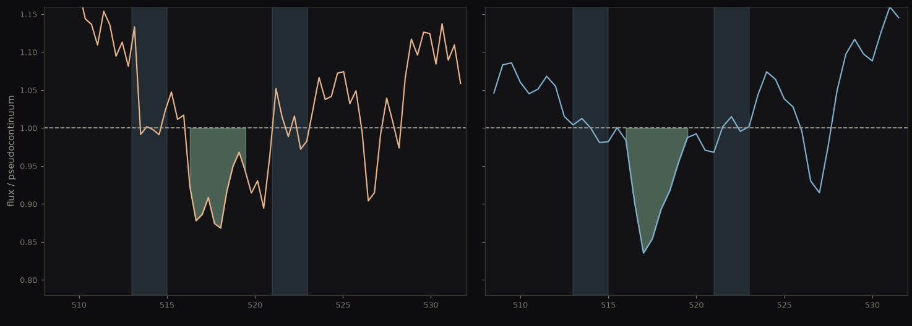</figure>

The same construction, run twice. Ours on the left, the K2III template on the right. The two blue bars are the side bands, each curve has been divided by its own straight-line continuum so that continuum lies flat at 1.0, and the shaded area below it is the index. Left reads **0.300 nm**, right reads **0.329 nm** — two numbers that mean the same thing because they were made the same way.

| Index | Ours | K1 III | K2 III | K3 III | K5 III | M0 III |
|---|---|---|---|---|---|---|
| G4300 | 0.656 ± 0.034 | 0.718 | 0.636 | 0.632 | 0.745 | 0.673 |
| Fe4383 | 0.317 ± 0.024 | 0.190 | 0.223 | 0.175 | 0.183 | 0.214 |
| Mg b | **0.300 ± 0.035** | 0.305 | **0.329** | 0.271 | 0.487 | 0.706 |
| Fe5270 | 0.264 ± 0.031 | 0.241 | 0.255 | 0.238 | 0.244 | 0.233 |

### What a cool star's label is worth

Four indices fall inside the range we can reach: G4300, Fe4383, Mg b and Fe5270. Other valuable indices are out of our spectrum window. The same χ² from before ranks the templates.

<figure>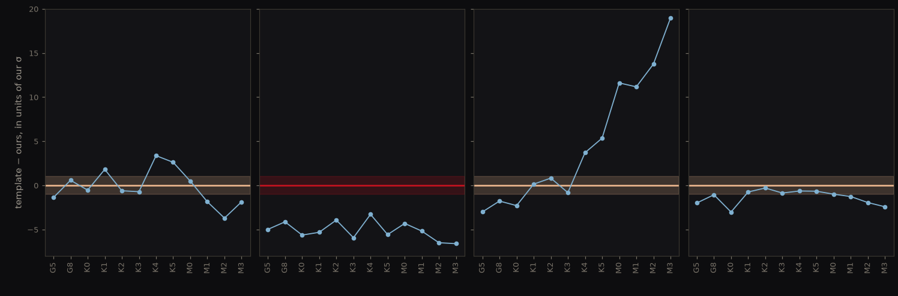</figure>

We disregard Fe4383 because it has no distinguishing power and use the other three for the χ² ranking.

<figure>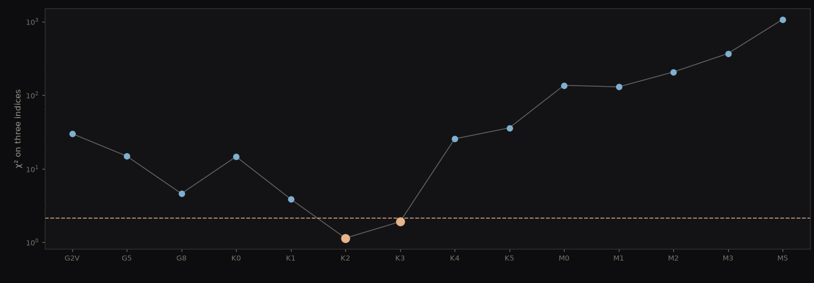</figure>

Xi Draconis = K2–K3 III

Indistinguishable between the two. SIMBAD lists K2III — consistent, and not confirmed to a subclass.

