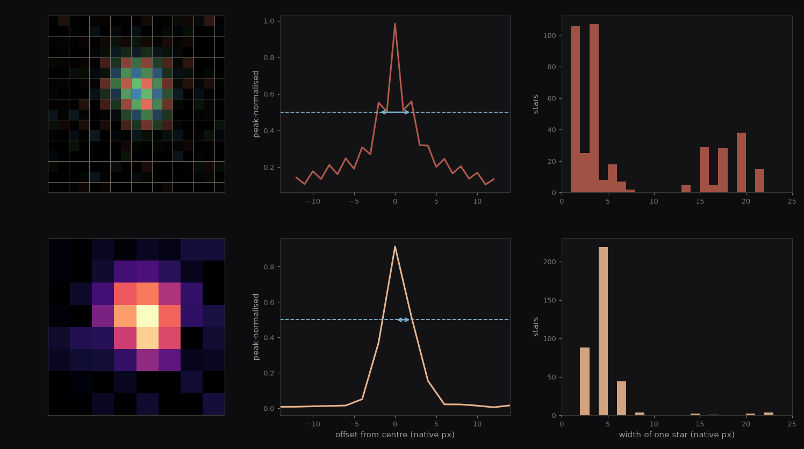
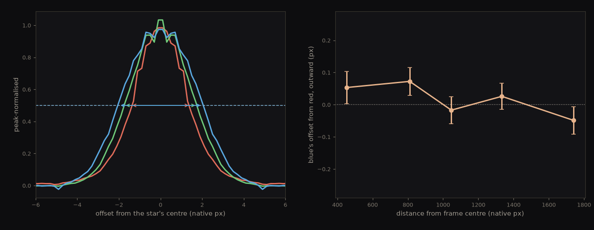

A diffraction grating attached to the Seestar produces a small rainbow band for stars. Vega's spectrum clearly shows hydrogen bands that confirm it as <strong>A0V</strong>. Albireo's bands are shallower, as expected since neither of its two stars is near the ~10,000 K where the strongest hydrogen absorption takes place.

## The journey of light

### The star makes a continuum

Deep inside Vega the gas is hot and dense, and a photon cannot leave it without being absorbed and re-emitted many times, every interaction scrambling its energy and direction. The light becomes thermalized into equilibrium with the gas, and its spectrum is set by temperature alone.

This is a **blackbody**: one smooth emission curve carrying every wavelength at once. Every star radiates one. The shape of the curve tells you how hot the star is and nothing about what it is made of.

We see that light from the photosphere, the layer where photons finally stop being reabsorbed and get out — not the core, which is hotter still and sealed far below. The blackbody is the baseline. Everything the rest of this report measures is something that happened to it on the way out.

### Hydrogen makes the dark bands

In the photosphere's cooler upper reaches, hydrogen atoms in the n = 2 level absorb exactly the photons whose energy lifts them to n = 3, 4, 5 or 6 — the Balmer series, at 656.3, 486.1, 434.0 and 410.2 nm. Those wavelengths leave the star depleted, and the dark gaps they leave behind are our target measurement.

### Why Vega

Vega is the classic target for spectroscopy, because its hydrogen lines are about as deep as a star's get, and the reason is the physics that makes a spectral type mean a temperature. Populating n = 2 takes heat, but much more heat ionizes the hydrogen away entirely, so the number of atoms able to absorb at all peaks near 10,000 K — which is Vega's temperature almost exactly. Hotter stars and cooler ones both show weaker Balmer lines. Line strength therefore reads temperature, and that is what makes a classification possible from nothing but the depth of a few gaps.

## Setting up

### Attaching the diffraction grating

The Star Analyser 100 carries a hundred grooves per millimetre, so its groove spacing is 10,000 nm — the number the whole wavelength scale hangs on. We threaded it onto the front of the objective lens, so light from every star in the field passes through the rulings before it reaches the optics and the frame fills with parallel rainbows.

<figure></figure>
<figure></figure>
<figure></figure>

### Checking dispersion

We held it up to a laptop screen. Every white pixel split into three narrow bands, because a screen fakes white out of three coloured emitters; sunlight through the same grating would give an unbroken rainbow.

<figure class="medium"></figure>

### Choosing the filter

We need to capture the entire spectrum, the Seestar has two filters available. Vega through the LP filter throws off a cyan stub because the red stub is offscreen. The IRCUT presents a full violet-to-red streak.

**LP** is a filter for photographing nebulae from a city. It was never meant to be pointed at a star. Nebular gas is thin enough to be near vacuum, so nothing thermalizes into a continuum: a nearby hot star ionizes it, electrons recombine and cascade down the energy levels, and every jump emits at one exact wavelength. A nebula's entire output is therefore a few bright lines, while streetlight skyglow is spread across all of them — so keeping two narrow windows, at Hα and at Hβ/OIII, discards most of the glow and almost none of the nebula.

**IRCUT** blocks everything past about 700 nm. A silicon pixel only registers a photon carrying enough energy to lift an electron across the silicon bandgap, and that gap of 1.12 eV corresponds to a wavelength of 1100 nm: anything shorter is detected, anything longer passes through the sensor unseen. So the chip responds all the way out to 1100 nm while the eye stops near 700. Cutting at 700 nm is what puts the red end of our spectrum there.

<figure></figure>
<figure></figure>
<figure></figure>

The IRCUT does more than set where our red end falls. The near-infrared beyond it — which the sensor sees and we cannot — causes two problems of its own if allowed to pass through.

The first is focus. A lens bends light by refraction, and the refractive index of glass is not a single number — it falls as wavelength rises, so blue is bent harder than red. A lens's focal length is set by that index, so if the index changes with colour then the focal length does too, and every wavelength comes to its own focus at its own distance behind the glass. Designers cancel this by cementing two glasses whose dispersions pull in opposite directions, which drags a chosen pair of wavelengths back to a common focus; the correction holds across the visible band it was built for and lapses outside it. Near-infrared sits far enough outside that its focus can be millimetres adrift, so with the visible image sharp the infrared is still a wide converging cone when it reaches the sensor and lands as a broad disc — the halo around every star in the camera's captured image.

The second is colour, and it needs the sensor introduced first.

**The Bayer mosaic** is how a camera sensor records colour at all. Silicon cannot tell one wavelength from another — a pixel counts photons and reports a single number — so colour has to be built in front of it. A tiny dyed filter is laid over every pixel in a repeating 2 × 2 tile: green and red on one row, blue and green on the next, which is the pattern named after Bryce Bayer. Green gets two of the four because the eye is most sensitive there. Every pixel therefore records one colour only, and full-colour images are reconstructed afterwards by guessing each pixel's two missing channels from its neighbours.

<figure class="medium">
<svg viewBox="0 0 660 152" style="width:100%;height:auto" role="img" aria-label="A grid of red, green and blue filters laid over the sensor in a repeating two-by-two tile of green, red, blue, green; one tile enlarged; and the four bare numbers the sensor actually stores for it">
  <defs>
    <!-- The mosaic drawn once as a tile and repeated, so the pattern is
         guaranteed regular rather than hand-placed 60 times. -->
    <pattern id="bayer" width="44" height="44" patternUnits="userSpaceOnUse">
      <rect x="0"  y="0"  width="22" height="22" fill="#4a9d5b"/>
      <rect x="22" y="0"  width="22" height="22" fill="#d1584a"/>
      <rect x="0"  y="22" width="22" height="22" fill="#4a86c8"/>
      <rect x="22" y="22" width="22" height="22" fill="#4a9d5b"/>
    </pattern>
    <marker id="fl" markerUnits="userSpaceOnUse" markerWidth="9" markerHeight="9" refX="8" refY="4" orient="auto"><path d="M0,0 L9,4 L0,8 z" fill="#8b949e"/></marker>
  </defs>

  <rect x="20" y="10" width="220" height="132" fill="url(#bayer)"/>
  <!-- The ringed tile is painted explicitly rather than left to the pattern.
       Where a pattern's tiling starts depends on the renderer's anchoring, so
       relying on it would risk ringing a tile that does not match the enlarged
       one beside it -- the one thing this figure must get right. -->
  <g>
    <rect x="132" y="44" width="22" height="22" fill="#4a9d5b"/>
    <rect x="154" y="44" width="22" height="22" fill="#d1584a"/>
    <rect x="132" y="66" width="22" height="22" fill="#4a86c8"/>
    <rect x="154" y="66" width="22" height="22" fill="#4a9d5b"/>
  </g>
  <rect x="132" y="44" width="44" height="44" fill="none" stroke="#1f2328" stroke-width="2.5"/>

  <line x1="258" y1="76" x2="300" y2="76" stroke="#8b949e" stroke-width="1.6" marker-end="url(#fl)"/>

  <g>
    <rect x="316" y="24" width="52" height="52" fill="#4a9d5b"/>
    <rect x="368" y="24" width="52" height="52" fill="#d1584a"/>
    <rect x="316" y="76" width="52" height="52" fill="#4a86c8"/>
    <rect x="368" y="76" width="52" height="52" fill="#4a9d5b"/>
  </g>
  <g font-family="-apple-system, sans-serif" font-size="17" font-weight="600" fill="#ffffff" text-anchor="middle">
    <text x="342" y="56">G</text><text x="394" y="56">R</text>
    <text x="342" y="108">B</text><text x="394" y="108">G</text>
  </g>

  <line x1="438" y1="76" x2="480" y2="76" stroke="#8b949e" stroke-width="1.6" marker-end="url(#fl)"/>

  <g fill="#eceff2" stroke="#d1d9e0" stroke-width="1.2">
    <rect x="496" y="24" width="52" height="52"/>
    <rect x="548" y="24" width="52" height="52"/>
    <rect x="496" y="76" width="52" height="52"/>
    <rect x="548" y="76" width="52" height="52"/>
  </g>
  <g font-family="ui-monospace, Menlo, monospace" font-size="13" fill="#57606a" text-anchor="middle">
    <text x="522" y="55">1204</text><text x="574" y="55">812</text>
    <text x="522" y="107">640</text><text x="574" y="107">1190</text>
  </g>
</svg>
</figure>

The pattern on the left repeats across the whole chip, and the middle is the one tile ringed inside it. Every pixel sees the world through exactly one of those dyes, and what comes back is the panel on the right — four bare numbers with no colour attached to them. The colour exists only in the pattern, which is why it has to be reconstructed and why that reconstruction is a convenience for photographs and a hazard for measurements. It comes back twice below. What matters here is that the filters are dyes, and a dye absorbs because its molecules have transitions at particular wavelengths — transitions that sit in the visible. In the near-infrared they have nothing to absorb with, so red, green and blue are all transparent to it alike. Infrared therefore reaches every pixel whatever filter is over it and adds the same pedestal to all three channels. Since colour is read from the ratios between channels, an equal addition to each drags every ratio toward grey, and nothing in the frame says how much of a pixel was infrared, so it cannot be subtracted afterwards.

### Aiming the telescope

We want to capture the whole spectrum on our photograph, we use only the first order m = 1.

1d · sin θ = m · λ

2θ = asin( λ / d )

A lens sorts light by **direction**. Parallel rays are brought together at a single point in the focal plane. Rays arriving at a different angle meet at a different point. That is the whole reason a star photographs as a dot: its rays arrive parallel, so they all end up in one place.

Now put the grating in front of it. Starlight arrives as one parallel beam. The grating splits it into several parallel beams, one per wavelength, each leaving at its own angle θ — and each beam is still parallel within itself. The lens then does the only thing it does, and sends each beam to its own point. The undeflected beam lands on the axis, and that is the zero-order dot. The beam tilted by θ lands a distance s away from it.

3s = f · tan θ

That f is the telescope's focal length, and the tan comes from the lens's angle-to-position mapping rather than from a ray crossing a gap. The grating's distance from the lens does not matter.

<figure>
<svg viewBox="0 0 680 300" style="width:100%;height:auto" role="img" aria-label="Starlight arrives parallel at the grating on the right, which splits it into two parallel beams at different angles; the objective lens then brings each beam to its own point on the sensor, the tilted one landing s away from the axis">
  <defs><marker id="ray" markerWidth="8" markerHeight="8" refX="7" refY="3" orient="auto">
    <path d="M0,0 L8,3 L0,6 z" fill="context-stroke"/></marker></defs>

  <g fill="none" stroke="#1f2328" stroke-width="1.6">
    <line x1="600" y1="70" x2="600" y2="250"/>
    <line x1="100" y1="45" x2="100" y2="265"/>
  </g>
  <ellipse cx="430" cy="160" rx="9" ry="90" fill="none" stroke="#1f2328" stroke-width="1.6"/>

  <g stroke="#57606a" stroke-width="1.6" marker-end="url(#ray)">
    <line x1="672" y1="170" x2="616" y2="170"/>
    <line x1="672" y1="200" x2="616" y2="200"/>
    <line x1="672" y1="230" x2="616" y2="230"/>
  </g>

  <g stroke="#8b949e" stroke-width="1.3">
    <line x1="600" y1="170" x2="430" y2="170"/>
    <line x1="600" y1="200" x2="430" y2="200"/>
    <line x1="600" y1="230" x2="430" y2="230"/>
    <line x1="430" y1="170" x2="101" y2="200"/>
    <line x1="430" y1="200" x2="101" y2="200"/>
    <line x1="430" y1="230" x2="101" y2="200"/>
  </g>

  <g stroke="#b3576b" stroke-width="1.5">
    <line x1="600" y1="170" x2="430" y2="128"/>
    <line x1="600" y1="200" x2="430" y2="158"/>
    <line x1="600" y1="230" x2="430" y2="188"/>
    <line x1="430" y1="128" x2="101" y2="105"/>
    <line x1="430" y1="158" x2="101" y2="105"/>
    <line x1="430" y1="188" x2="101" y2="105"/>
  </g>

  <path d="M 540 200 A 60 60 0 0 1 545 185" fill="none" stroke="#b3576b" stroke-width="1.4"/>
  <circle cx="100" cy="200" r="4.5" fill="#656d76"/>
  <circle cx="100" cy="105" r="4.5" fill="#b3576b"/>

  <g stroke="#8b949e" stroke-width="1.1">
    <line x1="100" y1="278" x2="430" y2="278"/>
    <line x1="100" y1="273" x2="100" y2="283"/><line x1="430" y1="273" x2="430" y2="283"/>
    <line x1="68" y1="105" x2="68" y2="200"/>
    <line x1="63" y1="105" x2="73" y2="105"/><line x1="63" y1="200" x2="73" y2="200"/>
  </g>

  <g font-family="ui-monospace, Menlo, monospace" font-size="15" fill="#1f2328">
    <text x="528" y="195" text-anchor="end">θ</text>
    <text x="265" y="293" text-anchor="middle">f</text>
    <text x="40" y="157">s</text>
  </g>
  <g font-family="-apple-system, sans-serif" font-size="12.5" fill="#656d76">
    <text x="600" y="60" text-anchor="middle">grating</text>
    <text x="430" y="60" text-anchor="middle">objective lens</text>
    <text x="100" y="36" text-anchor="middle">sensor</text>
    <text x="660" y="252" text-anchor="end">starlight, parallel</text>
    <text x="114" y="98">m = 1 · this wavelength</text>
    <text x="114" y="245">m = 0 · the zero-order dot</text>
  </g>
</svg>
</figure>

Dividing by the pixel size, p = 2.9 µm, puts the distance in pixels rather than millimetres.

4px = s / p

Substituting 2 into 3 and 3 into 4 leaves f and p appearing only as a ratio, so they collapse into a single constant A = f / p. With d = 1 / (100 grooves per mm) = 10,000 nm, one free parameter carries the entire wavelength scale:

5px(λ) = A · tan( asin( λ / 10,000 nm ) )

Neither half of A is ours to measure, and the two are known in very different ways.

The pixel pitch p is a manufacturing dimension. A sensor's pixel grid is etched into silicon by the same photolithography that prints a processor, so the spacing is fixed when the wafer is patterned and is identical on every copy of the chip ever made. Nothing about the telescope, the night or the focus can move it. Ours is the IMX585, and its pitch — the distance from the centre of one pixel to the centre of the next, which is also the width of one pixel since they tile without gaps — is **2.9 µm**. That number is taken from the sensor's specification and never questioned again.

The focal length f is a different kind of number entirely. It is not a single part you can measure with calipers — it is a property of the assembled optics, set by where the lens elements actually sit and how far they end up from the sensor once the thing is screwed together and focused. The Seestar writes a value into every frame's header, `FOCALLEN = 160 mm`, but that is the figure the instrument was designed to, not a measurement of the one in front of us. Good enough to aim with. Not good enough to build a wavelength scale on, which is what the rest of this step is about.

6A = f / p = 160 mm ÷ 2.9 µm = 55,172 px

Hα's wavelength is not ours to measure either. It is fixed by atomic physics at 656.3 nm, the energy gap between hydrogen's n = 3 and n = 2 levels, identical in every hydrogen atom anywhere. So both numbers going in are known before the telescope is even pointed:

7px(656.3 nm) = 55,172 · tan( asin( 0.06563 ) ) = 3,629 px

**That is the answer this step exists to produce: Hα should land about 3,600 px from the star.** The sensor's long side is 3,840 px. So the spectrum only just fits, and only if the star sits hard against a short edge — centre it and Hα falls off the chip entirely. Running the same relation at 400 nm, where IRCUT starts transmitting, puts the blue end at 2,209 px, so the usable spectrum occupies roughly 2,200 to 3,900 px measured out from the star.

Every number there rests on a focal length nobody verified, which is fine for framing — that needs a few pixels of accuracy at most. But the nameplate is wrong, and two things we did measure both say so:

| Source | rests on | implies |
|---|---|---|
| nameplate | a spec sheet | 160.0 mm |
| plate scale, 3.669″/px | plate solving, no grating involved | 163.0 mm |
| A = 56,016, fitted later | the four dark bands themselves | 162.4 mm |

The other two rows need a word each.

**Plate solving** is matching the pattern of stars in a frame against a catalogue of known positions. Once it matches, you know where the scope was pointing and — the useful part here — how much sky each pixel covers, which is 3.669 arcseconds. That converts straight into a focal length, because a telescope maps *direction* onto *position*: light arriving at angle θ off-axis lands f · tan θ from the centre of the frame. Arcseconds per pixel and the 2.9 µm pixel size therefore give f, and it comes out at 163.0 mm.

**The Balmer fit** runs the same relation backwards. Instead of assuming a focal length and predicting where the lines will fall, it measures where they actually fell — the pixel distance from the zero-order dot out to each of the four dark bands — and then solves for the one A that places all four at their known wavelengths at once. That happens properly a few steps below, and it lands on A = 56,016. Multiplied by the 2.9 µm pixel size, that is a focal length of 162.4 mm.

Both measure the same f by completely unrelated means — one from the positions of catalogued stars, one from hydrogen — and they agree with each other to 0.4% while both sit about 2% off the header value. That is why the wavelength scale gets re-fitted further down, on wavelengths fixed by atomic physics rather than by a manufacturer's figure.

### Gathering light

**An exposure** is how long the sensor is left collecting light for one frame. Longer gathers more photons and buries the sensor's own read noise, but every pixel has a ceiling. Once a pixel fills, further photons go unrecorded and its reading stops meaning anything — it is saturated, and no processing recovers what it did not count.

**A sub** — short for sub-exposure — is one of those frames, saved as its own file rather than as part of a finished picture. Stacking many afterwards averages the random noise down while the real signal adds up, which is how something faint survives being photographed at all.

We pointed the scope at Vega and put it in the corner worked out above, so the star and as much of its spectrum as the sensor would hold landed on the same frame. Thirty subs of five seconds each, stacked afterwards.

<figure></figure>

The dot on the left is the **zero order** — light the grating did not bend, every colour together. Its position does not depend on wavelength, so it is the origin everything else is measured from. The streak running away from it is the **first order**, blue bent least and so nearest the star, red bent most and furthest. The frame is turned a quarter turn here; on the sensor the spectrum runs down the long axis.

Look closely at that streak and it is not a smooth rainbow. Four dark gaps interrupt it, arrowed above, and those gaps are the whole experiment: hydrogen in Vega's upper atmosphere absorbing its own wavelengths on the way out, exactly as described at the start. The arrows are not placed by eye — each sits where the grating geometry says that line must fall, and each lands on a real dip in the streak's brightness within a pixel, Hγ the deepest at 83 % of the light either side of it. The measurement is already there in a single unprocessed frame. Everything after this is turning it into numbers good enough to compare against a catalogue.

The red end stops short of where IRCUT would allow. 700 nm falls 3872 px from the star and the sensor's long axis is only 3840, so the full 400–700 nm cannot fit while keeping the zero-order dot on the frame. We kept the anchor and took the trim: this frame runs 400–672 nm, putting Hα 83 px inside the bottom edge. Barely enough — and enough, because Hα is one of the two lines the classification ends up resting on.

Vega is why one streak dominates the frame. It is the star the magnitude scale was originally pinned to, defined as magnitude zero and sitting at 0.03 on the modern scale, and it outshines its brightest neighbours in Lyra by roughly fifty times. Squint at the dark parts of the frame, though, and fainter parallel streaks are there too. Every star is a point source, the grating sits ahead of the optics, and so every star in the field gets dispersed into its own spectrum — the same physics, just too faint to measure. Vega is the one bright enough to read, which is exactly why we started with it.

## Frame to spectrum

### Measuring the blur

The goal of this step is to measure how wide a point of light comes out on our sensor, and then to hold that number against what the atmosphere alone would have done. If our blur is the bigger of the two, waiting for a better night will not help.

It matters for the spectrum because of what a spectrum actually is. It is not really a rainbow — it is a **stack of images of the light source**, one for every wavelength, each shifted a little further along by the grating. With no slit anywhere in our setup the source is the star's own image, so every wavelength paints its own copy of that blob, and the blob's width sets the finest wavelength difference we can hope to separate.

**The point spread function**, or PSF, is the shape a single point of light comes out as. Every star is a true point — even the nearest is far too small for any telescope to show as a disc — so every bit of width in a star's image was added on the way, by the air, the optics, the focus and the tracking. The PSF is that added shape. It is essentially the same for every star in a frame, because it belongs to the instrument and the night rather than to any one star, and that is what makes it measurable: measure it on any star and you know what happens to all of them. Its width is what this step exists to produce.

**Seeing** is atmospheric turbulence, and it is one of the things that widens the PSF. Warm and cool air pockets have slightly different refractive indices, so they refract light by slightly different amounts, and parts of the beam arrive travelling in slightly different directions. Focusing is just a lens sorting light by the direction it came from — so a beam arriving from a spread of directions gets sent to a spread of points instead of one, and the star spreads into a blob that dances as the air keeps moving. Two to four arcseconds in a backyard, half of one on a mountaintop.

**A resolution element** is the smallest gap between two things that still reads as two. The grating turns a wavelength difference into a distance on the sensor, but each wavelength arrives as a blob rather than a point, so two wavelengths shifted by less than the blob is wide overlap into one smudge.

**A slit** fixes that by changing what the source *is*. Put a narrow slit at the focus and only the light falling through it carries on to the grating, so each wavelength now paints an image of the **slit** instead of an image of the star. Slit width is something you choose, unlike seeing — narrow it and every wavelength's image narrows with it, so wavelengths can sit closer together before they merge. The price is every photon that missed the slit, which is most of them. We have no slit, so we are stuck with whatever blob the sky, the focus and the tracking hand us.

Seeing has to be measured on a frame with no grating on the scope, because once the grating is fitted every star in the field is a streak and there are no point sources left to measure. We used this frame of Vega, taken before the grating went on, where every star is still a point.

<figure class="tall"></figure>

The stars in that frame are the ruler, but the frame cannot be measured raw as it comes off the sensor.

**Binning** is adding up a block of neighbouring pixels and treating the total as a single larger pixel. Binning 2 × 2 turns every square of four into one, so the frame comes out half as wide and half as tall.

Binning is normally done to trade resolution for signal, and the reason that trade is favourable is worth slowing down for. Starlight adds coherently: every pixel's share of the star pushes the total the same way, so four pixels summed give four times the signal. Read noise does not behave like that. It is a random wobble in each pixel, as likely to be positive as negative, so adding four of them lets some cancel against the others. Four random ±1 errors do not give ±4; they typically give about ±2. In general n independent random errors combine to √n rather than n — they add in quadrature, the same rule that makes a right triangle's hypotenuse √(a² + b²) instead of a + b. So four binned pixels carry **four times** the starlight and only **twice** the noise, and the ratio between them — the thing that decides whether anything is measurable at all — doubles. The cost is detail: half the width and half the height, gone for good.

Here binning is doing a different job, and the lost detail is affordable because the thing being measured is a star's blob several pixels across rather than anything fine.

The problem it solves is that neighbouring pixels are not equally sensitive. Each sits under its own colour filter, so a green pixel and a red one report different numbers for the same amount of starlight. What we are trying to measure is a *shape* — how the brightness falls away from the star's centre — and a shape is read by comparing each pixel against the next one along. Do that on the raw mosaic and you measure the star's profile multiplied by the filter pattern, rather than the profile itself.

Binning is the obvious way out, and it is where we started. It fixes the problem by making every pixel identical in composition. The filters repeat on a 2 × 2 tile — one red, one blue, two green — so a 2 × 2 block always contains exactly one of each, wherever it falls. Each binned pixel sums the same set of filters as every other, which turns a sensitivity that varied pixel to pixel into one flat factor applied everywhere. A constant factor cannot distort a shape, and normalising each star to its own peak divides it out completely. That is why the block is 2 × 2 and not some other size: it matches the mosaic's period exactly.

The rest is bookkeeping. Local maxima are picked out, keeping only stars bright enough to measure, faint enough not to saturate, and far enough from the edge to have room around them. Each is cut out in a small box and normalised to its own peak so a bright star and a faint one count equally, and the boxes are averaged together. The width of that stacked profile at half its height is the number.

That last step needs a word, because a star has no edge. Its brightness fades away smoothly into the sky, so there is no distance at which it stops and no width to read off directly. **Full width at half maximum** picks a repeatable place to measure instead: find the peak, drop to half of it, and measure straight across. Half is not arbitrary — it is roughly where the profile is steepest, and therefore where the crossing point is best determined. Up near the peak or out in the tail the curve is nearly flat, so a tiny error in brightness would slide the crossing a long way sideways and the width would come out different every time.

Choosing half also settles something that looks like a contradiction in the frame above. Bright stars plainly show as bigger blobs than faint ones, and yet every star is a point source and the optics blur them all by exactly the same amount. Both are true. The instrument hands every star the same profile shape, and brightness only scales that shape taller or shorter. A bright star is the same bell with a higher peak, so it stays above the sky background much further out into its wings, and the part you can see is wider. Apparent size on an image is a brightness measurement in disguise; it says nothing about the optics, which is exactly what we are trying to measure here.

Half maximum sidesteps it because the level is not a fixed brightness — it is half of whatever that particular star peaked at. Scale a profile up and the peak and the half-maximum level rise together, so the two crossing points stay exactly where they were and the width does not move. A star ten times brighter gives the same answer. That is what lets a thousand stars of wildly different brightness land on one number. The exception is a star bright enough to clip flat at the top, which has no true peak left to take half of, and that is why the selection kept only stars faint enough not to saturate.

<figure></figure>

That pipeline is worth running twice to see what the mosaic costs. The top row measures the sensor's raw output, the bottom row bins 2 × 2 first, and both rows measure the same stars so that binning is the only difference between them.

**One star, as recorded.** Top left, each pixel is tinted by the filter sitting over it, with the 2 × 2 tiles outlined — a smooth blob of light seen through a grid of three different sensitivities. Bottom left, the same star binned, and the grid is gone.

**The stacked profile,** with the dashed line at half the peak and the arrow spanning the width it defines. Raw, the peak is narrow and the wings carry a visible ripple as the trace steps from one filter to the next. Binned, the ripple is gone and the bell is smooth — and distinctly wider.

**Every star's own width.** Binned, the widths land on 2, 4 or 6 native pixels and nothing in between, because one binned pixel is two native ones and the method counts whole pixels. Raw, they land on 2 or 3. Neither of them scatters.

That last panel is not what we expected, and it is worth being straight about why. An earlier version of this measurement showed the raw widths scattering enormously, with a whole second population of very wide stars, and read that as the price of the mosaic. It was nothing of the kind. Those wide stars were saturated — clipped flat at the top, so half of their maximum was half of a plateau, and the width came out huge. The cut that was supposed to exclude them was being tested against the binned frame, where a clipped star's four summed wells put it under the limit; tested against the raw frame where saturation actually happens, it removes them, the scatter vanishes, and the two rows agree.

So the mosaic does not wreck this particular measurement. What binning does do is change the answer: the same stars measure 4 native pixels binned and 2 unbinned. Binning cannot sharpen anything, so the larger number is the suspect one. Feeding the method synthetic stars of known width shows exactly what it is doing — a true 3 px star reads 4, a true 5 reads 6, a true 4 reads 4. It is not biased so much as rounded, and it has to be: a width counted in binned pixels can only come out even. A reading of 4 means somewhere between 3 and 4, which is not precise enough for a number the rest of the report leans on.

The way to avoid the trade is to stop mixing filters rather than average over them. Take one colour at a time — those pixels all share a sensitivity, so nothing is imprinted, and no binning is needed. The cost is that a single colour samples the star only every second pixel, which is coarser than the raw grid rather than finer. What rescues it is how many stars there are. Each of the 1,158 stars in this frame sits at its own arbitrary position within a pixel, so pooling all of them by true distance from their own centre samples the profile far more finely than any single star can. The sub-pixel placement we cannot control becomes the sampling we could not otherwise buy.

<figure></figure>

Left, each colour's pooled profile with its width arrowed at half maximum. The right-hand panel answers a different question, taken up below.

<strong>Red 2.83 native px (10.4″), green 3.46 (12.7″), blue 3.97 (14.6″)</strong>, from 1,158 stars with no binning anywhere.

Two things fall out of that. The first answers the question this step opened with: every one of those widths is far larger than the two to four arcseconds a backyard sky delivers. The blur is ours — optics, focus and tracking — and not the sky's.

The second is that the blur depends on colour, with blue 40 % wider than red. That is the chromatic focus problem from the filter step arriving in the visible band: refractive index falls as wavelength rises, so each colour comes to focus at its own distance behind the glass, and a lens corrected across the visible still leaves a residue inside it. Blue is landing slightly out of focus.

That is one of the two ways a lens mishandles colour, and having measured one it is worth asking about the other. Focusing each colour at its own distance is the longitudinal kind, and it makes blue blurrier everywhere in the frame equally. The lateral kind is different: each colour is magnified by a slightly different amount, so blue's image of a star sits a little further out from the centre of the frame than red's. It is zero in the middle and grows towards the corners, and it would matter here, because a spectrum is a wavelength scale laid across the sensor and lateral colour would stretch that scale differently depending on where the star happened to sit.

Measuring it needs one piece of care, which is the right-hand panel. Red and blue centres never land in exactly the same place, if only because each is measured with its own noise — so the raw distance between them is about 0.65 px everywhere and proves nothing. What separates the two cases is direction. Noise pushes blue off red in a random direction, so it averages to nothing. Lateral colour always pushes it directly outward, away from the frame's centre, so it survives averaging. The panel plots that outward component alone.

It sits at <strong>zero across the whole frame</strong> — averaged over all 1,158 stars, blue's outward offset from red is 0.02 ± 0.02 px.

So this telescope has essentially no lateral colour. The whole of its chromatic error is focus, and the 0.65 px that red and blue centres differ by is our own measurement noise rather than anything the optics did.

For the spectrum this means the resolution element is not one number. It is widest at the blue end and narrowest at the red, so of the four Balmer lines Hα at 656 nm is the best resolved and Hδ at 410 nm the worst. It is also why the spectral type came out solid while the subclass stayed marginal — the A in A0V is safe, the 0 much less so. At something like 13″ the resolution element is wide enough to blend neighbouring wavelengths, so a broad type survives and a fine subdivision inside it barely does.

### Splitting the Bayer planes

The goal of this step is a trace in which every wiggle belongs to the star.

The step before this one arrived at the rule the hard way: when you are measuring a shape, never mix pixels sitting under different filters. It got there by trying the alternative first, binning them together, and finding that the cure cost more than the disease. Reading one colour at a time is what finally worked.

That same rule now has to be applied to the spectrum, and it is worth seeing why the identical mistake carries two very different prices. Measuring stars, mixing filters added scatter — an error we could average away across a thousand stars, and one that showed up honestly as a wider spread. Extracting a spectrum, it does something far more dangerous.

The classification rests on how deep the dark gaps sit below the smooth continuum on either side of them. A dip only means anything relative to that continuum, so anything that puts a ripple into the continuum manufactures dips that no atom made, and nothing in the finished trace says which dips are hydrogen and which are the sensor. The mosaic does not add scatter here. It adds a ripple — and a ripple is the exact shape of the thing we are hunting for. That is why this has to be dealt with before the spectrum is extracted rather than cleaned up afterwards.

The reason it turns into a ripple is that the streak lies at an angle across a grid of pixels that are not equally sensitive.

**Debayering** is undoing the mosaic — separating those interleaved grids back into three full images, one per colour. The usual way fills in each pixel's two missing channels by interpolating from its neighbours, which invents numbers that were never measured. That is fine for a photograph and not fine here.

Extracting without it means drawing a box across the streak on the raw mosaic and adding up everything inside it, filters and all. Our streak runs within four degrees of the sensor's long axis, so stepping one place along the spectrum moves almost exactly one row down the mosaic. And in a GRBG pattern the rows alternate: one row is green and red repeating, the next is blue and green. Those two collect different amounts of the same starlight — measured at one point along this streak, 25,652 against 33,488, a difference of nearly a quarter.

So consecutive points along the spectrum are being read through alternating filter combinations, and the trace saws up and down between them once every pixel. Both traces in the figure below are built from the same photons in the same frame. The only difference is that one of them counts pixels that share a filter and the other does not.

Worse, the size of that step is not fixed. It depends on the colour of the light arriving at that point, and the entire purpose of a spectrum is that the colour changes along it. Blue-and-green rows win at the blue end, green-and-red rows win at the red end, so the sawtooth swells and shrinks as you move along. That slow swelling is the beat between two patterns that almost match, and it is the dangerous part: a fast ripple could be smoothed away, but its envelope drifts on the same scale as a real absorption feature. We took the planes at half resolution instead, with no interpolation — each colour is read off only the pixels that actually carry it, and nothing is invented for the gaps between them. The image comes out half as wide and half as tall, which is the honest size of what each colour was really sampled at.

Measured across a stretch of spectrum with no absorption lines in it, where a correct trace would be flat, that cut the ripple from **0.273 to 0.055** — down to a fifth.

<figure></figure>

Left, twenty pixels square of the raw mosaic with the streak running through it. The checkerboard is not noise — it is the filters, and that alternation is what a summing box has to walk across. Middle, the line-free window with both traces divided by their own local average, so that flat means correct: the un-debayered trace in pale purple, the split-plane one in orange. The purple is one line, not a band — it wobbles up and down faster than the plot can draw at this scale, so the thickness of it at any wavelength is the size of the error there. It does not settle down anywhere, and it is at its worst toward the red end. The blue block is not data — it marks the five nanometres that the third panel enlarges. Right, that slice blown up far enough to see individual pixels, which is where the purple line stops looking like noise. It steps up, down, up, down, one pixel at a time, because consecutive pixels sit under different filters — and a wobble that regular, sitting on top of the continuum, is exactly the shape of an absorption line.

Worth sizing that against what we are trying to measure. The ripple swings by roughly a fifth of the continuum. The Hα line this report eventually measures in Albireo is a dip of 9.7 %. Left in, the mosaic would have been writing features into the spectrum larger than the real ones we were there to read.

### Finding the dot and rectifying the streak

Two things have to be pinned down before any wavelength can be read: where the spectrum starts, and which way it runs. The zero-order dot is the origin, since every wavelength is measured as a distance out from it, so an error in the dot's position slides the entire wavelength scale along with it. And the streak lies at an angle across the sensor, so a column of pixels is not yet one wavelength — it has to be straightened before it can be.

The dot is found as the compact bright blob rather than the long one, which is what separates it from the streak. Its position is then taken from its unsaturated wings and not its peak. On a bright frame the core clips flat — ten pixels of this one sit exactly on the sensor's ceiling — and the brightest pixel inside a plateau is wherever noise put it, while the wings still fall away smoothly and give a centre good to a fraction of a pixel. Whether the core clips depends on the star and the exposure, and on the shorter subs it does not, so the wings are used either way rather than testing each frame and switching method.

The streak's direction is the direction out of the dot along which the light is brightest, refined by following how far the light sits off that line as you go out. With a centre and an angle, the frame is resampled along that axis so the spectrum lies horizontal — after which every column is one wavelength, which is the whole reason for straightening it.

The dot centroided at (816.4, 143.9) and the streak ran at −4.1°.

<figure></figure>

### Collapsing to 1-D

With the streak straight, every column holds one wavelength, so adding a column up collapses the rainbow to one number per wavelength. The three colour planes are added back together first — they were split apart only to stop the mosaic printing itself onto the trace, and all three carry part of the same starlight.

How wide to sum was the only judgement call. Past the edge of the star each extra row adds sky noise and no signal, so noise grows as √rows while signal has stopped. We swept the width to find out where the trade turns: three pixels either side was best, while forty captures every photon and keeps only **56 %** of the achievable signal-to-noise.

<figure></figure>

### Fitting the wavelength scale

The dispersion relation that placed the star in its corner carries one free parameter, and the whole wavelength scale is that parameter. Aiming only needed a rough A; reading a spectrum needs a measured one.

A is measured, not derived. We read the pixel distance from the dot out to each dark line; every wavelength is fixed by atomic physics, so four lines gave four equations in one unknown. Three were spare, and that redundancy is the test — no wrong model places four lines to a fraction of a nanometre with a single number.

| Line | Wavelength, from atomic physics | Distance from the dot, measured |
|---|---|---|
| Hδ | 410.174 nm | 2,305 px |
| Hγ | 434.047 nm | 2,441 px |
| Hβ | 486.135 nm | 2,735 px |
| Hα | 656.281 nm | 3,693 px |

Least squares over all four, with A the only thing free to move, settles on 56,016.

<figure></figure>

<strong>A = 56,016 px</strong>, out-of-sample residuals <strong>0.185 nm rms</strong>. <code>A × 2.9 µm = 162.9 mm</code> against a 163 mm plate-scale focal length. The residuals scatter around zero rather than sloping with wavelength, so the tan-of-asin shape is right and not merely fitted.

A needs re-fitting after every unscrew. The same Hα sat at 3629 px on the 2026-07-28 mounting and 3684 px on this one — and since sliding the grating along the axis cannot move it, the likeliest culprit is tilt: a grating not quite square to the axis has its groove spacing foreshortened, which changes the dispersion directly. The streak angle swung from 16° to −3.8° across those same two mountings, which says the barrel really did seat differently.

## Reading the star

### Dividing out the continuum

**The continuum** is the smooth, roughly blackbody background a hot dense photosphere radiates at every wavelength at once. Dividing the spectrum by a smooth fit through its own line-free stretches removes the star's temperature slope and the instrument response together, leaving every line as a dip below a flat 1.0.

### Measuring equivalent width, not depth

Depth is the obvious measurement and the wrong one: seeing makes a line shallower and wider at once, though the total light removed has not changed. Equivalent width measures that total — the area of the dip, written as the width of a rectangular notch removing the same light — and area survives blurring. Normalised against the local continuum, it also needs no flux calibration.

EW = ∫ ( 1 − F / Fcontinuum ) dλ

We swept the integration width outward to confirm the number had settled rather than still climbing.

<figure></figure>

<strong>Hγ ≈ 13.1 Å · Hα ≈ 11.7 Å</strong>, both converged.

<figure></figure>

The bump near 480 nm and the dip between 560 and 590 nm are instrument, not star.

### Fitting χ² against 131 templates

The Pickles atlas publishes Balmer equivalent widths for 131 templates — the same quantity we measured, so no resolution matching and no flux calibration were needed. We pulled the published equivalent widths from VizieR (J/PASP/110/863) and ordered the templates hot to cool.

χ² = Σ ( EWours − EWtemplate )² / σ²

<figure></figure>

The minimum sits among the A stars and is deep — its neighbours are an order of magnitude worse.

| Rank | Type | χ² | Δχ² |
|---|---|---|---|
| 1 | **A0V** | 4.27 | 0.00 |
| 2 | A3V | 6.28 | 2.01 |
| 3 | A0IV | 8.00 | 3.73 |

σ was derived rather than assumed: the value making reduced χ² equal 1 is our equivalent-width uncertainty, 1.5 Å, and at that σ only A0V and A3V survive — hence ±3 subclasses.

Vega = A0V

±3 subclasses, equivalent-width uncertainty ≈ 1.5 Å. We consulted the catalogue only afterwards, so it was a blind classification: SIMBAD lists A0V.

### Running a second star through the same chain

Albireo is a pair we cannot resolve — 35″ of separation is 4.8 px here, so what reached the sensor was one blended streak carrying a K3II giant and a B8V dwarf together. The other rainbows in that frame are unrelated field stars. Both targets went through the identical chain, and depth and significance were reported line by line for each.

<figure></figure>

It came out shallower at all four lines, not one. There was also far less of it — 3 × 20 s against Vega's 30 × 5 s — so its continuum noise is 0.043 against 0.017, and every significance falls with it.

| Line | Vega | Albireo | Albireo σ |
|---|---|---|---|
| Hδ 410.2 | 30.7 % | 19.2 % | 4.5 |
| Hγ 434.0 | 37.4 % | 25.3 % | 5.9 |
| Hβ 486.1 | 32.1 % | 5.6 % | 1.3 |
| Hα 656.3 | 31.9 % | 9.7 % | 2.3 |

Read Hγ and Hα, the two lines on clean continuum and the two the classification used. Hβ's 5.6 % looks like the sharpest contrast here and is the one number not to quote: at 1.3σ it is not a detection, and its continuum is the one stretch of the spectrum we could not fit cleanly.

**Why the blend is shallow, and it is not composition.** Both stars are overwhelmingly hydrogen, the same as Vega — nothing here is hydrogen-poor or metal-rich in any way that matters. What differs is how many hydrogen atoms sit in n = 2, the only ones that can absorb a Balmer photon, and that population is set by temperature. It peaks around 10,000 K, and **neither** of Albireo's stars is near it: the K3II giant at ~4,300 K is far too cool to lift electrons to n = 2, so nearly all its hydrogen sits in the ground state and is invisible to these lines, while the B8V at ~13,000 K is hot enough that hydrogen is beginning to ionize and the neutral atoms are being removed.

A second effect stacks on top. The pair is unresolved, and the K giant is brighter by roughly six times in visible light, so its continuum floods the blend and dilutes whatever Balmer absorption the B star contributes — a fixed amount of absorbed light against a much larger total reads as a smaller percentage. Vega gets both halves right at once: one star, sitting almost exactly at the peak.

The K giant does show far more metal lines than Vega, which is where the "heavy metals" intuition comes from, but that is the same cause read the other way round. Cool gas keeps its metals neutral or singly ionized with many low-energy transitions available, and the hydrogen lines have got out of the way. Excitation, not abundance.

Albireo is shallower at every Balmer line — <strong>9.7 % against Vega's 31.9 % at Hα</strong>, <strong>25.3 % against 37.4 % at Hγ</strong>. That is the control working: the pipeline is reading temperature, and a star at the wrong temperature comes out different. Without it the A0V label has nothing to be measured against.

