<p class="lede">A diffraction grating threaded onto the front of the Seestar spreads each star's light into a small rainbow. Thirty short infrared-filtered exposures of Vega, stacked, give a spectrum clean enough to read the dark gaps where hydrogen has absorbed — deep enough here to classify the star as <strong>A0V</strong>, which is what SIMBAD independently lists for Vega — checked only after the classification was made. Albireo through the identical chain comes out shallower at every hydrogen line — 9.7 % against Vega's 31.9 % at Hα — because neither of its two stars sits near the ~10,000 K at which hydrogen absorbs most strongly. That contrast is what makes the classification mean anything.</p>

## The journey of light

<div class="step">

### The star makes a continuum

Vega's photosphere is hot dense gas. A photon cannot cross it without being absorbed and re-emitted an enormous number of times, and every one of those interactions scrambles its energy and direction. What finally escapes bears no relation to the photon that went in: the light has come into equilibrium with the gas — thermalized — and its spectrum is now set by one thing only, the temperature. That equilibrium spectrum is the smooth blackbody curve, carrying every wavelength at once. There is no structure in it yet. This is only the baseline everything else gets measured against.

</div>

<div class="step">

### Cooler gas above it removes specific wavelengths

Above the photosphere sits a thinner, cooler layer. Hydrogen atoms sitting in the n = 2 level absorb exactly the photons whose energy lifts them to n = 3, 4, 5 or 6 — the Balmer series, at 656.3, 486.1, 434.0 and 410.2 nm. Those wavelengths leave the star depleted, and the dark gaps they leave behind are the entire measurement.

<figure>
<svg viewBox="0 0 620 300" style="width:100%;height:auto" role="img" aria-label="Hydrogen energy levels: a photon lifting an atom from n=2 up to n=3, 4, 5 or 6 gives each of the four Balmer lines">
  <defs><marker id="balmer-up" markerWidth="8" markerHeight="8" refX="7" refY="3" orient="auto">
    <path d="M0,0 L8,3 L0,6 z" fill="context-stroke"/></marker></defs>
  <g stroke="#1f2328" stroke-width="2">
    <line x1="95" y1="232" x2="470" y2="232"/>
    <line x1="95" y1="130" x2="470" y2="130"/>
    <line x1="95" y1="86"  x2="470" y2="86"/>
    <line x1="95" y1="64"  x2="470" y2="64"/>
    <line x1="95" y1="50"  x2="470" y2="50"/>
  </g>
  <g font-family="ui-monospace, Menlo, monospace" font-size="12" fill="#656d76" text-anchor="end">
    <text x="86" y="237">n = 2</text><text x="86" y="135">n = 3</text>
    <text x="86" y="91">n = 4</text><text x="86" y="69">n = 5</text><text x="86" y="55">n = 6</text>
  </g>
  <g stroke-width="2.6" marker-end="url(#balmer-up)">
    <line x1="150" y1="228" x2="150" y2="140" stroke="#c0392b"/>
    <line x1="230" y1="228" x2="230" y2="96"  stroke="#2e86c1"/>
    <line x1="310" y1="228" x2="310" y2="74"  stroke="#5b4bc4"/>
    <line x1="390" y1="228" x2="390" y2="60"  stroke="#7d3c98"/>
  </g>
  <g font-family="-apple-system, sans-serif" font-size="12.5" text-anchor="middle">
    <text x="150" y="256" fill="#c0392b">Hα</text><text x="150" y="273" fill="#656d76">656.3</text>
    <text x="230" y="256" fill="#2e86c1">Hβ</text><text x="230" y="273" fill="#656d76">486.1</text>
    <text x="310" y="256" fill="#5b4bc4">Hγ</text><text x="310" y="273" fill="#656d76">434.0</text>
    <text x="390" y="256" fill="#7d3c98">Hδ</text><text x="390" y="273" fill="#656d76">410.2</text>
    <text x="270" y="292" fill="#656d76" font-size="11.5">wavelength in nm — set by the size of the gap, nothing else</text>
  </g>
  <g font-family="-apple-system, sans-serif" font-size="12" fill="#656d76">
    <text x="486" y="229">where every</text>
    <text x="486" y="245">Balmer line starts</text>
    <text x="486" y="72">levels crowd together</text>
    <text x="486" y="89">as n climbs…</text>
  </g>
</svg>
</figure>

All four Balmer lines start on the same rung, n = 2. The jump to n = 3 is the smallest gap, so it takes the least energy and absorbs the longest wavelength — red Hα. Higher rungs mean bigger gaps and bluer light, and they bunch up towards the top because the energy levels themselves bunch up.

<div class="term">

**Why Vega's lines are so deep** is the physics that makes a spectral type mean a temperature. Populating n = 2 takes heat, but much more heat ionizes the hydrogen away entirely, so the number of atoms able to absorb at all peaks near 10,000 K — which is Vega's temperature. Hotter stars and cooler ones both show weaker Balmer lines. Line strength therefore reads temperature, and that is what makes a classification possible from nothing but the depth of a few gaps.

</div>

</div>

## Setting up

<div class="step">

### Threading the grating onto the objective lens

The Star Analyser 100 carries a hundred grooves per millimetre, so its groove spacing is 10,000 nm — the number the whole wavelength scale hangs on. We threaded it onto the objective lens, 163 mm ahead of the sensor, so light from every star in the field passes through the rulings and the frame fills with parallel rainbows.

<div class="row">
<figure>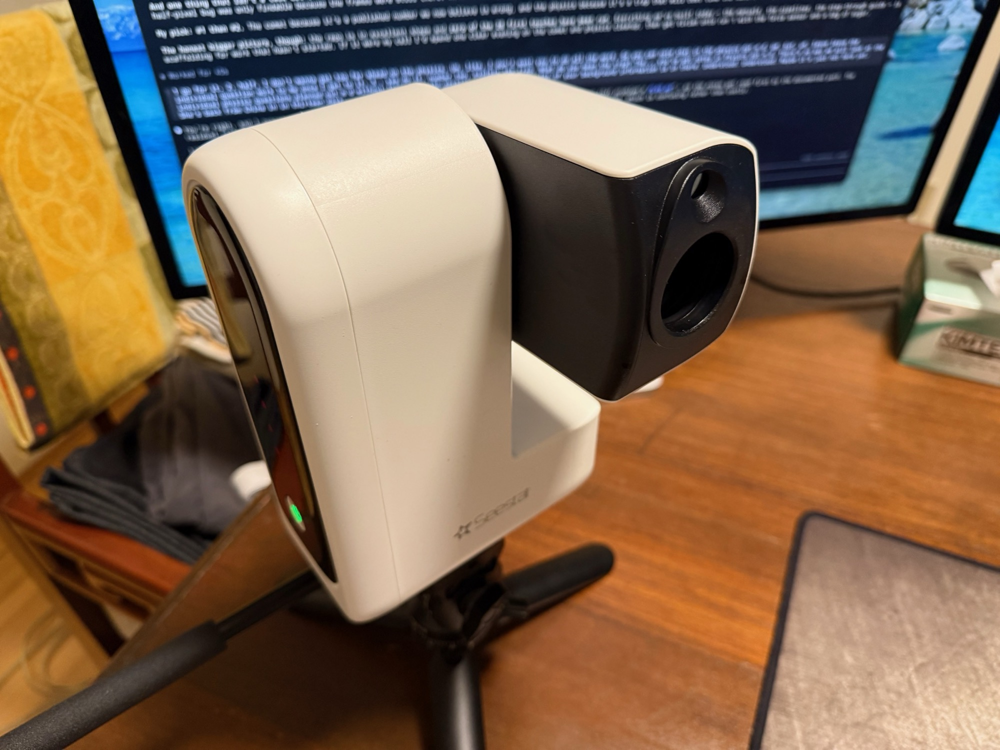</figure>
<figure>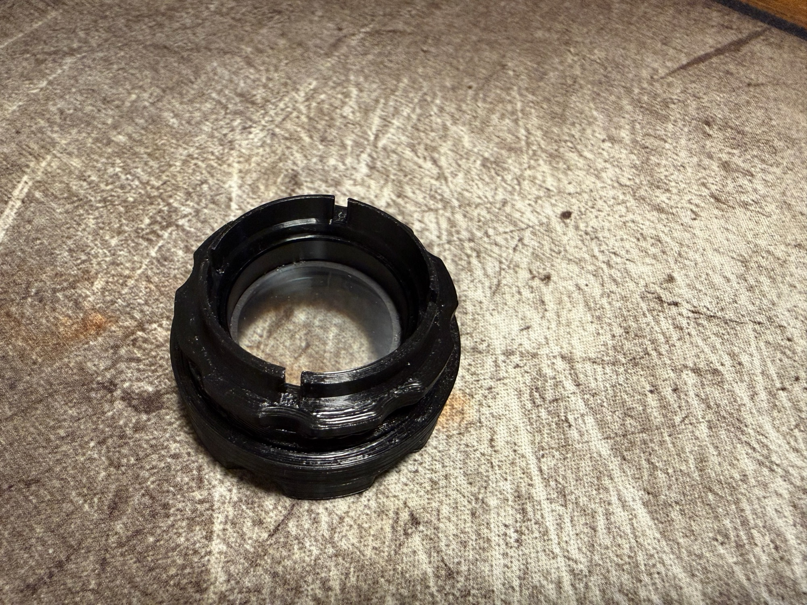</figure>
<figure></figure>
</div>

</div>

<div class="step">

### Checking dispersion

We held it up to a laptop screen before dark. Every white pixel split into three narrow bands, because a screen fakes white out of three coloured emitters; sunlight through the same grating gives an unbroken rainbow.

<figure class="small">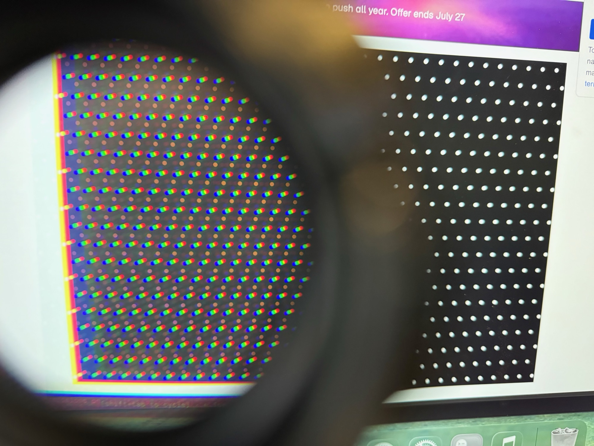</figure>

</div>

<div class="step">

### Choosing the filter

Those dark bands are the measurement, and they exist only as gaps in the continuum around them, so reading them means capturing the continuum too, across the whole visible range. Any filter that keeps a selection of wavelengths rather than a band of them destroys the thing being measured.

The scope carries two, and only one leaves that intact.

<div class="term">

**IRCUT** blocks everything past about 700 nm. A silicon pixel only registers a photon carrying enough energy to lift an electron across the silicon bandgap, and that gap of 1.12 eV corresponds to a wavelength of 1100 nm: anything shorter is detected, anything longer passes through the sensor unseen. So the chip responds all the way out to 1100 nm while the eye stops near 700. Cutting at 700 nm is what puts the red end of our spectrum there.

**LP** is a filter for photographing nebulae from a city. It was never meant to be pointed at a star. Nebular gas is thin enough to be near vacuum, so nothing thermalizes into a continuum: a nearby hot star ionizes it, electrons recombine and cascade down the energy levels, and every jump emits at one exact wavelength. A nebula's entire output is therefore a few bright lines, while streetlight skyglow is spread across all of them — so keeping two narrow windows, at Hα and at Hβ/OIII, discards most of the glow and almost none of the nebula.

</div>

That band of near-infrared the sensor can see and we cannot causes two separate problems.

The first is focus. A lens bends light by refraction, and the refractive index of glass is not a single number — it falls as wavelength rises, so blue is bent harder than red. A lens's focal length is set by that index, so if the index changes with colour then the focal length does too, and every wavelength comes to its own focus at its own distance behind the glass. Designers cancel this by cementing two glasses whose dispersions pull in opposite directions, which drags a chosen pair of wavelengths back to a common focus; the correction holds across the visible band it was built for and lapses outside it. Near-infrared sits far enough outside that its focus can be millimetres adrift, so with the visible image sharp the infrared is still a wide converging cone when it reaches the sensor and lands as a broad disc — the halo around every star.

The second is colour. The Bayer filters are dyes, and a dye absorbs because its molecules have transitions at particular wavelengths — transitions that sit in the visible. In the near-infrared they have nothing to absorb with, so red, green and blue are all transparent to it alike. Infrared therefore reaches every pixel whatever filter is over it and adds the same pedestal to all three channels. Since colour is read from the ratios between channels, an equal addition to each drags every ratio toward grey, and nothing in the frame says how much of a pixel was infrared, so it cannot be subtracted afterwards.

<div class="row">
<figure>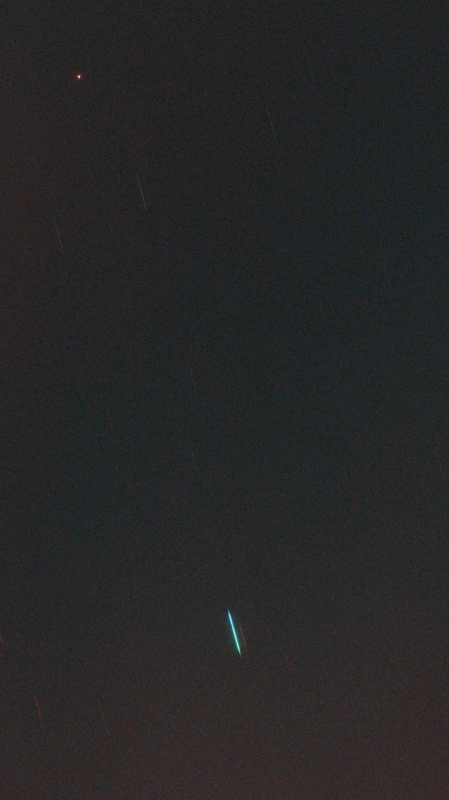</figure>
<figure>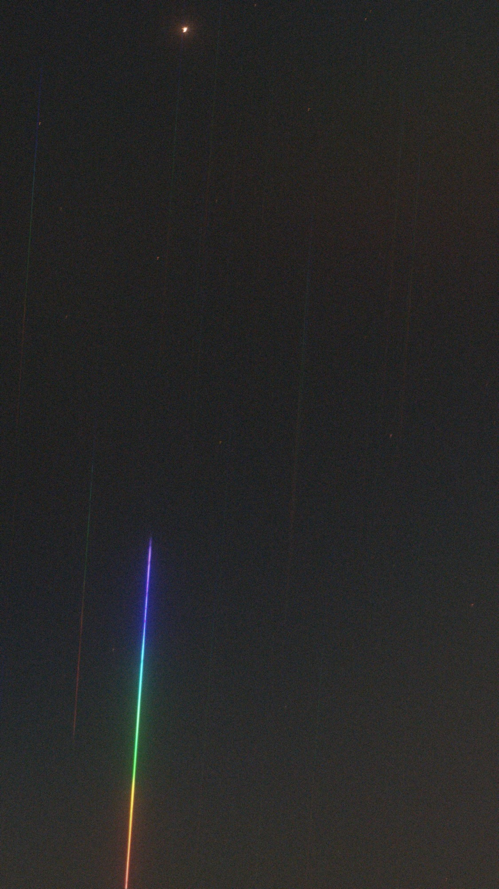</figure>
<figure>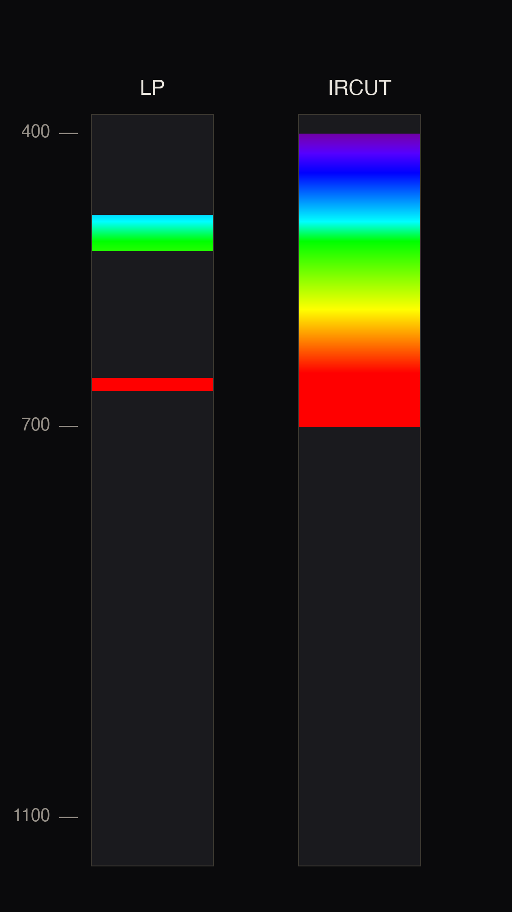</figure>
</div>

</div>

<div class="step">

### Aiming so the spectrum stays on the sensor

Where a given wavelength lands follows from the grating itself. The grating equation says light leaving at angle θ reinforces itself only where the path difference between neighbouring grooves is a whole number of wavelengths.

<div class="eq"><span class="eq-n">1</span>d · sin θ = m · λ</div>

We used first order only, so m = 1, and solving for the angle a wavelength leaves at gives:

<div class="eq"><span class="eq-n">2</span>θ = asin( λ / d )</div>

The sensor is a flat plane a distance D behind the grating, so that ray lands a distance s from the undeflected spot.

<div class="eq"><span class="eq-n">3</span>s = D · tan θ</div>

<figure>
<svg viewBox="0 0 630 250" style="width:100%;height:auto" role="img" aria-label="Light enters at the grating on the right and lands on the flat sensor at the left, a ray at angle theta arriving D times tan theta from the undeflected spot">
  <g fill="none" stroke="#1f2328" stroke-width="1.6">
    <line x1="540" y1="35" x2="540" y2="215"/>
    <line x1="90" y1="35" x2="90" y2="215"/>
  </g>
  <defs><marker id="ah" markerWidth="8" markerHeight="8" refX="6" refY="3" orient="auto">
    <path d="M0,0 L7,3 L0,6 z" fill="context-stroke"/></marker></defs>
  <line x1="606" y1="185" x2="556" y2="185" stroke="#57606a" stroke-width="2.6" marker-end="url(#ah)"/>
  <line x1="540" y1="185" x2="104" y2="185" stroke="#57606a" stroke-width="2.6" marker-end="url(#ah)"/>
  <line x1="540" y1="185" x2="103" y2="59" stroke="#b3576b" stroke-width="1.6" marker-end="url(#ah)"/>
  <path d="M 470 185 A 70 70 0 0 1 473 165" fill="none" stroke="#b3576b" stroke-width="1.4"/>
  <circle cx="90" cy="185" r="4.5" fill="#656d76"/>
  <circle cx="90" cy="55" r="4.5" fill="#b3576b"/>
  <g stroke="#8b949e" stroke-width="1.1">
    <line x1="90" y1="232" x2="540" y2="232"/>
    <line x1="90" y1="227" x2="90" y2="237"/><line x1="540" y1="227" x2="540" y2="237"/>
    <line x1="58" y1="55" x2="58" y2="185"/>
    <line x1="53" y1="55" x2="63" y2="55"/><line x1="53" y1="185" x2="63" y2="185"/>
  </g>
  <g font-family="ui-monospace, Menlo, monospace" font-size="15" fill="#1f2328">
    <text x="452" y="180" text-anchor="end">θ</text><text x="315" y="247" text-anchor="middle">D</text><text x="30" y="126">s</text>
  </g>
  <g font-family="-apple-system, sans-serif" font-size="12.5" fill="#656d76">
    <text x="540" y="26" text-anchor="middle">grating</text>
    <text x="581" y="174" text-anchor="middle">starlight</text>
    <text x="90" y="26" text-anchor="middle">sensor</text>
    <text x="104" y="205">m = 0 · the zero-order dot</text>
    <text x="104" y="48">m = 1 · this wavelength</text>
  </g>
</svg>
</figure>

Dividing by the pixel size, p = 2.9 µm, puts that in pixels rather than millimetres.

<div class="eq"><span class="eq-n">4</span>px = s / p</div>

Substituting 2 into 3 and 3 into 4 leaves D and p appearing only as a ratio, so they collapse into a single constant A = D / p. With d = 1 / (100 grooves per mm) = 10,000 nm, one free parameter carries the entire wavelength scale:

<div class="eq">px(λ) = A · tan( asin( λ / 10,000 nm ) )</div>

Hα's wavelength is not something we measure. It is fixed by atomic physics at 656.3 nm — the energy gap between hydrogen's n = 3 and n = 2 levels, identical in every hydrogen atom anywhere — so it can be put into the relation as a known and the answer predicted before observing anything. It lands about 3630 px from the star, against a sensor whose long side is 3840 px. A centred star throws its own spectrum off the chip, so it has to sit hard against a short edge. `spectro_frame.py` picked the corner by running the relation outward to the frame boundary, using a provisional A anchored on one measured point:

```python
A_PX  = 2209.0 / math.tan(math.asin(400.0 / GROOVE_NM))
px_of = lambda lam: A_PX * math.tan(math.asin(lam / GROOVE_NM))
best_corner(angle_deg, margin)     # star goes in the corner the streak runs AWAY from
```

</div>

<div class="step">

### Gathering light

<div class="term">

**An exposure** is how long the sensor is left collecting light for one frame. Longer gathers more photons and buries the sensor's own read noise, but every pixel has a ceiling. Once a pixel fills, further photons go unrecorded and its reading stops meaning anything — it is saturated, and no processing recovers what it did not count.

**A sub** — short for sub-exposure — is one of those frames, saved as its own file rather than as part of a finished picture. Stacking many afterwards averages the random noise down while the real signal adds up, which is how something faint survives being photographed at all.

</div>

We pointed the scope at Vega and put it in the corner worked out above, so the star and as much of its spectrum as the sensor would hold landed on the same frame. Thirty subs of five seconds each, stacked afterwards.

<figure>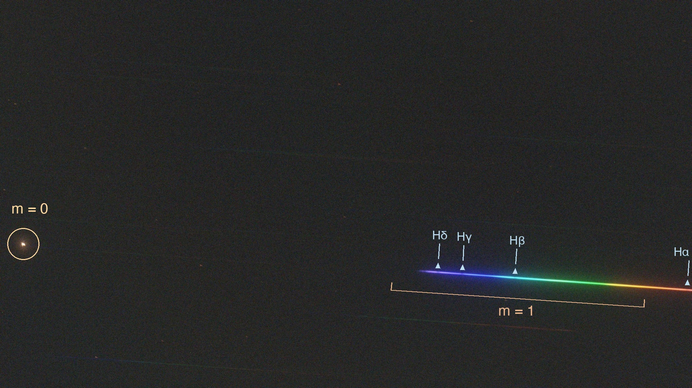</figure>

The dot on the left is the **zero order** — light the grating did not bend, every colour together. Its position does not depend on wavelength, so it is the origin everything else is measured from. The streak running away from it is the **first order**, blue bent least and so nearest the star, red bent most and furthest. The frame is turned a quarter turn here; on the sensor the spectrum runs down the long axis.

Look closely at that streak and it is not a smooth rainbow. Four dark gaps interrupt it, arrowed above, and those gaps are the whole experiment: hydrogen in Vega's upper atmosphere absorbing its own wavelengths on the way out, exactly as described at the start. The arrows are not placed by eye — each sits where the grating geometry says that line must fall, and each lands on a real dip in the streak's brightness within a pixel, Hγ the deepest at 83 % of the light either side of it. The measurement is already there in a single unprocessed frame. Everything after this is turning it into numbers good enough to compare against a catalogue.

The red end stops short of where IRCUT would allow. 700 nm falls 3872 px from the star and the sensor's long axis is only 3840, so the full 400–700 nm cannot fit while keeping the zero-order dot on the frame. We kept the anchor and took the trim: this frame runs 400–672 nm, putting Hα 83 px inside the bottom edge. Barely enough — and enough, because Hα is one of the two lines the classification ends up resting on.

Vega is why one streak dominates the frame. It is the star the magnitude scale was originally pinned to, defined as magnitude zero and sitting at 0.03 on the modern scale, and it outshines its brightest neighbours in Lyra by roughly fifty times. Squint at the dark parts of the frame, though, and fainter parallel streaks are there too. Every star is a point source, the grating sits ahead of the optics, and so every star in the field gets dispersed into its own spectrum — the same physics, just too faint to measure. Vega is the one bright enough to read, which is exactly why we started with it.

</div>

## Frame to spectrum

<div class="step">

### Measuring the blur

With no slit anywhere in the setup, the star's own image profile is the finest detail the spectrum can resolve.

<div class="term">

**Seeing** is atmospheric turbulence. Warm and cool air pockets have slightly different refractive indices and act as weak, shifting lenses, so a wavefront that arrives flat at the top of the atmosphere is crumpled by the time it reaches the telescope and the star lands as a blob a few arcseconds across — half an arcsecond on a mountaintop, two to four in a backyard.

**A resolution element** is the smallest gap between two things that still reads as two. The grating turns a wavelength difference into a distance, but each wavelength arrives as a blob, so two wavelengths landing closer than the blob is wide merge. A spectrograph's slit throws away most of the light to replace that blob with a clean line; we have none.

</div>

It had to be measured on a plain frame taken without the grating, because with the grating fitted every star is a streak and no point sources are left. All 400 unsaturated stars shared the same profile, so the blur is optics, focus and tracking rather than any individual star — and it is why the type came out solid while the subtype stayed marginal.

<figure>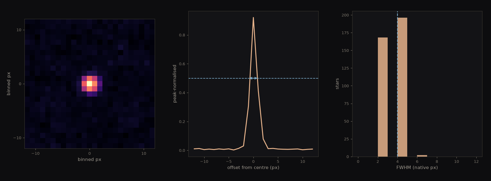</figure>

</div>

<div class="step">

### Splitting the Bayer planes

<div class="term">

**Debayering.** A pixel cannot see colour — silicon counts photons — so each one sits under a tiny colour filter in a repeating 2 × 2 tile, green and red on one row, blue and green on the next. Separating those interleaved grids back into three images is debayering.

</div>

Extracting without it averages three different filter throughputs at once, and as the streak drifts across the two-pixel grid the mix inside the box keeps shifting. The two periodic patterns beat against each other like two mistuned strings, leaving a ripple that belongs to the mosaic and not the star. `reduce_spectrum.py` takes the planes at half resolution with no interpolation:

```python
def planes(path):
    """GRBG -> (G, R, B) at half resolution, no interpolation."""
```

Measured across a line-free window, that halved the ripple, **0.05 → 0.026**.

<figure>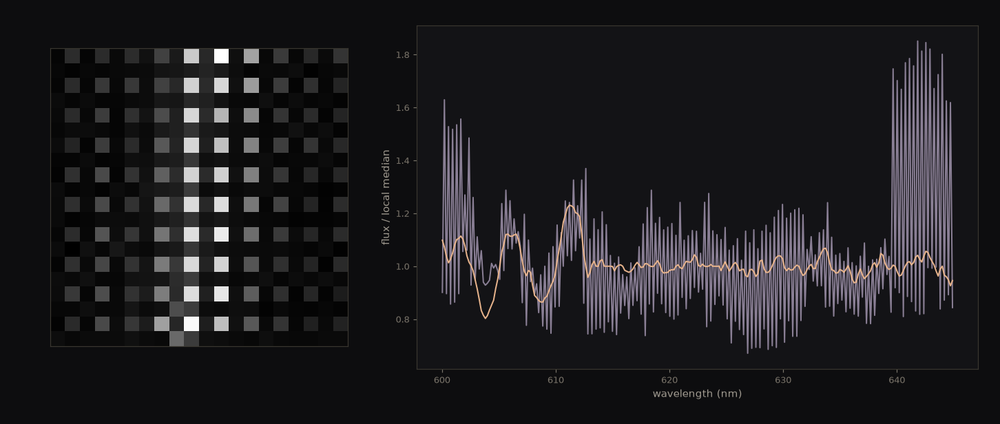</figure>

</div>

<div class="step">

### Finding the dot and rectifying the streak

`spectro_annotate.py` handles both. The zero-order dot is located on its unsaturated wings rather than its peak, because the core is clipped flat and `argmax` lands arbitrarily inside it:

```python
find_zero_order(d)                      # compact bright blob; streaks are long, so filter on extent
centroid_zero_order(d, y, x, box=60)    # centroid the WINGS, not the clipped core
measure_angle(d, y0, x0, r0=1600, r1=3600)   # brightest direction, refined on transverse drift
rectify(rgb, y0h, x0h, ux, uy, rs_h, half_width=22)
```

On the 2026-07-29 frame the dot centroided at (816.4, 143.9) and the streak ran at −4.1°.

<figure>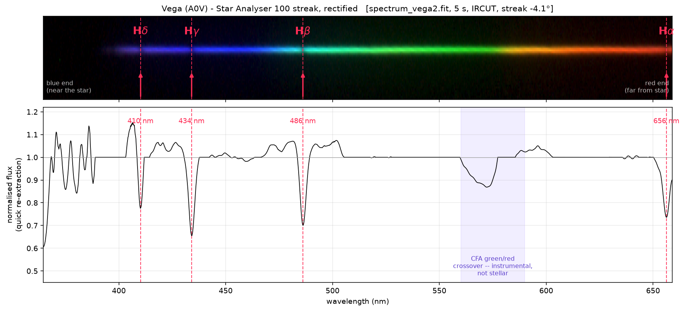</figure>

</div>

<div class="step">

### Collapsing to 1-D

With the streak straight, every column holds one wavelength, so adding a column up collapses the rainbow to one number per wavelength.

```python
strip = rectify(rgb, y0, x0, ux, uy, rs, half_width=w)
strip = strip.sum(axis=2)      # R+G+B, planes already separated
prof  = strip.sum(axis=0)      # sum DOWN each column
```

How wide to sum was the only judgement call. Past the edge of the star each extra row adds sky noise and no signal, so noise grows as √rows while signal has stopped. Three pixels either side was best; forty captures every photon but keeps **56 %** of the achievable signal-to-noise. `extract_demo.py` swept the width.

<figure>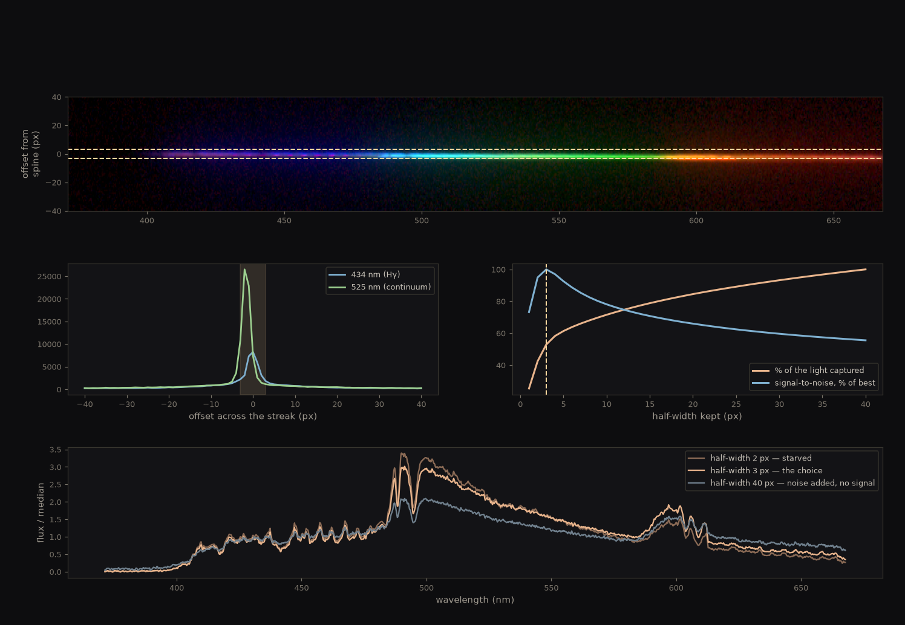</figure>

</div>

<div class="step">

### Fitting the wavelength scale

The dispersion relation that placed the star in its corner carries one free parameter, and the whole wavelength scale is that parameter. Aiming only needed a rough A; reading a spectrum needs a measured one.

A is measured, not derived. We read the pixel distance from the dot out to each dark line; every wavelength is fixed by atomic physics, so four lines gave four equations in one unknown. Three were spare, and that redundancy is the test — no wrong model places four lines to a fraction of a nanometre with a single number. `fit_A_demo.py` did the fit:

```python
r = [2305, 2441, 2735, 3693]                       # px, measured off the frame
lam = [410.174, 434.047, 486.135, 656.281]         # nm, atomic physics
A_FIT = 56016.0                                    # least squares over all four
```

<figure>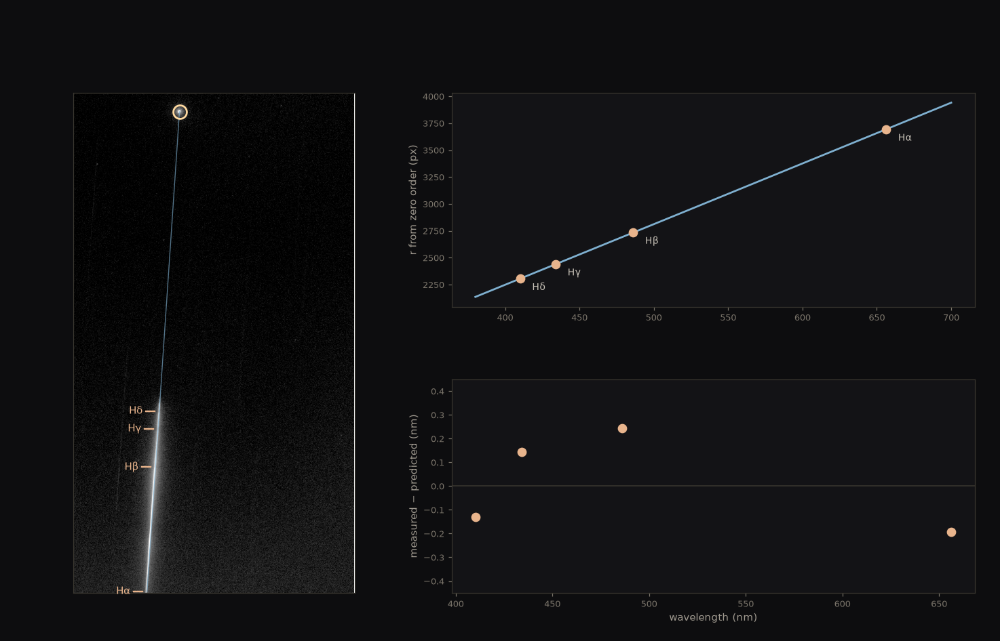</figure>

<div class="result">
<strong>A = 56,016 px</strong>, out-of-sample residuals <strong>0.185 nm rms</strong>. <code>A × 2.9 µm = 162.9 mm</code> against a 163 mm plate-scale focal length. The residuals scatter around zero rather than sloping with wavelength, so the tan-of-asin shape is right and not merely fitted.
</div>

A needs re-fitting after every unscrew, since re-threading shifts the grating axially by a few millimetres. The same Hα sat at 3629 px on the 2026-07-28 mounting and 3684 px on this one.

</div>

## Reading the star

<div class="step">

### Dividing out the continuum

<div class="term">

**The continuum** is the smooth, roughly blackbody background a hot dense photosphere radiates at every wavelength at once. Dividing the spectrum by a smooth fit through its own line-free stretches removes the star's temperature slope and the instrument response together, leaving every line as a dip below a flat 1.0.

</div>

</div>

<div class="step">

### Measuring equivalent width, not depth

Depth is the obvious measurement and the wrong one: seeing makes a line shallower and wider at once, though the total light removed has not changed. Equivalent width measures that total — the area of the dip, written as the width of a rectangular notch removing the same light — and area survives blurring. Normalised against the local continuum, it also needs no flux calibration.

<div class="eq">EW = ∫ ( 1 − F / F<sub>continuum</sub> ) dλ</div>

We swept the integration width outward to confirm the number had settled rather than still climbing.

<figure>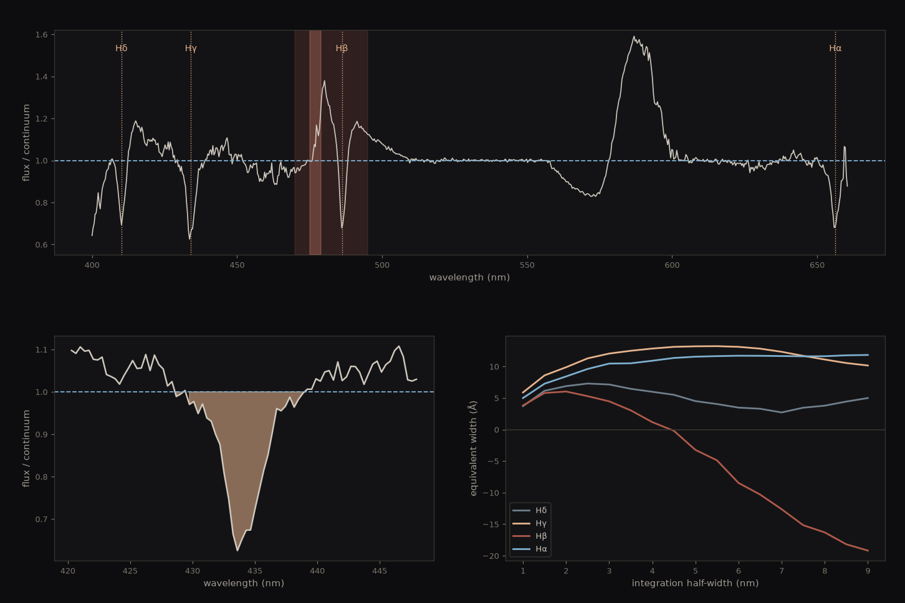</figure>

<div class="result">
<strong>Hγ ≈ 13.1 Å · Hα ≈ 11.7 Å</strong>, both converged.
</div>

<figure>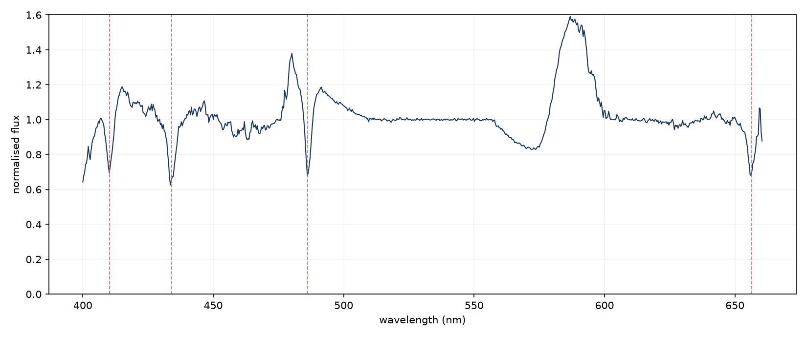</figure>

The bump near 480 nm and the dip between 560 and 590 nm are instrument, not star.

</div>

<div class="step">

### Fitting χ² against 131 templates

The Pickles atlas publishes Balmer equivalent widths for 131 templates — the same quantity we measured, so no resolution matching and no flux calibration were needed. `pickles_chi2.py` pulled table `lew` from VizieR (J/PASP/110/863), cached it, and ordered the templates hot to cool.

<div class="eq">χ² = Σ ( EW<sub>ours</sub> − EW<sub>template</sub> )² / σ²</div>

<figure>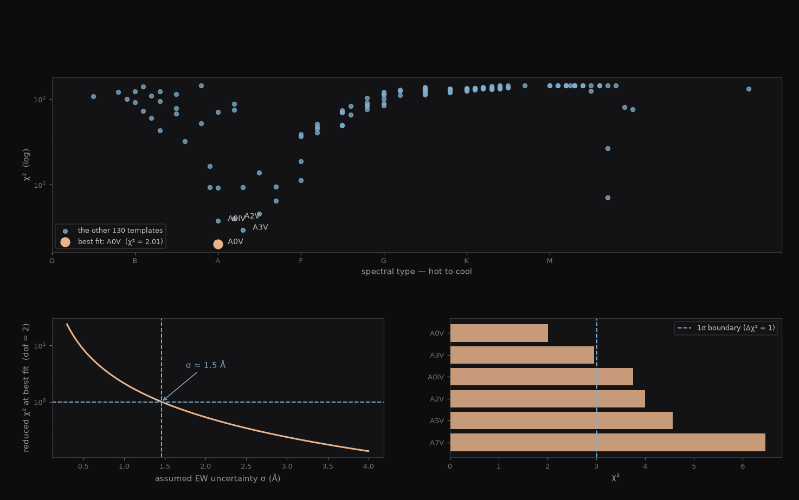</figure>

The minimum sits among the A stars and is deep — its neighbours are an order of magnitude worse.

| Rank | Type | χ² | Δχ² |
|---|---|---|---|
| 1 | **A0V** | 4.27 | 0.00 |
| 2 | A3V | 6.28 | 2.01 |
| 3 | A0IV | 8.00 | 3.73 |

σ was derived rather than assumed: the value making reduced χ² equal 1 is our equivalent-width uncertainty, 1.5 Å, and at that σ only A0V and A3V survive — hence ±3 subclasses.

<div class="result">
<p class="big">Vega = A0V</p>
<p>±3 subclasses, equivalent-width uncertainty ≈ 1.5 Å. We consulted the catalogue only afterwards, so it was a blind classification: SIMBAD lists A0V.</p>
</div>

</div>

<div class="step">

### Running a second star through the same chain

Albireo is a pair we cannot resolve — 35″ of separation is 4.8 px here, so what reached the sensor was one blended streak carrying a K3II giant and a B8V dwarf together. The other rainbows in that frame are unrelated field stars. `spectra_results.py` ran both targets and reported depth and significance line by line.

<figure>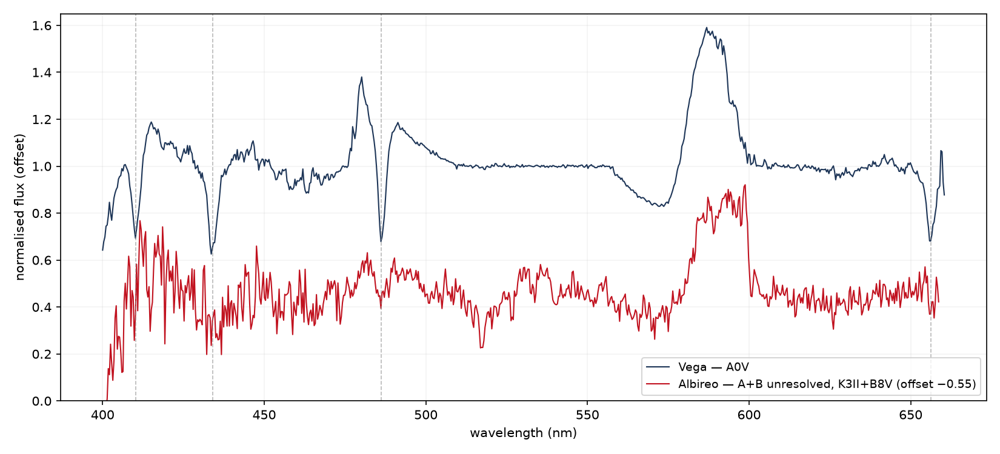</figure>

It came out shallower at all four lines, not one. There was also far less of it — 3 × 20 s against Vega's 30 × 5 s — so its continuum noise is 0.043 against 0.017, and every significance falls with it.

| Line | Vega | Albireo | Albireo σ |
|---|---|---|---|
| Hδ 410.2 | 30.7 % | 19.2 % | 4.5 |
| Hγ 434.0 | 37.4 % | 25.3 % | 5.9 |
| Hβ 486.1 | 32.1 % | 5.6 % | 1.3 |
| Hα 656.3 | 31.9 % | 9.7 % | 2.3 |

Read Hγ and Hα, the two lines on clean continuum and the two the classification used. Hβ's 5.6 % looks like the sharpest contrast here and is the one number not to quote: it sits on the broken 477 nm continuum, and at 1.3σ it is not a detection.

<div class="term">

**Why the blend is shallow, and it is not composition.** Both stars are overwhelmingly hydrogen, the same as Vega — nothing here is hydrogen-poor or metal-rich in any way that matters. What differs is how many hydrogen atoms sit in n = 2, the only ones that can absorb a Balmer photon, and that population is set by temperature. It peaks around 10,000 K, and **neither** of Albireo's stars is near it: the K3II giant at ~4,300 K is far too cool to lift electrons to n = 2, so nearly all its hydrogen sits in the ground state and is invisible to these lines, while the B8V at ~13,000 K is hot enough that hydrogen is beginning to ionize and the neutral atoms are being removed.

A second effect stacks on top. The pair is unresolved, and the K giant is brighter by roughly six times in visible light, so its continuum floods the blend and dilutes whatever Balmer absorption the B star contributes — a fixed amount of absorbed light against a much larger total reads as a smaller percentage. Vega gets both halves right at once: one star, sitting almost exactly at the peak.

</div>

The K giant does show far more metal lines than Vega, which is where the "heavy metals" intuition comes from, but that is the same cause read the other way round. Cool gas keeps its metals neutral or singly ionized with many low-energy transitions available, and the hydrogen lines have got out of the way. Excitation, not abundance.

<div class="result">
Albireo is shallower at every Balmer line — <strong>9.7 % against Vega's 31.9 % at Hα</strong>, <strong>25.3 % against 37.4 % at Hγ</strong>. That is the control working: the pipeline is reading temperature, and a star at the wrong temperature comes out different. Without it the A0V label has nothing to be measured against.
</div>

</div>

## Open defects

Both sit in the continuum, and neither blocked the result, because equivalent width needs a good continuum only locally.

- **A step in the instrument response near 477 nm.** Flux doubles across about 2 nm. No running median tracks a jump that sharp, so the continuum sags just redward and manufactures a false bump that cancels Hβ's blue wing, driving Hβ's equivalent width negative — physically impossible. Cause still unidentified.
- **The blue cutoff below 400 nm** contaminates Hδ, whose equivalent width peaks and then falls instead of converging.

So the classification rests on Hγ and Hα alone. Most of the residual χ² comes from Hα, where we read 11.71 Å against A0V's 9.8, and Hα sits nearest the IRCUT edge — an uncorrected response slope there is the first suspect.

<div class="term">

"Hβ is 32 % deep" looked healthy and hid this for three days. "Hβ has an equivalent width of −16 Å" is impossible on sight. Switching to the quantity the reference catalogue also publishes is what exposed it.

</div>
