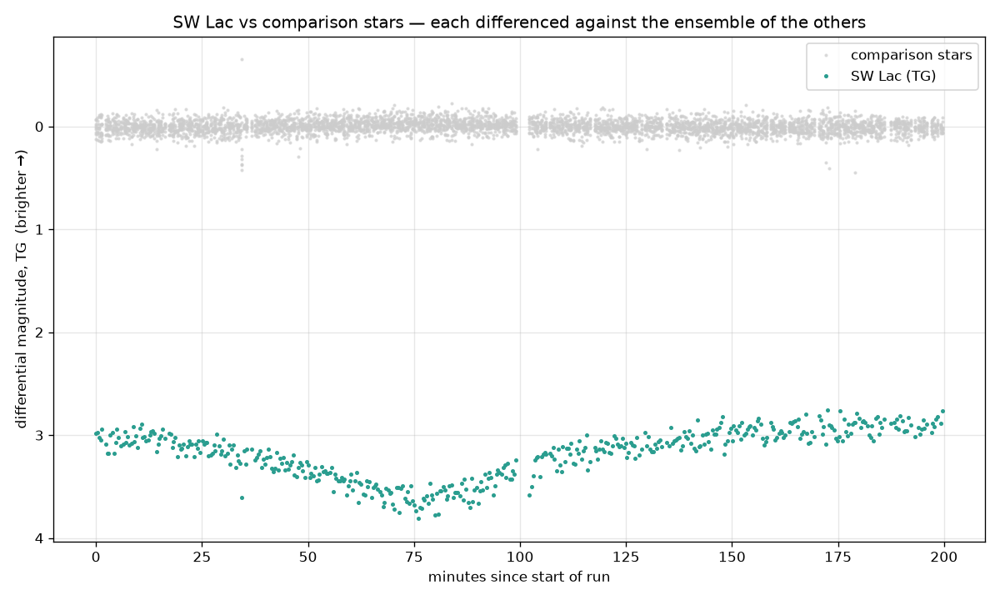
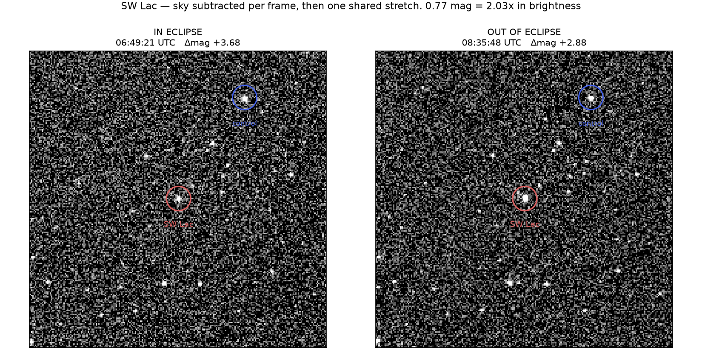
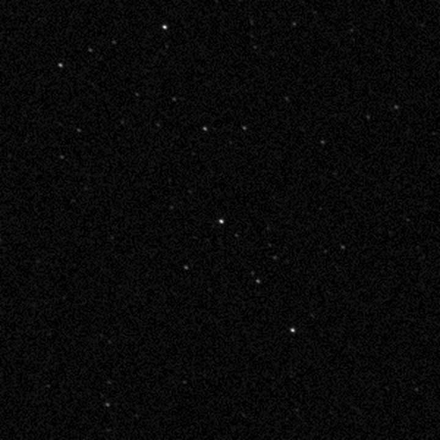
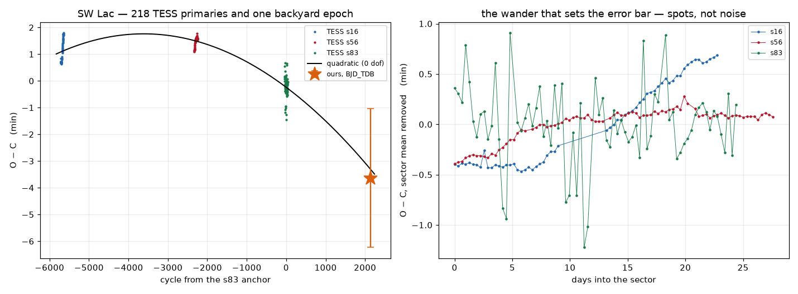
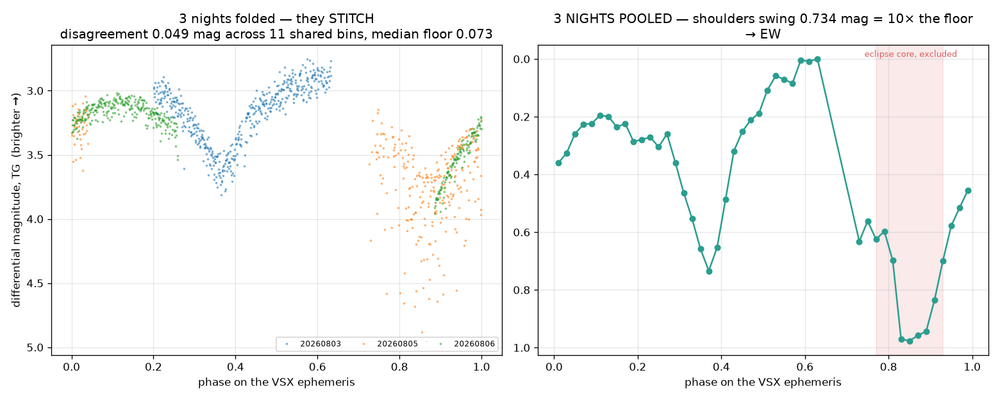
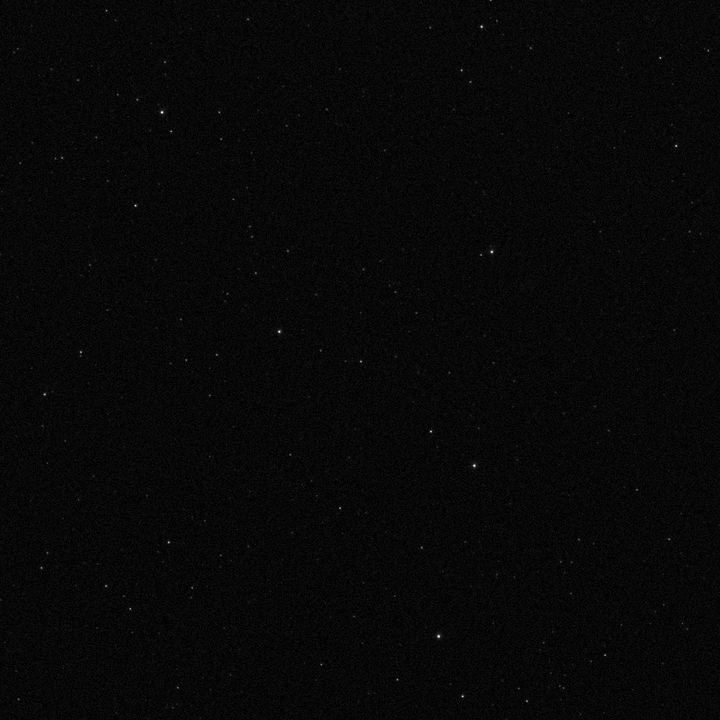
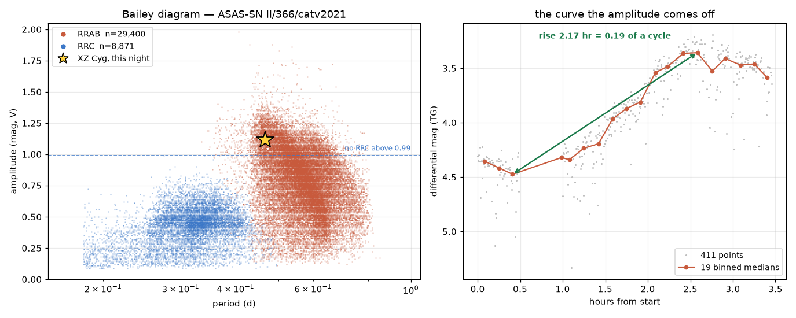

SW Lacertae is two stars orbiting so close that they touch, each passing in front of the other every 7.7 hours. A 30 mm telescope in a Vancouver back garden watched one of those eclipses from beginning to end and timed the moment of minimum. Read against a five-year ephemeris built from a space telescope's own measurements, our epoch lands <strong>twenty seconds away</strong>. This report is how a number that small comes out of a small instrument, and what had to be found wrong first.

## The clock in the sky

### Brightness is only ever relative

You cannot measure how bright a star is. You can only measure how bright it is **compared with its neighbors in the same frame**.

That sounds like a limitation and it is the entire method. Cloud, haze, altitude, dew on the lens — every one of them dims the target, and every one dims the comparison stars sitting beside it on the same sensor, through the same column of air, in the same twenty seconds. Divide the target's brightness by theirs and all of it cancels. What survives the division is only what is *not* shared, and a star that is genuinely changing is the only thing not shared.

So the comparison stars do not need to be independent of the target. They need to **share its fate**, and the target needs one extra thing happening to it.

Here is that arithmetic on the real night. Between the bottom of the eclipse and full light, the target's raw brightness changed by 0.784 magnitudes. The comparison stars — which do not vary — changed by 0.070 over the same interval. That 0.070 is not a star. It is the sky. Subtract it and what remains is the eclipse.

This is why aperture matters less than you would expect. A bigger telescope reaches fainter stars, but it does not make a *ratio* more honest. The 30 mm objective limits how faint we can go, at about magnitude 15. It does not limit how precisely we can measure anything brighter.

### An eclipse is a clock

Most variable stars change brightness because something inside them is changing. An eclipsing binary does not. Both stars burn steadily the whole time; they simply pass in front of one another, and the dimming is pure geometry.

That makes it a **clock**. The eclipse happens once per orbit, at the same point in the orbit every time, and the moment of minimum is a tick you can put a number on. Astronomers have been recording those ticks for over a century, which means a measurement made tonight can be compared with one made in 1950.

SW Lac is an extreme case: the two stars are in contact, sharing an envelope, going round in 7.7 hours. It is bright — magnitude 8.5 to 9.3, within reach of binoculars — and it eclipses twice per orbit, so on a good night you can catch a tick without waiting long.

### Why a tiny error can be measured at all

Here is the trick that makes the whole project possible.

If the period were perfectly constant, every minimum would land exactly where the previous one predicts, and the difference between the observed time and the calculated time — called **O − C**, observed minus calculated — would be zero forever. If the period is slightly wrong, O − C drifts. If the period is *changing*, O − C curves.

Now consider the size of what we are chasing. SW Lac's period appears to be shrinking by about **21 milliseconds per year**. In one night that is a millionth of a cycle — utterly unmeasurable. But the O − C diagram does not measure the rate. It measures the **accumulated** effect, and over the 5,680 cycles between two space-telescope visits, 21 ms/yr piles up into 8.3 minutes of drift.

The diagram is a magnifying glass whose magnification is time itself, and it costs nothing but patience. A backyard telescope that can time a minimum to a minute is therefore a useful instrument for a question no single night could touch.

## Setting up

### Saving every frame

The Seestar normally throws its individual exposures away, stacking them on the fly into one pretty picture. Photometry needs the opposite: every exposure kept separately, because each one is a point on the light curve.

Advanced Settings → *Save each frame in enhancing*. Frames then land as individual FITS files, one per exposure. That single toggle is the whole preparation.

477 exposures of 20 seconds over 200 minutes, on 2026-08-02/03

### Green only, and why

The sensor is a color camera. Every pixel sits under a red, green or blue filter in a repeating tile, so a raw frame is not one image — it is three interleaved images at different wavelengths.

That matters more than it sounds. Adding all three together measures brightness through a passband nobody can name, which makes the result impossible to compare with anyone else's. And letting the camera interpolate the colors — debayering — smears light across the boundary of the aperture we are about to measure, which corrupts the measurement outright.

So we throw away three quarters of the pixels and keep only the green ones. That halves the resolution, which does not matter at all when the job is summing light inside a circle. What it buys is a **defined passband**: green on this sensor is close enough to the standard Johnson V band to be reported as one. Having a band with a name is the difference between a light curve and a submission.

### Choosing the comparison stars

For each frame the software plate-solves the sky, converts each comparison star's celestial coordinates into pixel positions, and sums the light inside a circle 3.5 pixels across, subtracting the sky measured from a ring around it.

The circle is deliberately tight. Photometry's classic failure is a neighboring star sneaking inside the aperture and being counted as part of the target — on an earlier asteroid measurement that mistake cost a factor of 2.5.

Every frame is plate-solved individually rather than assuming the field holds still, because the mount re-centers itself mid-run. Fitting one transformation at the start and trusting it drifts off target partway through the night, and the software then measures whatever star happens to be nearest.

### Vetting them, which nobody had done

The comparison stars are the ruler. Everything in this report is measured against them, so a comparison star that varies is a ruler that stretches.

Nothing in the pipeline had ever checked. We took all 25 stars that had been used as references across every night and asked two catalogs — Gaia and the Variable Star Index — a simple question: is this star known to vary?

<strong>Six of twenty-five</strong> carry a variability flag — including V0364 Lacertae, a named variable — and between them they were contributing <strong>31.7 %, 48.7 % and 32.5 %</strong> of the reference brightness on the three nights.

Roughly a third of the ruler was made of rubber, and on one night nearly half.

Rebuilding the list took two passes. First the catalog check above, which left 19. Then a second question the catalogs cannot answer: is the star actually *measurable* on every night? That is not the same as whether it was detected. One night found only 7 comparison stars where another found 20 — not because thirteen stars had left the sky, but because a brighter background raised the detection threshold past them. Measuring at the known coordinates instead, one star that had only ever been *detected* on the worst night turns out to measure cleanly on all three.

Nine stars survive both tests, spanning magnitude 5.8 to 8.7. The list is now fixed and written down, so every night is measured against the same ruler.

The cost is real and worth stating: nine stars average worse than twenty, so on two of the three nights the noise floor got slightly *worse*. On the third it improved. Removing the variables mattered more than losing the count.

Both questions we asked were about the *stars*. Neither asked whether the camera could measure them, and that turned out to be the one that mattered — but not for another two weeks, and it has its own section further down.

## Frame to light curve

### Three cuts, catching three different failures

Not every frame is usable, and the ways a frame fails do not overlap.

**Noise** rejects frames where the sky itself was bad. **Roundness** rejects frames where the mount slipped and every star is a short dash instead of a dot — and this one is invisible to a noise cut, because smearing a star preserves its total brightness while destroying its shape. **Transparency** rejects frames where the comparison stars as a group faded, which catches cloud drifting through.

Measured across three nights, the cuts genuinely do not substitute for each other. On one night 14.2 % of frames were trailed and the noise cut kept **every single one** of them. On another there was no trailing at all, and the noise cut removed 22 %.

### The envelope measures its own ruler

Here is the idea the whole reduction turns on.

Every comparison star is measured **exactly the same way as the target** — each one divided by the ensemble of the others. The comparison stars do not vary, so whatever scatter they show is the measurement noise, measured on this night, through this air, with this code. It is not estimated or inherited from a textbook. It is the floor, and it arrives free with the light curve.

Comparison-star scatter <strong>0.064 magnitudes</strong> — measured on the night, not assumed

<figure></figure>

The gray points are the comparison stars, flat. The green points are SW Lac. The eclipse is not subtle once the sky has been divided out — but it needed dividing out first, and that is the point.

This is also what makes a *negative* result trustworthy. An earlier attempt on a different star looked like a detection until it was compared with its own envelope, where it turned out the target was not standing out from its comparison stars at all. That measurement was retracted, and it was the envelope that caught it.

### Seeing it by eye

A light curve is a plot of a number. It is worth asking the blunter question: **can you actually see the star change?**

<figure></figure>

Two exposures of the same patch of sky, one at the bottom of the eclipse and one at full light. Both have their own sky background subtracted and then get **one shared brightness stretch** — because stretching each image to its own range is exactly how you manufacture a difference that is not there.

SW Lac is circled in red. A comparison star of similar brightness is circled in blue as a control: if the target changes and the control does not, the change belongs to the star and not the night.

<figure class="medium"></figure>

The caption on that figure claims 0.768 magnitudes. The target's raw brightness in those two frames differs by 0.827, so the eye is seeing the whole of the claimed change and a little more — worth checking rather than assuming, because a figure quoting a number the eye cannot see is a figure that has stopped being evidence.

## Timing the minimum

### Bracketing the eclipse, and losing it twice

A time of minimum is measured by **symmetry**. You guess a moment, fold the light curve back on itself about that moment, and measure how badly the two halves disagree. The disagreement is smallest at the true minimum, and the shape of that disagreement gives the error bar.

The method needs both halves. With only the descent and no ascent, there is nothing to fold against, and the fit honestly reports a huge uncertainty rather than a confident wrong answer.

We have lost this twice. On one night the minimum arrived at the very start of coverage; on another the eclipse bottomed out **thirty seconds** after the shutter opened, leaving half a minute of ingress against 168 minutes of egress. Both nights produced clean, well-measured light curves and neither is a usable timing.

Both failures had the same cause, and it was not the weather: the star was pointed at when the telescope became free rather than when the eclipse demanded. This is the one measurement in the project that cannot be rescued afterwards at a desk.

The night that worked: <strong>83 minutes of lead-in</strong>, the floor, and <strong>117 minutes of egress</strong>

### The error bar worth arguing about

The fitting method returns its own uncertainty, and quoting it alone would be dishonest, because it describes *one* fit rather than the measurement.

Re-run the fit across ten reasonable choices of how far to reflect and how wide a window to search, and the answer moves around. That movement is a real uncertainty and it is not in the formula's answer.

formal fit error <strong>1.30 min</strong> · spread across ten method choices <strong>0.41 min</strong> · quoted, in quadrature, <strong>±1.36 min</strong>

On the first version of this reduction those two numbers were 1.69 and **4.19** minutes — the method spread dominated the formal error by two and a half times. A result that moves four minutes depending on how you fit it was never limited by the telescope.

### Getting the time itself right

This is the correction that took the longest to find, because nothing about it looks like an error.

You wrote down the time your shutter opened. But you are standing on a planet that swings 300 million kilometres across its own orbit each year, and light takes **8.3 minutes** to cross one astronomical unit. The same eclipse observed in February and in August arrives at your telescope up to sixteen minutes apart — not because the star did anything, but because you moved.

So a raw observation time is not a fact about the star. The fix is to convert it to when that light would have reached the **center of mass of the solar system**, a point that does not swing around annually. Every observer and every spacecraft reports times that way, which is what lets a garden in Vancouver and a telescope in orbit put numbers on the same line.

light travel to the barycenter <strong>+3.897 min</strong> · clock scale correction <strong>+1.153 min</strong> · total <strong>+5.05 min</strong>

Our whole error bar is ±1.36 minutes. The correction is nearly four times larger than the measurement's uncertainty.

And it does not cancel when two epochs are subtracted, which is the trap. It depends on where Earth sits in its orbit relative to that particular star, and the space telescope observed in September while we observed in August. For weeks this pipeline printed results under a label claiming a correction it had never applied. Left uncorrected, our result would have missed by 5.4 minutes — and looked like a discovery.

### Against a space telescope

TESS observed SW Lac in three separate sectors across five years. Rather than take its published ephemeris, we pulled the raw light curves and fitted **434 individual minima** with the same code we run on our own frames, so that whatever biases the method has cancel in the comparison rather than being assumed away.

<figure></figure>

BJD_TDB 2461255.78722 ± 0.00095 d

Predicted by the TESS curve: −3.29 ± 1.12 min. Measured: −3.63 ± 1.36 min. <strong>Residual −0.19σ — twenty seconds.</strong>

Our point took no part in fitting that curve, which is what makes the agreement worth something.

The right-hand panel explains the error bars, and it is a small lesson in itself. Within a single sector the timings do not scatter randomly — they **drift**, one sector ramping half a minute over twenty days and stepping back. That is not the spacecraft; the pattern does not reset at the data downlink. It is starspots migrating across an active pair of stars, dragging the apparent moment of minimum with them. Treating that drift as random noise would have produced an error bar twenty times too small and a false precision to go with it.

### What the curve does and does not prove

The curve through those three points is a parabola, and a parabola has three free parameters. Three points, three parameters — it passes through all of them by construction and **cannot be tested**. Saying "the parabola fits" is arithmetic, not evidence.

But a straight line has only two parameters, so against three points it has something left over, and it **can** fail. It does, decisively.

straight line rejected at <strong>χ² = 26.0</strong> on one degree of freedom — a constant period is excluded

So the period is genuinely changing. What we cannot yet say is *how*. A parabola means the two stars are steadily exchanging mass or bleeding angular momentum — the road to an eventual merger. A **sine wave** would mean something entirely different: an unseen third star, with the eclipsing pair swinging toward and away from us as they orbit it, arriving early and then late. Three points fit both stories equally well.

That second possibility is not exotic. It is how the first planets outside the solar system were found in 1992 — by timing a pulsar and noticing its clock ran early and late. Same physics, different clock.

Separating the two needs a fourth point, and the archive cannot supply one: a search returns those three sectors and nothing else. It will have to be ours, a season from now.

## What the curve says about the star

### Contact, not detached

Three nights, measured against the same nine stars, can be folded together into a single cycle.

<figure></figure>

That they overlap at all is the payoff from fixing the comparison list. Where two nights cover the same part of the cycle they agree to **0.049 magnitudes**, which is below the measurement noise — so this is one light curve, not three stacked hopefully.

The classification does not come from how deep the eclipses are. It comes from whether the light is ever **constant**.

A detached binary — two small stars far apart — sits at flat maximum brightness for most of its orbit and drops into two narrow eclipses. A contact binary is two stars touching, tidally pulled into egg shapes, so the area you see changes continuously and the brightness never settles anywhere.

Excluding the eclipse itself, the remaining curve still swings **0.734 magnitudes, ten times the noise floor**. There is no flat stretch anywhere. That is a contact binary, and the catalogs agree — which makes this a test of the method rather than a discovery, and a useful one, since every previous run of this classifier had been on a completely different kind of star.

The verdict holds. The *margin* does not, quite: measured against a different set of comparison stars the same swing comes out at 0.526 magnitudes and under four times the floor. Out-of-eclipse wobble is exactly what a drifting reference would counterfeit, and the next section is about discovering that our reference drifts. The star is still in contact — but "ten times" is the number to be careful with.

### A different kind of variable altogether

XZ Cygni does not eclipse. It is a **pulsator** — one star, physically swelling and shrinking every 11.2 hours, driven by a layer of helium inside it that becomes more opaque when compressed, traps radiation, pushes the star outward, then cools and lets it fall back. A heat engine, cycling.

<figure class="medium"></figure>

Its type can be read off the light curve's shape, but rather than assert a threshold we asked a catalog of 38,000 real RR Lyrae stars a direct question: of stars with this period and this amplitude, how many are of each subtype?

<figure></figure>

<strong>1,516</strong> cataloged RRAB stars share this period and reach this amplitude. <strong>Zero</strong> of the other subtype do — the entire class tops out below our measurement.

Two independent arguments agree here, and they would fail differently: the amplitude argument would break if our brightness scale were wrong, while the rise time — 2.17 hours from minimum to maximum — is pure timing and would break if the period were wrong. Neither can rescue the other, and both point the same way.

## What we could not measure

### A period of our own

Every period in this report is borrowed from a catalog. We use them to fold the light curve, and they are stated as borrowed, but measuring one from our own frames would test the whole pipeline end to end in a way that fitting somebody else's ephemeris never does.

It does not come out. Pooling every night we have and scanning blindly across candidate periods, the answer is honestly *undetermined* — and the reason is not the photometry.

A baseline of *T* days can only distinguish periods differing by roughly P²/T. Our three nights on a common system span **3.23 days**, which resolves the period to about 12 %. The true value sits less than two resolution elements from the best candidate. No amount of clean measurement separates them; only nights further apart do.

This one moved from being a computing problem to an observing problem in the course of a single afternoon, which is worth recording. The diagnostic that reports it was rewritten to say so, because it had been blaming the reduction — correctly, when it was written, and wrongly thereafter.

### A color term that is not there

Blue light is scattered by the atmosphere more than red, so in principle a red star and a blue star fade at slightly different rates as they sink toward the horizon. That difference does not cancel in a differential measurement, and it would be a real systematic if it were large enough.

The first attempt found one. It was wrong, and the way it was wrong is the useful part: the fit used the comparison stars' own combined brightness as a stand-in for atmospheric thickness — but every measurement is *divided by* that same quantity, so the two axes of the fit shared their noise. Simulate stars that do not vary at all and the same method still produces an answer of the same size, differing only in sign depending on assumptions.

Rebuilt against genuine airmass taken from the clock, and run beside a **placebo** — the same fit using star brightness instead of star color, a quantity with no business producing an extinction signal —

color term <strong>0.9σ</strong> · placebo <strong>2.2σ</strong>

The placebo wins. There is no color result here, and saying so is the finding. This is a bounded negative rather than a shrug: it was tested on the best night available, with twenty comparison stars and a wide spread of color, and the answer did not move.

## The ruler was not straight

### A seam that had to join

XZ Cygni was watched on two nights three days apart, and by luck the two runs stop and start at almost the same point in its cycle — one ends just after maximum light, the next picks up a little further down the same slope. They do not overlap. They *abut*.

That is an unusually strict test, and we did not plan it. Where two runs overlap, any disagreement between them can be absorbed by nudging one up or down. Where they merely meet, the curve has to join, and there is nothing to adjust.

It did not join. Across a gap of eight per cent of one cycle, the brightness jumped <strong>0.66 magnitudes</strong> — steeper than the star's own rise, which is the fastest thing this kind of star does.

### It was not the star

The first suspects were all about timing: a stale ephemeris, the star's known 58-day modulation, an error in the period. Each was ruled out by arithmetic rather than opinion — a shift applied to both nights equally cannot produce a disagreement *between* them, and moving them relative to each other by the amount required needs a period wrong by nearly four per cent, on a star whose period is known to six decimal places.

What settled it was measuring the step twice, using different halves of the reference set. On the six brightest comparison stars the step read 0.78 magnitudes. On the six faintest it read 0.41.

A real light curve cannot depend on which constant stars you measured it against. The step was in the ruler.

### A pixel can only count so far

Every pixel in the camera is a bucket that collects light and reports how full it is. Fill it past the top and it keeps reporting the same number, because there is nowhere left to put anything — the brightness of that star is now under-reported, and by an amount that depends on how far past full it went.

Our comparison stars were chosen for being bright, because bright stars are precise. Every one of them was over the top of the bucket. On the brightest of them, eight pixels in the core sit pinned at the maximum value the camera can express.

The pipeline had a guard against exactly this, and it had never once fired. It compared each star against a ceiling of 60,000 — but it applied that test to a processed image in which a completely saturated star reads about 52,000. The guard was set above the value it was meant to catch, so it passed everything, on every target, for as long as it had existed.

Measured against 443 stars faint enough to be trustworthy, a star at the saturation plateau reads <strong>0.24 magnitudes too faint</strong>, and how much too faint changes from night to night. That is the step.

### Fixed on one star, impossible on the other

For XZ Cygni the repair worked. Rebuilt from fifteen fainter stars, all comfortably inside the bucket, the two nights join to **0.0001 magnitudes** — and become a single light curve covering 58 per cent of one cycle with nothing fitted between them.

For SW Lacertae it cannot be done, and knowing why is worth as much as the fix. The eclipse we are trying to measure is shallow enough that the reference has to be precise, and in that particular patch of sky every star bright enough to give that precision is over the top of the bucket, while every star inside the bucket is too faint to be quiet. We built the alternative and measured it: three times noisier than the measurement needs.

So SW Lacertae keeps its saturated reference deliberately, and the report keeps the consequence: its <strong>timing</strong> is unaffected, because a fault shared by every frame in a night shifts the whole curve without changing where its lowest point falls. Anything comparing <strong>brightness between nights</strong> carries the doubt.

The epoch was re-measured against the fainter, honest reference as a check. It moved **1.7 seconds**.

### One night that does not behave

Of the three SW Lacertae nights, one scatters four times as much as the other two — measured against identical stars, with identical apertures and identical code. It had been the report's open mystery.

It is not a mystery any more, and the answer is dull in the best way. Four candidate causes; three eliminated and the fourth measured.

It was not the star sitting near the edge of the frame, which it was not — 147 pixels clear, where the measurement needs eleven. It was not looking through more atmosphere: that night has the *flattest* altitude track of the three. What is left is that the night was simply dimmer, and a dimmer star is a noisier one. Building a noise model from a *different* night and applying it frame by frame accounts for most of the excess, and inside the bad night the scatter tracks the star's own brightness almost exactly as photon counting predicts.

The remainder is cloud that was not uniform across the sky. On that night the nine reference stars, spread across two degrees, disagree with **each other** by more than twice what they do on either neighbor — so no single average of them was the right correction for the target's particular line of sight.

Measured against what the star's own light can support, the night is <strong>1.7 times</strong> noisier rather than four. Nothing about it is a fault in the method. It is a night that should not have been observed through.

One consequence survives. That night is still the only one covering part of the cycle, and on the folded curve the deeper minimum lands where the space telescope says the shallower one should be. The fold cannot yet identify which eclipse is which from depth alone, and this report does not claim it can — settling that needs one night holding *both* eclipses, so that a common error cancels in the comparison.

## What a timing is worth

### One point, and why it is a beginning

The result is a single moment in time, measured to a minute and a half, agreeing with a space telescope to twenty seconds.

On its own that is a validation rather than a contribution — it demonstrates that the instrument and the method work, which is worth knowing but is not new knowledge about the star. What makes it a beginning is that the O − C diagram is **cumulative**. Every epoch measured is a permanent point on a curve that takes decades to draw, and nobody can go back and measure our 2026 point later. The next one, a season from now, is what turns a demonstration into a measurement series — and it is the same observation that would extend the baseline the period needs.

### What the errors taught, which was most of it

Almost everything in this report was found by something else being wrong first, and the pattern is consistent enough to be worth naming.

A brightness measured against a reference nobody had checked, where a third of that reference turned out to be variable stars. An extinction term fitted against the very quantity it was divided by. An error bar quoted from a formula that described one fit rather than the measurement. A timing compared against a space telescope without the five-minute correction that makes the two comparable — which would have read as a discovery. A statistic that reports a raw range and inflates with sample size rather than converging. A diagnostic that kept blaming a defect after the defect was fixed.

Every one of them produced a plausible number. None announced itself. What caught them was insisting on a control that could fail: measure the comparison stars exactly like the target, run a placebo beside the real regressor, check the picture shows what its caption claims, and ask whether the reference is a reference at all.

That discipline is the more transferable result. The twenty seconds is what it bought.

