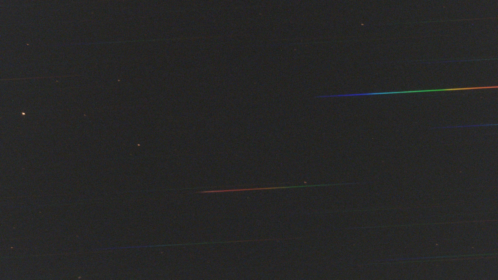
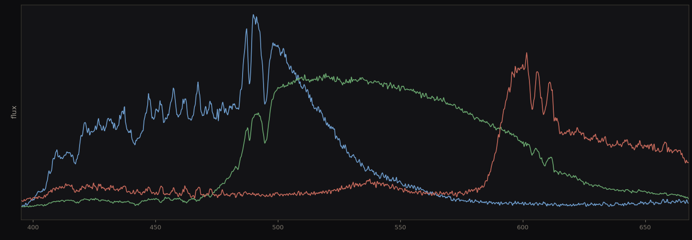
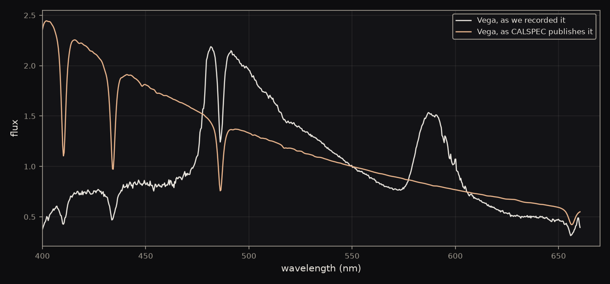
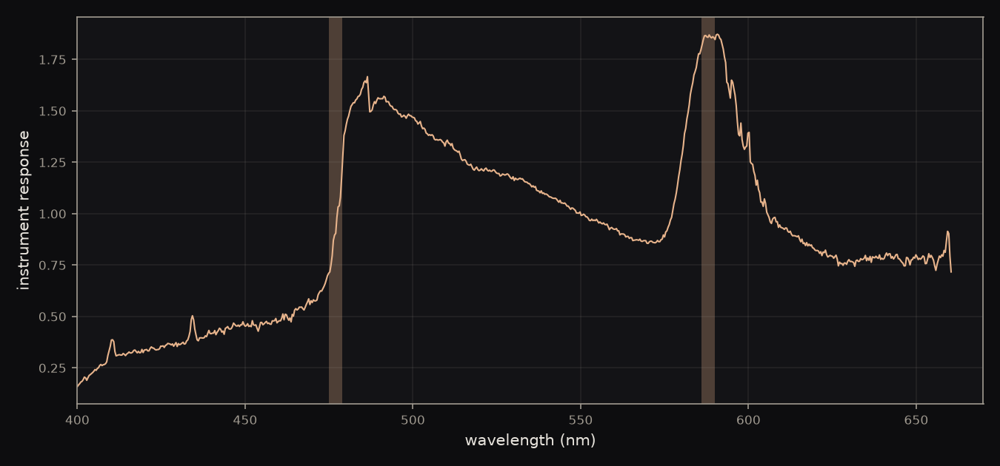
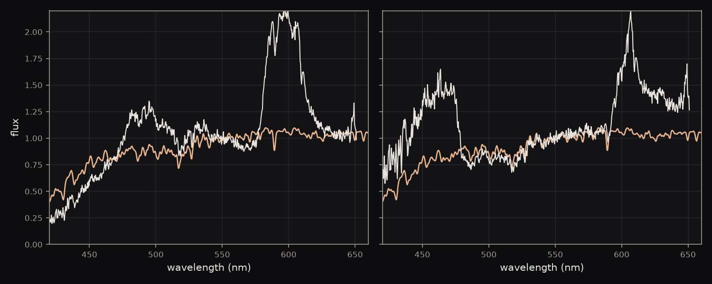
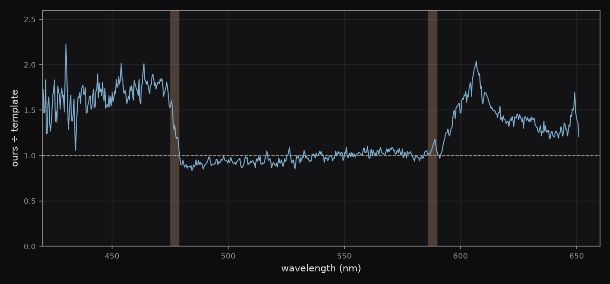
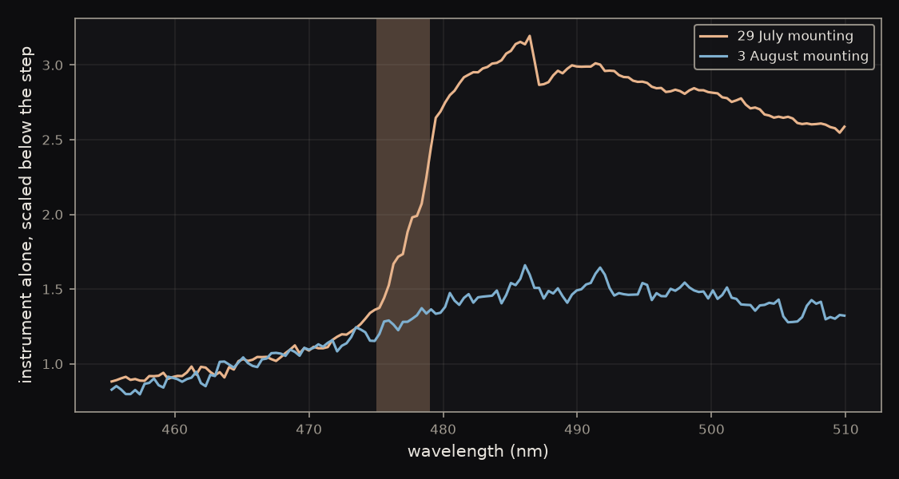
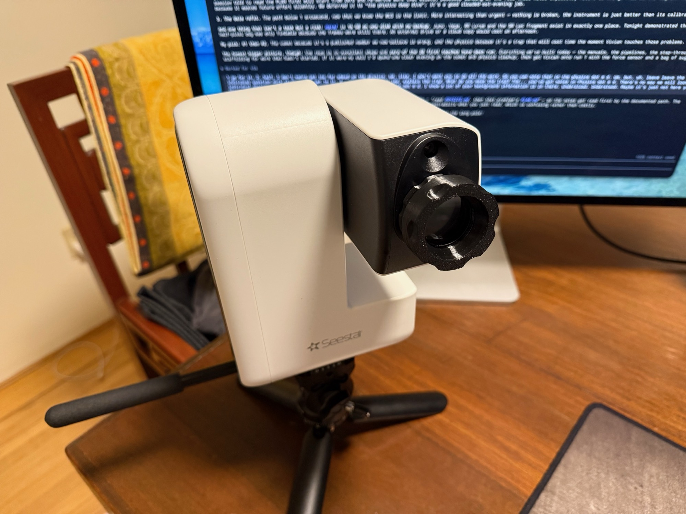
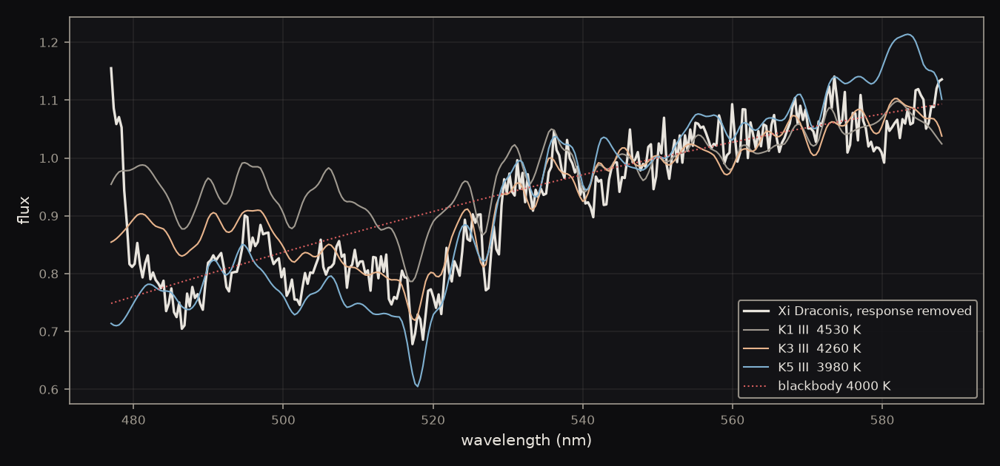

We use Vega as a standard to remove the visual sensor artifacts of the Seestar. This allows us to extract the true spectral continuum of other stars and calculate their temperature: <strong>Xi Draconis at 4260 K</strong>.

## What a label cannot tell you

### Reading a star by its lines

The first spectroscopy report classified Vega as A0V from the depth of its hydrogen lines, and Xi Draconis as K2–K3 III from magnesium and iron bands. Both of those are labels. We measured how deep a few absorption bands were, compared the pattern against a library of cataloged stars, and took the name of the closest match. The procedure returns a rank, not a physical quantity.

<figure class="medium"></figure>

### Why a defective camera did not spoil the label

The Seestar's sensor is a color camera. Red, green and blue filters sit over the pixels in a repeating mosaic, so when the grating spreads a star into a rainbow, different parts of that rainbow land under different filters. The throughput jumps where one filter hands over to the next.

<figure></figure>

**Local baseline.** Measuring a feature against continuum taken from right beside it — ten or twenty nanometers either side — rather than against any absolute scale. Anything varying slowly across a span that short is present in both feature and baseline, and so is removed.

Across ten or twenty nanometers the camera's distortion is near enough to a straight line to cancel, whichever way the baseline is drawn. The labels were sound, and would have been sound on a much worse camera.

Temperature drives the shape of the Planck curve for blackbody radiation, and determines the shape of the spectrum for cooler stars as well. So we need the overall spectrum of light to figure out a star's temperature. A local baseline throws that curve away by design. Reading it means getting the camera out of the way first.

## Removing the camera

### Using Vega as the ruler

Vega is the primary spectrophotometric standard of astronomy. Its true spectrum has been measured from space and published wavelength by wavelength in the CALSPEC database, so what it emits is not in question.

So we photographed it, and put what the sensor recorded beside what Vega actually emits.

<figure></figure>

The gap between those two curves is the whole of what the camera did to the light.

### Reading the camera off the difference

The camera multiplies. A filter passing 40% of the light at some wavelength scales it by 0.4 rather than removing a fixed amount, so the camera comes out by division: our Vega divided by CALSPEC's, wavelength by wavelength. What is left is everything the light met on the way to the pixel.

Our Vega is twenty-five separate exposures rather than one. Haze and airmass shift between them, so each frame is scaled to a common brightness at 550 nm before they are combined — otherwise the stack averages differences in transparency instead of beating down noise. One number per frame, which moves the whole curve up or down and leaves its shape alone.

Both filter handovers stand out as sharp steps, marked here, and between them the response runs smooth.

<figure></figure>

The blue-to-green handover at 477 nm is a factor of 2.7. The green-to-red handover at 588 nm is a factor of 1.2. Neither is subtle, and neither is the star.

### Testing it on a star it had never seen

A correction that only works on the star it came from is arithmetic, not calibration. The test is a different star: build the curve from Vega on one night, apply it to Xi Draconis shot five nights later, and ask whether the corrected shape matches a K giant better than before.

<figure></figure>

Uncorrected, the shape of Xi Draconis's light best matched a K4III template — two subclasses too cool, because the camera was still in it making the star look redder than it is. Corrected, it matches K2III, which is what the catalogs list.

The shape ranking moved from <strong>K4III</strong> to <strong>K2III</strong>, on a star that never entered the calibration and against a template that never entered the response.

## Where the correction can be trusted

### Splitting the leftover at the handovers

The correction works and it is not perfect, and the shape of what is left over says where. Divide the corrected star by its template and plot the ratio across the whole range.

<figure></figure>

It is not a gentle curve with drooping ends, which is what a general calibration error would look like. It is three flat zones with a jump at each handover. Between 477 and 588 nm the ratio sits on 1.0, so the correction is right there. Outside those marks it steps.

Between the handovers the calibration is good to <strong>3%</strong>. Outside them the error is entirely in the two steps.

### Finding that the steps move between nights

A filter is a piece of glass. Its handover should be fixed, identical every night. It is not.

Dividing each star by its own published reference leaves the instrument alone, so the two nights can be laid over each other. Below the handover they agree. At it they part.

<figure></figure>

The step measures 2.75 on the night Vega was shot and 1.36 on the night Xi Draconis was shot, a factor of two. Frames within a single night agree far better, scattering by 13% on Vega's and 5% on Xi Draconis's. The step belongs to the mounting, and the grating had been unscrewed and refitted in between.

<figure class="medium"></figure>

That is the whole remaining error, and it sets the rule for every night from now on: the standard star and the target go on the same mounting, without the grating coming off in between.

## Reading the temperature

### Fitting the continuum inside the good zone

Restricted to 477–588 nm, where the calibration is trustworthy, the corrected continuum can be compared against real stellar spectra of known temperature.

<figure></figure>

The white trace is Xi Draconis with the camera removed. The colored curves are cataloged giants either side of it. Our star sits on the K3 curve, below K1 and above K5.

Xi Draconis, <strong class="big">4260 K</strong>. The literature value for a K2 giant is 4390 K.

A continuum good to 3% constrains temperature to about ±100 K here, and the two numbers differ by 130 K.

### Not using a blackbody, and seeing why not

A star radiates roughly as a blackbody, so the obvious move is to fit the Planck curve and read the temperature off it. The dotted line on the figure above is that fit, and it returns 4000 K — low by 390 K.

**Line blanketing.** In a cool star, thousands of metal absorption lines crowd together toward the blue and remove flux wholesale. The continuum there sits well below a blackbody, so the star looks redder, and therefore cooler, than it is.

The error has the sign the mechanism predicts, and it bites hardest on exactly the cool stars this method works best on. So the comparison runs against real stellar continua, which already carry the blanketing, rather than against an idealized curve. Seeing the bias in the direction of the error is what separates a measurement from a fit that happens to return a number.

### What the number is worth

Two things separate 4260 K from K2–K3 III.

It is a property of the star in physical units, reached by comparing our light against published light, rather than a name borrowed from the nearest entry in a catalog. And it can be wrong. A label matched against a list is either the closest match or it is not; a temperature can be checked against an independent measurement and disagree with it.

It also arrives by a route sharing nothing with the line method. The classification used four absorption band depths. The temperature used the overall slope, with those same bands contributing almost nothing. Two independent observables, one answer.

The last part matters most for what comes next. Hydrogen lines vanish on cool stars, which was the finding the first report ended on — the method has to change with the star. The continuum does not vanish. It is sharpest on the coolest stars, exactly where the hydrogen method fails completely.

