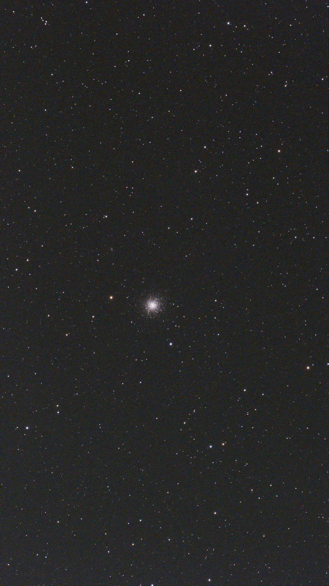
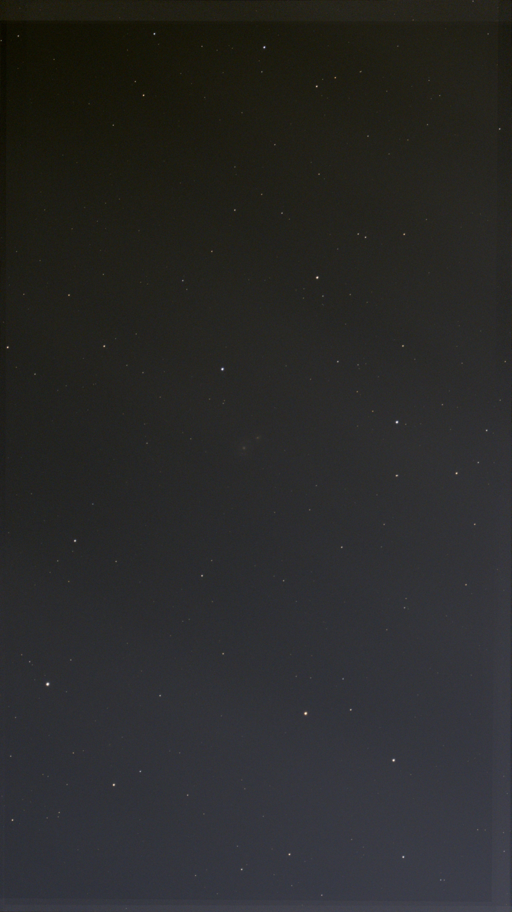
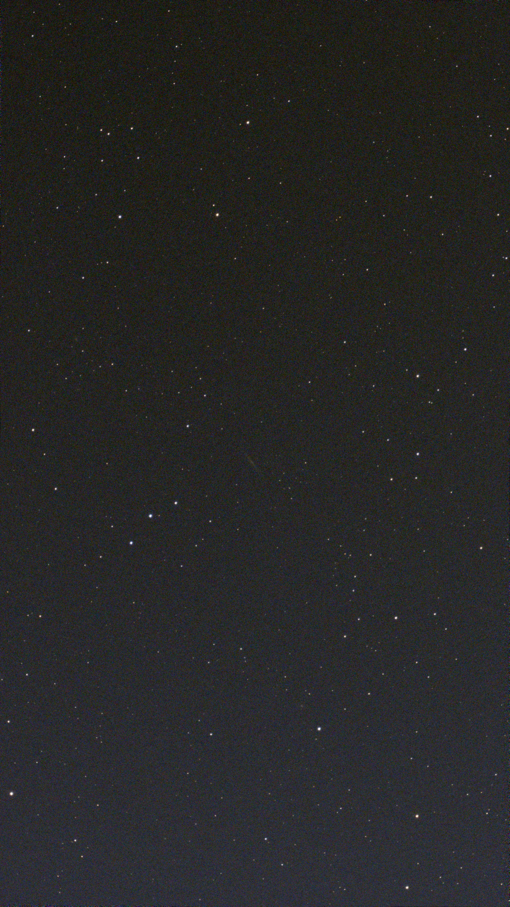
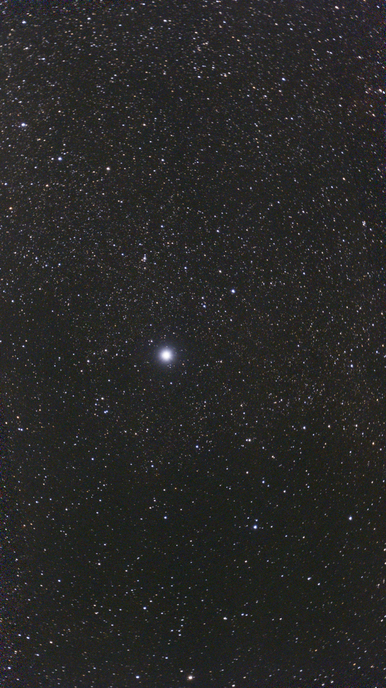
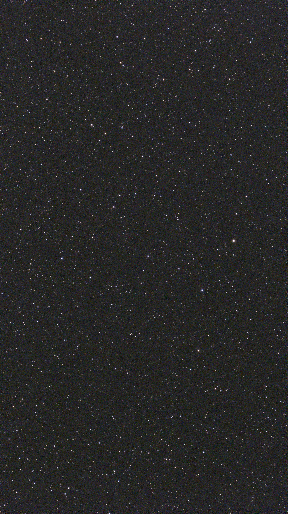
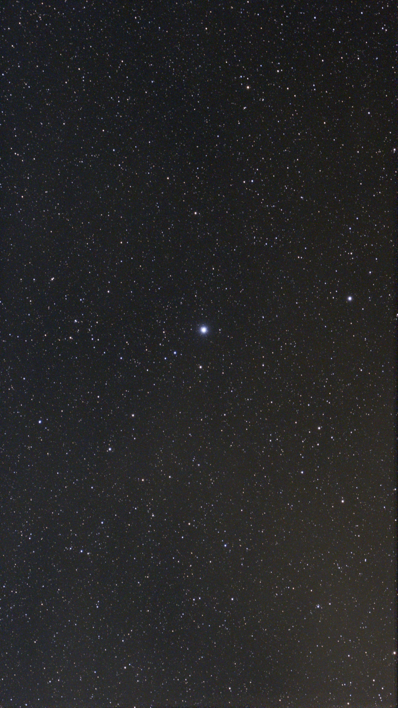
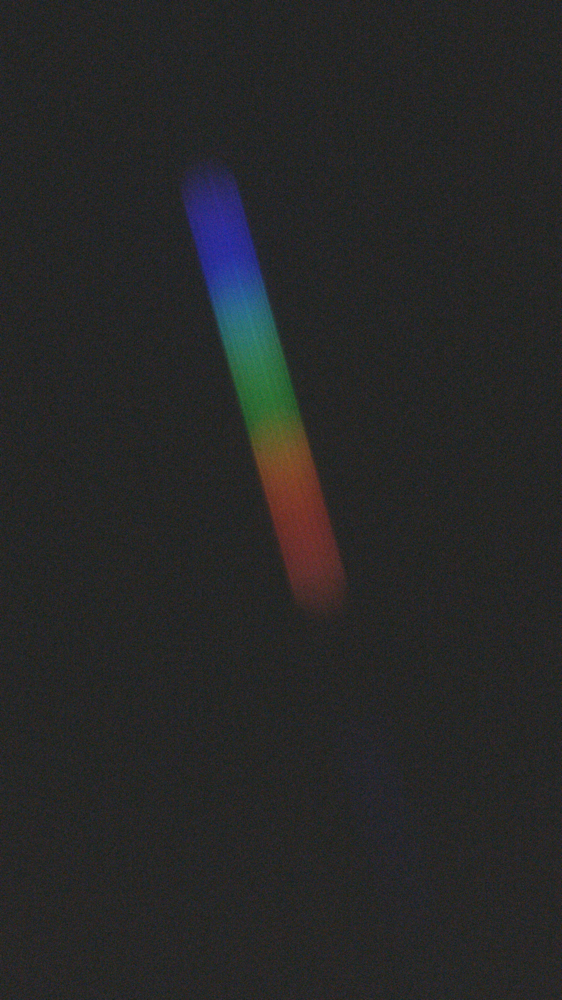
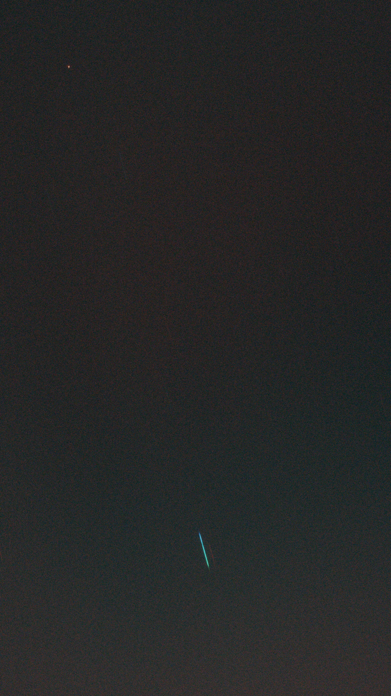
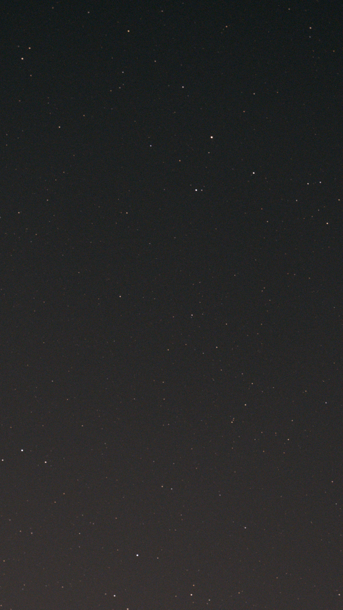
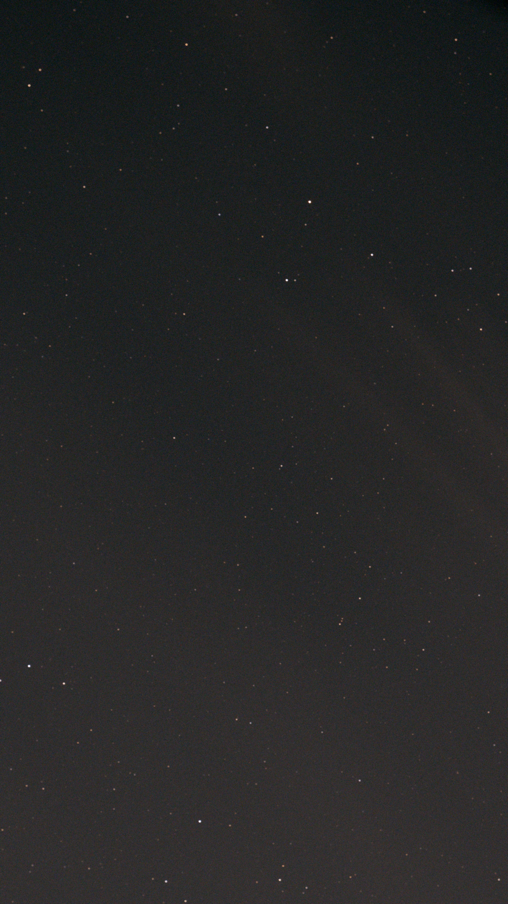

  <video src="data/Solar_video__2026-07-24-164602-Solar.mp4" autoplay loop muted playsinline preload="auto"></video>

  <figure class="sky-tile">
    
    <figcaption><b>M 31</b>17 × 10s</figcaption>
  </figure>
  <figure class="sky-tile">
    
    <figcaption><b>M 13</b>5 × 60s</figcaption>
  </figure>
  <figure class="sky-tile">
    
    <figcaption><b>M 51</b>30 × 10s</figcaption>
  </figure>
  <figure class="sky-tile">
    
    <figcaption><b>NGC 5907</b>9 × 10s</figcaption>
  </figure>
  <figure class="sky-tile">
    
    <figcaption><b>Vega</b>8 × 10s</figcaption>
  </figure>
  <figure class="sky-tile">
    
    <figcaption><b>Deneb</b>32 × 10s</figcaption>
  </figure>
  <figure class="sky-tile">
    
    <figcaption><b>RR Lyrae</b>21 × 5s</figcaption>
  </figure>
  <figure class="sky-tile">
    
    <figcaption><b>Delta Cygni</b>54 × 5s</figcaption>
  </figure>
  <figure class="sky-tile">
    
    <figcaption><b>Vega spectrum</b>1 × 2s</figcaption>
  </figure>
  <figure class="sky-tile">
    
    <figcaption><b>Vega spectrum</b>1 × 10s</figcaption>
  </figure>
  <figure class="sky-tile">
    
    <figcaption><b>Juno — before</b>1 × 20s</figcaption>
  </figure>
  <figure class="sky-tile">
    
    <figcaption><b>Juno — after</b>1 × 20s</figcaption>
  </figure>

  <button class="sky-nav sky-prev" type="button" aria-label="Previous image">‹</button>
  <figure class="sky-stage">
    
    <figcaption><b id="sky-name"></b></figcaption>
  </figure>
  <button class="sky-nav sky-next" type="button" aria-label="Next image">›</button>
  <button class="sky-close" type="button" aria-label="Close">×</button>

