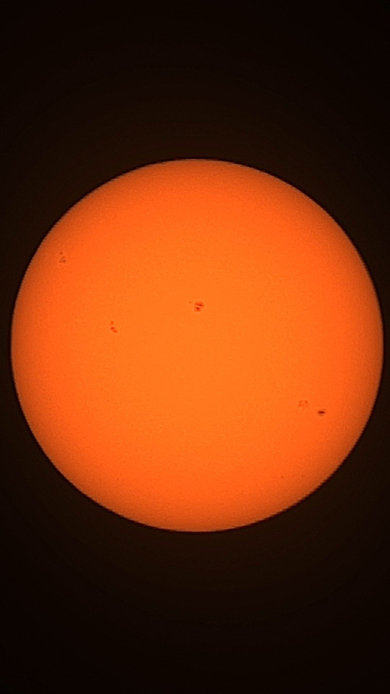
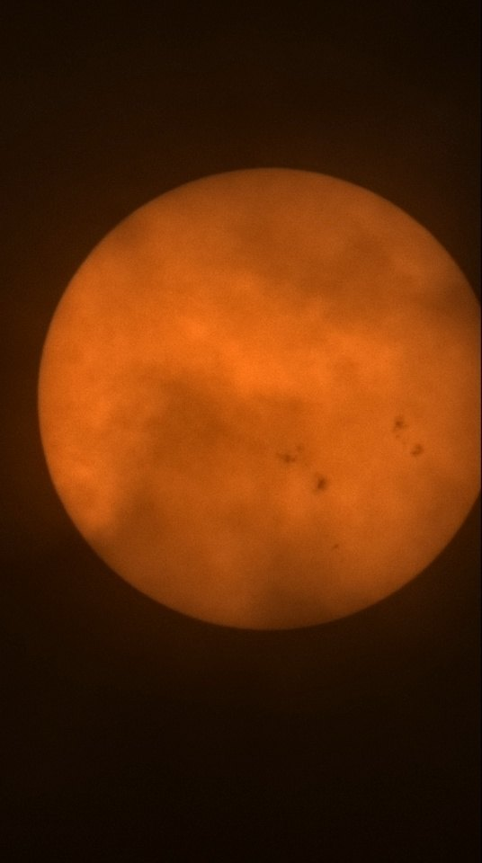
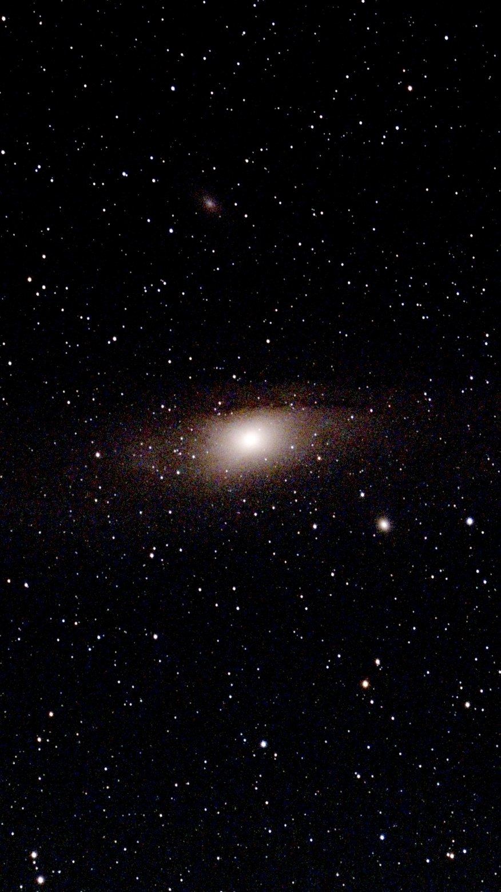
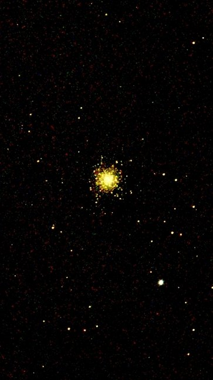
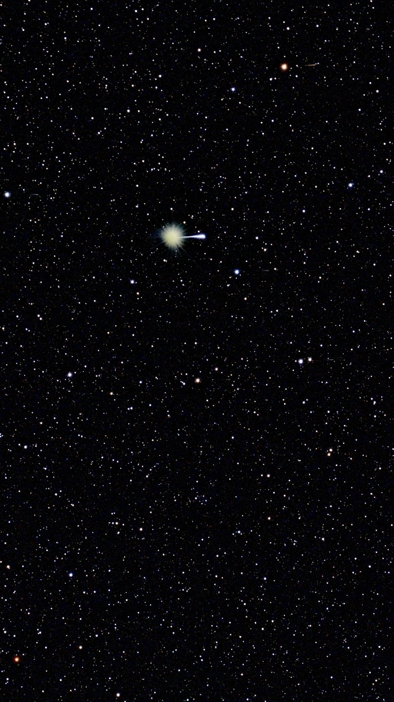
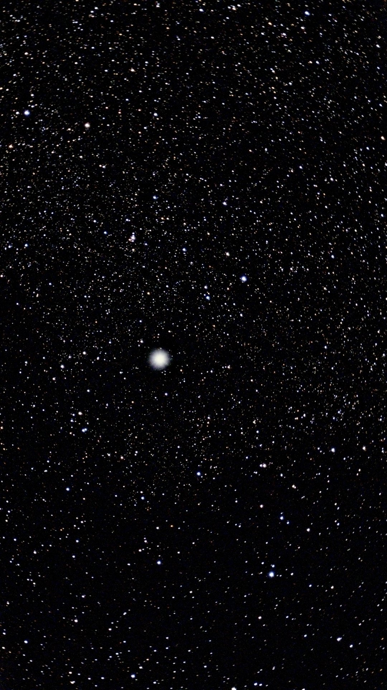
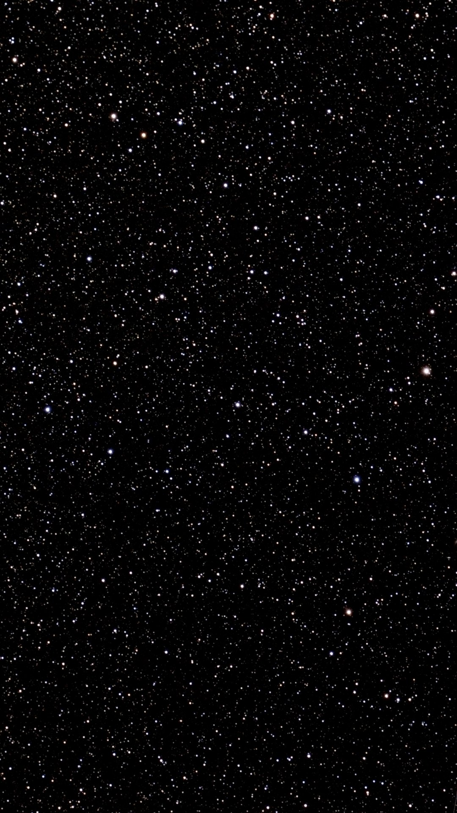

  <video src="media/sun-loop.mp4" poster="media/sun-loop-poster.jpg" autoplay loop muted playsinline preload="auto" aria-label="The Sun in white light, sunspot groups crossing the disk"></video>
  
The Sun in white light — a 6-second look through the solar filter, July 24

July 2026 ZWO Seestar S30 Pro with Tilting Wedge

## Overview

A running gallery of what the back-yard scope has caught. Nothing here is a measurement — these are the frames that came out looking like something, kept because they are worth looking at.

The Seestar shoots and exports **portrait**, 2160 × 3840, so the whole gallery is built that way: tall tiles, videos looping in place. Everything below is a stack of 10-second sub-frames (5 s for the fastest one) taken through the IR-cut filter, then cropped, flattened and stretched — no other retouching.

## Setup

| Toolkit | Details |
|----------|---------|
| Instrument | ZWO Seestar S30 Pro with Tilting Wedge |
| Optics | 160 mm focal length, IR-cut filter, gain 200 |
| Sub-frames | 10 s each (5 s on RR Lyrae); 5 to 425 of them per stack |
| Export | 2160 × 3840 JPEG + FITS, plus H.264 clips for the live views |
| Processing | Centre crop, sky-gradient subtraction, asinh stretch, chroma denoise — <a href="https://github.com/vivianweidai/science/blob/main/web/public/research/projects/20260725%20Stargazing/output/build_gallery.py" rel="noopener">build_gallery.py</a> |

## Sun

  <figure class="sky-tile">
    <a href="media/sun-clouds.mp4">
      <video src="media/sun-clouds.mp4" poster="media/sun-clouds-poster.jpg" autoplay loop muted playsinline preload="auto" aria-label="Cloud drifting across the solar disk"></video>
    </a>
    <figcaption><b>Cloud transit</b>17 s live view · July 1</figcaption>
  </figure>
  <figure class="sky-tile">
    
    <figcaption><b>Sunspot groups</b>Whole disk · July 24</figcaption>
  </figure>
  <figure class="sky-tile">
    
    <figcaption><b>Through high cloud</b>Whole disk · July 1</figcaption>
  </figure>

## Galaxies and Clusters

  <figure class="sky-tile">
    
    <figcaption><b>M 31 — Andromeda</b>17 × 10 s · with M 32 and M 110</figcaption>
  </figure>
  <figure class="sky-tile">
    
    <figcaption><b>M 13 — Hercules Cluster</b>30 × 10 s · edges resolving</figcaption>
  </figure>

## Stars

  <figure class="sky-tile">
    
    <figcaption><b>Vega</b>24 × 10 s · α Lyrae</figcaption>
  </figure>
  <figure class="sky-tile">
    
    <figcaption><b>Deneb</b>32 × 10 s · α Cygni</figcaption>
  </figure>
  <figure class="sky-tile">
    
    <figcaption><b>RR Lyrae</b>425 × 5 s · 35 minutes deep</figcaption>
  </figure>

