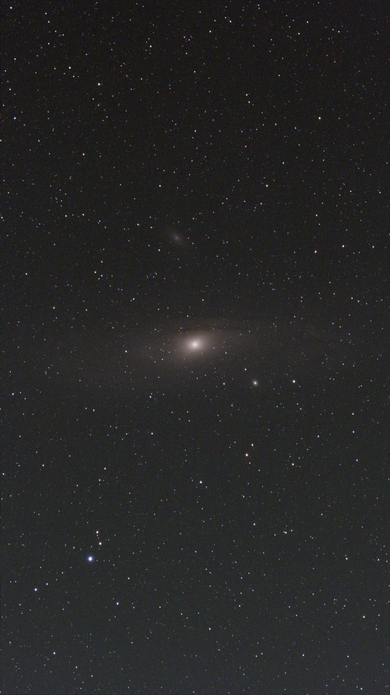
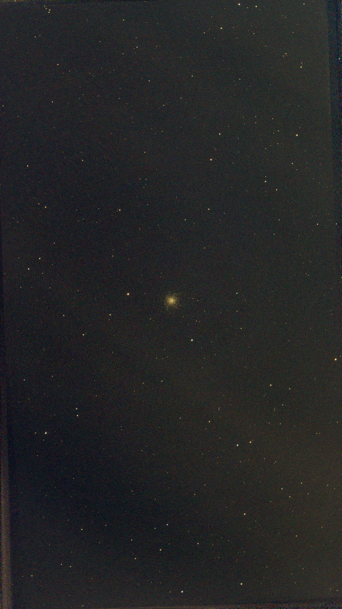
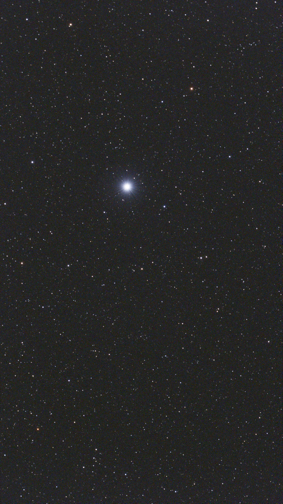

  <video src="media/Solar_video__2026-07-24-164602-Solar.mp4" autoplay loop muted playsinline preload="auto"></video>

  <figure class="sky-tile">
    
    <figcaption><b>M 31</b>17 × 10s</figcaption>
  </figure>
  <figure class="sky-tile">
    
    <figcaption><b>M 13</b>30 × 10s</figcaption>
  </figure>
  <figure class="sky-tile">
    
    <figcaption><b>M 51</b>30 × 10s</figcaption>
  </figure>
  <figure class="sky-tile">
    
    <figcaption><b>NGC 5907</b>9 × 10s</figcaption>
  </figure>
  <figure class="sky-tile">
    
    <figcaption><b>Vega</b>8 × 10s</figcaption>
  </figure>
  <figure class="sky-tile">
    
    <figcaption><b>Deneb</b>32 × 10s</figcaption>
  </figure>
  <figure class="sky-tile">
    
    <figcaption><b>RR Lyrae</b>21 × 5s</figcaption>
  </figure>

